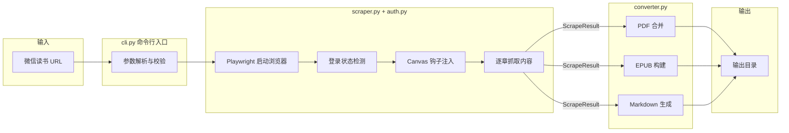
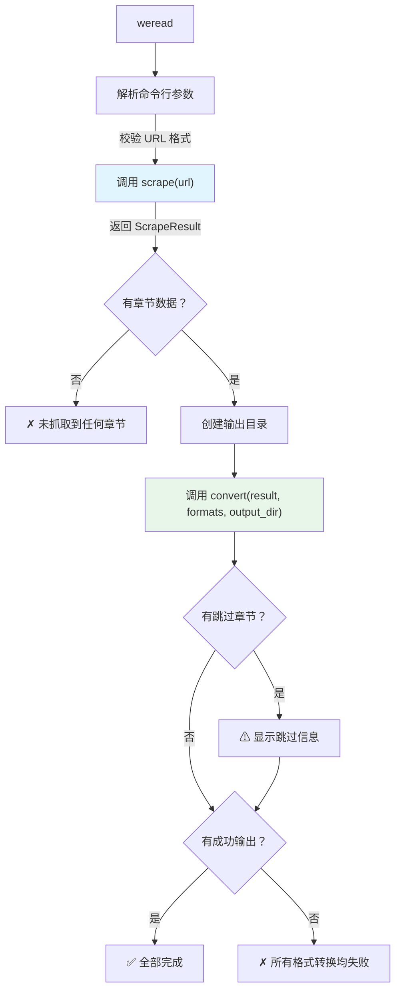

**weread-scrapy** 是一个基于 Python 的命令行工具，能够将微信读书网页版中的书籍内容抓取并导出为 **PDF**、**EPUB** 或 **Markdown** 格式。它通过 Playwright 驱动真实浏览器，利用 Canvas API 钩子拦截渲染文字与图片，再经过段落识别与格式转换，最终生成结构化的电子书文件。

Sources: [pyproject.toml](pyproject.toml#L5-L9), [cli.py](src/weread/cli.py#L38-L42)

---

## 项目定位与核心价值

微信读书网页版使用 Canvas 渲染书籍内容——文字不是以 HTML DOM 节点呈现，而是通过 `CanvasRenderingContext2D.fillText()` 绘制到画布上。这意味着传统的网页抓取方式（如 BeautifulSoup 解析 DOM）完全失效。weread-scrapy 的核心突破在于：**在页面脚本执行前注入 JavaScript 钩子，拦截 Canvas 的 `fillText` 和 `drawImage` 调用**，从渲染层面捕获文字与图片数据，再通过 Y 轴坐标排序和 X 轴缩进检测重建原始段落结构。

Sources: [scraper.py](src/weread/scraper.py#L31-L59)

项目解决的三个关键问题：

| 挑战 | 解决方案 | 实现位置 |
|------|---------|---------|
| Canvas 渲染导致文字不可抓取 | 注入 `fillText`/`drawImage` 钩子拦截绘制调用 | [scraper.py](src/weread/scraper.py#L31-L59) |
| 多章节书籍需逐章翻页 | 自动检测"下一章"按钮并循环遍历 | [scraper.py](src/weread/scraper.py#L313-L330) |
| 用户需登录才能阅读 | Cookie 持久化 + 扫码登录流程 | [auth.py](src/weread/auth.py#L14-L47) |

---

## 技术栈与依赖

项目采用纯 Python 实现，最低要求 Python 3.9，构建系统使用 Hatchling。

| 依赖 | 用途 | 版本要求 |
|------|------|---------|
| **Playwright** | 浏览器自动化（Chromium）、页面渲染、Cookie 管理 | ≥ 1.43 |
| **PyPDF2** | 多章节 PDF 文件合并 | ≥ 3.0 |
| **ebooklib** | EPUB 电子书结构构建 | ≥ 0.18 |

Sources: [pyproject.toml](pyproject.toml#L12-L16)

安装后通过命令 `weread` 直接调用，入口函数定义在 `cli.py:main`：

```
[project.scripts]
weread = "weread.cli:main"
```

Sources: [pyproject.toml](pyproject.toml#L18-L19)

---

## 整体架构概览

项目采用**管道式架构**（Pipeline Architecture），数据从输入 URL 单向流经抓取、解析、转换三个阶段，最终输出为文件。整个处理流程可以用下图表示：



Sources: [cli.py](src/weread/cli.py#L56-L68), [scraper.py](src/weread/scraper.py#L435-L492), [converter.py](src/weread/converter.py#L142-L170)

---

## 模块职责划分

项目源码位于 `src/weread/` 目录，由六个模块组成，各司其职、边界清晰：

```
src/weread/
├── __init__.py      # 包初始化，定义版本号
├── cli.py           # 命令行入口，参数解析与流程编排
├── scraper.py       # 核心抓取引擎：浏览器控制、Canvas 拦截、章节遍历
├── auth.py          # 登录管理：Cookie 持久化、扫码登录检测
├── converter.py     # 格式转换：PDF 合并、Markdown 生成、EPUB 构建
├── errors.py        # 异常体系：基础异常 + 三种具体错误类型
└── utils.py         # 工具函数：文件名清洗、路径管理、Cookie 路径
```

各模块的职责与交互关系如下：

| 模块 | 核心职责 | 关键导出 | 依赖模块 |
|------|---------|---------|---------|
| **cli.py** | 命令行参数解析、流程编排、异常处理 | `main()` | scraper, converter, utils, errors |
| **scraper.py** | 浏览器自动化、Canvas 钩子、内容提取 | `scrape()`, `ScrapeResult`, `ChapterInfo` | auth, errors |
| **auth.py** | 登录状态检测、Cookie 存储、扫码引导 | `ensure_login()`, `save_state()` | errors, utils |
| **converter.py** | 多格式转换的统一入口 | `convert()`, `merge_pdfs()`, `convert_to_markdown()`, `convert_to_epub()` | scraper, errors |
| **errors.py** | 自定义异常层级 | `WereadError`, `LoginExpiredError`, `ChapterLoadError`, `ConvertError` | （无） |
| **utils.py** | 文件名合法性处理、路径构建 | `sanitize_filename()`, `get_cookie_path()`, `get_output_dir()` | （无） |

Sources: [cli.py](src/weread/cli.py#L1-L12), [scraper.py](src/weread/scraper.py#L1-L16), [auth.py](src/weread/auth.py#L1-L8), [converter.py](src/weread/converter.py#L1-L11), [errors.py](src/weread/errors.py#L1-L19), [utils.py](src/weread/utils.py#L1-L5)

---

## 核心数据模型

抓取与转换之间的数据传递通过两个数据类（dataclass）完成，它们构成了整个管道的**数据契约**：

**`ChapterInfo`** —— 单个章节的完整数据：

```python
@dataclass
class ChapterInfo:
    num: int          # 章节序号（从 1 开始）
    name: str         # 章节标题
    pdf_path: Path    # 该章节的 PDF 截图路径
    text: str = ""    # 提取的 Markdown 格式文本（含图片引用）
```

**`ScrapeResult`** —— 整本书的抓取结果：

```python
@dataclass
class ScrapeResult:
    book_name: str                        # 书籍名称
    chapters: list[ChapterInfo]           # 成功抓取的章节列表
    skipped: list[str]                    # 跳过的章节及原因
    temp_dir: str = ""                    # 临时文件目录（含 PDF 分片和图片）
```

`ScrapeResult` 是 `scraper.py` 的输出，也是 `converter.py` 的输入。每个 `ChapterInfo` 同时携带 PDF 截图和结构化文本两种形式的章节内容——PDF 用于直接合并，文本用于生成 Markdown 和 EPUB。

Sources: [scraper.py](src/weread/scraper.py#L419-L433)

---

## 主流程详解

命令行入口 `main()` 函数编排了完整的抓取→转换流程。以下是其核心执行路径：



流程中设计了三层异常防护：`LoginExpiredError` 专门处理登录失败，`WereadError` 捕获所有业务异常，`KeyboardInterrupt` 支持用户中断时保存已抓取的章节数据，避免前功尽弃。

Sources: [cli.py](src/weread/cli.py#L38-L99)

---

## 输出格式支持

项目支持三种输出格式，可同时指定、并行生成：

| 格式 | 文件扩展名 | 实现方式 | 特点 |
|------|-----------|---------|------|
| **PDF** | `.pdf` | 逐章截取页面 PDF → PyPDF2 合并 | 保留原始排版样式，所见即所得 |
| **Markdown** | `.md` | Canvas 文本 + 图片路径 → 格式化拼接 | 纯文本结构化，适合二次编辑，图片保存到 `images/` 子目录 |
| **EPUB** | `.epub` | 章节 HTML + 嵌入图片 → ebooklib 构建 | 标准电子书格式，含目录导航，兼容各阅读器 |

使用示例：

```bash
# 仅导出 PDF（默认）
weread https://weread.qq.com/web/reader/abc123

# 同时导出三种格式
weread https://weread.qq.com/web/reader/abc123 -f pdf,epub,md

# 指定输出目录
weread https://weread.qq.com/web/reader/abc123 -f epub -o ~/books
```

Sources: [cli.py](src/weread/cli.py#L43-L51), [converter.py](src/weread/converter.py#L142-L170)

---

## 测试体系

项目使用 `pytest` 框架，测试代码位于 `tests/` 目录。当前覆盖两个核心模块：

| 测试文件 | 覆盖模块 | 测试要点 |
|---------|---------|---------|
| [test_converter.py](tests/test_converter.py) | converter.py | PDF 合并（文件生成、页数验证）、Markdown 生成（章节结构）、EPUB 生成（文件完整性） |
| [test_utils.py](tests/test_utils.py) | utils.py | 文件名清洗（中文字符、非法字符、空白、边界情况） |

Sources: [test_converter.py](tests/test_converter.py#L1-L9), [test_utils.py](tests/test_utils.py#L1-L2), [pyproject.toml](pyproject.toml#L24-L25)

---

## 项目文件结构全景

```
weread-scrapy/
├── pyproject.toml              # 项目元数据、依赖、构建配置
├── src/weread/
│   ├── __init__.py             # 版本号 (0.1.0)
│   ├── cli.py                  # CLI 入口：参数解析 + 流程编排
│   ├── scraper.py              # 抓取引擎：Playwright + Canvas 拦截
│   ├── auth.py                 # 登录管理：Cookie + 扫码
│   ├── converter.py            # 格式转换：PDF / Markdown / EPUB
│   ├── errors.py               # 异常体系：4 个异常类
│   └── utils.py                # 工具函数：文件名清洗 + 路径管理
└── tests/
    ├── __init__.py
    ├── test_converter.py       # 转换器单元测试
    └── test_utils.py           # 工具函数单元测试
```

---

## 下一步阅读

本文档提供了项目的高层概览。要深入了解各个模块的具体实现，建议按以下顺序阅读：

1. **[快速上手：安装与首次使用](2-kuai-su-shang-shou-an-zhuang-yu-shou-ci-shi-yong)** —— 动手安装工具并完成第一次书籍导出
2. **[命令行参数与输出格式详解](3-ming-ling-xing-can-shu-yu-shu-chu-ge-shi-xiang-jie)** —— 掌握所有可用的命令行选项
3. **[整体架构：从 URL 到电子书的完整数据流](4-zheng-ti-jia-gou-cong-url-dao-dian-zi-shu-de-wan-zheng-shu-ju-liu)** —— 深入理解数据在模块间的流转机制