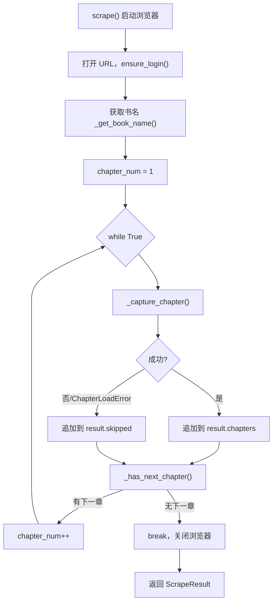
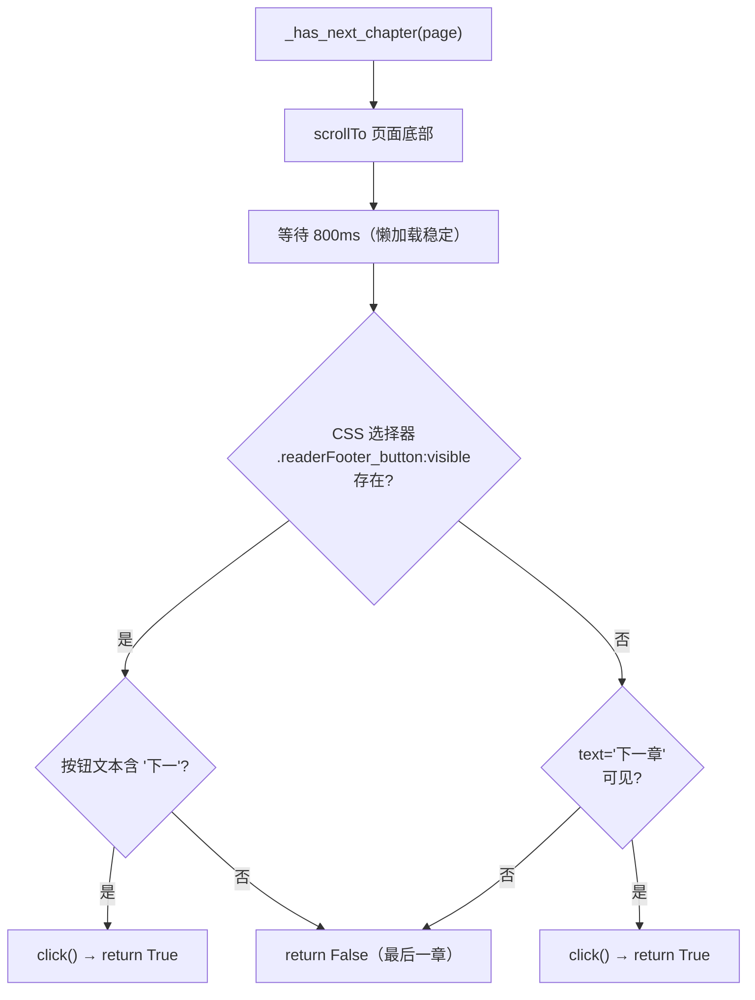

本文深入解析微信读书书籍抓取过程中最核心的控制流——**从第一章到最后一章的自动化遍历机制**。内容涵盖：主循环的架构设计、单章节抓取的完整生命周期、翻页检测与章节导航的 DOM 策略，以及渲染失败时的容错重试机制。阅读本文前，建议先了解 [整体架构：从 URL 到电子书的完整数据流](4-zheng-ti-jia-gou-cong-url-dao-dian-zi-shu-de-wan-zheng-shu-ju-liu) 中的全局流程，以及 [Playwright 浏览器自动化：启动配置与反检测策略](7-playwright-liu-lan-qi-zi-dong-hua-qi-dong-pei-zhi-yu-fan-jian-ce-ce-lue) 中的浏览器初始化细节。

Sources: [scraper.py](src/weread/scraper.py#L1-L21)

## 遍历架构总览

整个章节遍历由 `scrape()` 函数驱动，采用 **`while True` 无限循环 + 显式 `break`** 的控制模式。循环体在每次迭代中完成一个章节的完整抓取，随后通过 `_has_next_chapter()` 判断是否存在后续章节——若存在则自动点击翻页并将递增计数器，否则退出循环。



这一设计的核心优势在于：**即使某个章节渲染失败（抛出 `ChapterLoadError`），循环也不会中断**——失败的章节被记录到 `result.skipped` 列表中，遍历流程继续推进到下一章。这种「跳过而非中止」的错误策略确保了单章故障不会阻断整本书的抓取。

Sources: [scraper.py](src/weread/scraper.py#L435-L492)

## 主循环的精确控制流

`scrape()` 函数的主体是一个包含完整状态管理的 `while True` 循环，其结构可分解为四个阶段：

| 阶段 | 职责 | 关键函数 |
|------|------|----------|
| 初始化 | 创建临时目录、图片目录、启动浏览器 | `scrape()` L441-L463 |
| 登录验证 | 等待页面加载、检测登录态 | [ensure_login()](src/weread/auth.py#L28-L47) |
| 章节抓取循环 | 逐章捕获内容与 PDF | `_capture_chapter()` |
| 翻页判断 | 检测并点击「下一章」按钮 | `_has_next_chapter()` |

循环体的核心逻辑如下（精简后）：

```python
chapter_num = 1
while True:
    try:
        info = _capture_chapter(page, chapter_num, temp_dir, images_dir, result.book_name)
        result.chapters.append(info)
    except ChapterLoadError as e:
        result.skipped.append(str(e))      # 失败章节不中断循环

    if not _has_next_chapter(page):
        break
    chapter_num += 1
```

值得注意的是，`chapter_num` 的递增发生在 `_has_next_chapter()` 返回 `True` **之后**，这意味着翻页操作（点击「下一章」按钮）在计数器更新之前就已经完成——浏览器已经导航到了下一章的 DOM 状态，为下一次循环迭代做好准备。

Sources: [scraper.py](src/weread/scraper.py#L472-L492)

## 翻页检测：_has_next_chapter() 的双重策略

`_has_next_chapter()` 是遍历循环的「推进器」，承担两个职责：**检测是否存在下一章**和**执行翻页点击**。其实现采用了一套分层容错的 DOM 查询策略。



函数的执行流程有三个关键细节：

**首先**，它强制将页面滚动到底部（`scrollTo(0, document.body.scrollHeight)`），随后等待 800 毫秒。这是因为微信读书的「下一章」按钮位于页面底部，可能处于懒加载状态——只有滚动到可见区域后，按钮的 DOM 元素才会被渲染出来。

**其次**，采用**两级选择器降级策略**：优先使用 CSS 选择器 `.readerFooter_button:visible` 精确匹配按钮元素，并通过 `:visible` 伪类过滤掉被隐藏的元素；如果首选选择器未命中，则退回到 Playwright 的文本定位器 `text='下一章'` 进行模糊匹配。这种降级策略增强了不同微信读书版本的兼容性。

**最后**，点击操作直接内嵌在检测逻辑中——函数不仅是查询器，更是执行器。当检测到「下一章」按钮时，`click()` 调用立即触发页面导航，这要求后续的 `_capture_chapter()` 必须等待新页面渲染完成。

Sources: [scraper.py](src/weread/scraper.py#L313-L330)

### 关键 CSS 选择器与常量

翻页逻辑依赖的 DOM 定位常量集中定义在模块顶部：

| 常量 | 值 | 用途 |
|------|----|------|
| `_CHAPTER_CONTENT` | `.readerChapterContent` | 章节内容容器的 CSS 选择器，用于渲染就绪检测 |
| `_FOOTER_BTN` | `.readerFooter_button:visible` | 页脚翻页按钮（仅匹配可见元素） |
| `_CHAPTER_TITLE` | `.readerTopBar_title_link,.readerTopBar_title` | 顶栏章节标题（两个候选选择器的并集） |
| `_RENDER_TIMEOUT` | `15000`（15 秒） | 等待章节内容渲染的最大超时时间 |
| `_MAX_RETRY` | `1` | 渲染失败后的最大重试次数（即最多尝试 2 次） |

Sources: [scraper.py](src/weread/scraper.py#L17-L21)

## 单章节抓取生命周期：_capture_chapter()

`_capture_chapter()` 是遍历循环中最复杂的原子操作，负责完成一个章节从「原始 DOM」到「结构化数据」的完整转化。其执行过程可分为六个阶段：


### 阶段①：章节名提取与清洗

函数首先通过 `_get_chapter_name()` 从顶栏 `.readerTopBar_title` 元素中提取章节标题。微信读书的顶栏可能同时显示书名和章节名（以换行符分隔），因此需要进行**书名过滤**——使用 `_text_fingerprint()` 对文本进行归一化（去除标点、空白、大小写差异）后，将与书名指纹匹配的行排除，仅保留章节名部分。

Sources: [scraper.py](src/weread/scraper.py#L336-L347)

### 阶段②：日志偏移量快照

在触发渲染之前，函数先记录当前 Canvas 拦截日志的长度：

```python
text_start = page.evaluate("window.__wr_text_log__.length")
img_start = page.evaluate("window.__wr_img_log__.length")
```

这一设计的原因在于：Canvas 拦截钩子在页面加载时就开始记录（包括滚动触发的增量渲染），而 `_capture_chapter()` 可能被多次调用在同一页面上。通过记录**渲染前的日志位置**，后续的内容提取可以从正确的偏移量开始，避免将前一章节的残留数据混入当前章节。值得注意的是，当发生页面重载（`page.reload()`）时，注入的初始化脚本会重新执行，日志数组被重置为空，此时偏移量也会相应重置为 0。

Sources: [scraper.py](src/weread/scraper.py#L349-L364)

### 阶段③：渲染等待与重试机制

`_wait_for_render()` 通过三重等待确保页面完全就绪：

1. **`wait_for_selector(_CHAPTER_CONTENT)`** — 等待章节内容容器出现在 DOM 中（15 秒超时）
2. **`wait_for_load_state("networkidle")`** — 等待所有网络请求完成（无活跃连接持续 500ms）
3. **`wait_for_timeout(1000)`** — 硬性等待 1 秒，确保 Canvas 渲染管道完成绘制

当首次等待失败时，函数执行 `page.reload()` 重新加载页面，并将日志偏移量重置为 0（因为初始化脚本会重建日志数组）。最多重试 `_MAX_RETRY + 1 = 2` 次；若仍失败则抛出 `ChapterLoadError`，携带章节编号和名称信息。

Sources: [scraper.py](src/weread/scraper.py#L292-L295), [scraper.py](src/weread/scraper.py#L353-L364), [errors.py](src/weread/errors.py#L7-L12)

### 阶段④：内容收集

渲染就绪后调用 `_collect_chapter_content()`，该函数执行滚动触发、文本/图片提取、段落检测等操作——这些细节在 [Canvas 文字拦截原理：fillText 钩子与文本行重组算法](8-canvas-wen-zi-lan-jie-yuan-li-filltext-gou-zi-yu-wen-ben-xing-zhong-zu-suan-fa)、[Canvas 图片提取：drawImage 钩子与 DOM 图片双重采集](9-canvas-tu-pian-ti-qu-drawimage-gou-zi-yu-dom-tu-pian-shuang-zhong-cai-ji) 和 [段落识别算法：缩进检测与 Y 轴间距分析](12-duan-luo-shi-bie-suan-fa-suo-jin-jian-ce-yu-y-zhou-jian-ju-fen-xi) 中有详细阐述。

Sources: [scraper.py](src/weread/scraper.py#L366-L371)

### 阶段⑤：章节名的二次校正

微信读书顶栏默认显示的是**书名**而非章节名。当从顶栏提取到的章节名为空，或其指纹与书名完全一致时，函数会从已提取的文本内容中尝试识别真正的章节标题——取文本中第一个非空、非图片、非书名的行作为章节名，并从正文中移除该标题行以避免重复。

Sources: [scraper.py](src/weread/scraper.py#L375-L403)

### 阶段⑥：PDF 生成

最终，函数以 `screen` 媒体模式、零边距、宽度 800px 的配置，将当前页面生成为单章节 PDF 文件（`chapter_{num}.pdf`），存放在临时目录中。所有数据封装为 `ChapterInfo` 数据类返回。

Sources: [scraper.py](src/weread/scraper.py#L405-L416)

## 数据结构设计

遍历过程中的状态通过两个 dataclass 进行结构化管理：

**`ChapterInfo`** — 单章节数据容器：

| 字段 | 类型 | 含义 |
|------|------|------|
| `num` | `int` | 章节序号（从 1 开始） |
| `name` | `str` | 章节名称（经清洗校正后） |
| `pdf_path` | `Path` | 单章节 PDF 的临时文件路径 |
| `text` | `str` | Markdown 格式的章节文本内容 |

**`ScrapeResult`** — 整本书抓取结果：

| 字段 | 类型 | 含义 |
|------|------|------|
| `book_name` | `str` | 书名（从页面标题解析） |
| `chapters` | `list[ChapterInfo]` | 成功抓取的章节列表 |
| `skipped` | `list[str]` | 跳过的失败章节（含错误描述） |
| `temp_dir` | `str` | 临时文件目录路径（PDF 和图片） |

`ScrapeResult` 同时承载成功与失败信息的设计，使得下游的[格式转换引擎](16-tong-zhuan-huan-ru-kou-duo-ge-shi-bing-xing-zhuan-huan-ji-zhi)可以根据 `chapters` 列表生成完整输出，同时通过 `skipped` 列表向用户报告哪些章节因故缺失。

Sources: [scraper.py](src/weread/scraper.py#L419-L432)

## 容错机制分析

章节遍历的容错设计体现在三个层面：

**渲染级容错**：`_capture_chapter()` 内部的重试机制允许一次 `page.reload()` 后重新尝试渲染。重载时日志偏移量重置为 0，因为初始化脚本 `_CANVAS_INTERCEPT` 会重新注入并清空日志数组。超过 `_MAX_RETRY` 次重试后抛出 `ChapterLoadError`。

Sources: [scraper.py](src/weread/scraper.py#L353-L364)

**章节级容错**：主循环通过 `try/except ChapterLoadError` 捕获单章失败，将错误信息记录到 `skipped` 列表后继续下一章。这保证了即使某章因渲染超时、DOM 结构异常等原因完全无法抓取，整本书的其余章节仍然可以正常完成。

**导航级容错**：`_has_next_chapter()` 采用两级选择器降级（CSS 选择器 → 文本定位器），增加了翻页按钮检测的鲁棒性。即便微信读书前端更新了按钮的 CSS 类名，文本定位器作为后备方案仍可能命中。

Sources: [scraper.py](src/weread/scraper.py#L313-L330), [scraper.py](src/weread/scraper.py#L482-L484)

## 延伸阅读

- [Canvas 文字拦截原理：fillText 钩子与文本行重组算法](8-canvas-wen-zi-lan-jie-yuan-li-filltext-gou-zi-yu-wen-ben-xing-zhong-zu-suan-fa) — 了解章节内容提取的底层文本拦截机制
- [Canvas 图片提取：drawImage 钩子与 DOM 图片双重采集](9-canvas-tu-pian-ti-qu-drawimage-gou-zi-yu-dom-tu-pian-shuang-zhong-cai-ji) — 深入图片提取的双重策略
- [段落识别算法：缩进检测与 Y 轴间距分析](12-duan-luo-shi-bie-suan-fa-suo-jin-jian-ce-yu-y-zhou-jian-ju-fen-xi) — 理解文本如何从 Canvas 行数据重组为段落
- [登录状态管理：Cookie 持久化与扫码登录流程](11-deng-lu-zhuang-tai-guan-li-cookie-chi-jiu-hua-yu-sao-ma-deng-lu-liu-cheng) — 了解 `ensure_login()` 在遍历流程前的登录保障
- [PDF 合并：多章节 PDF 拼接实现](13-pdf-he-bing-duo-zhang-jie-pdf-pin-jie-shi-xian) — 理解单章节 PDF 如何被合并为最终输出