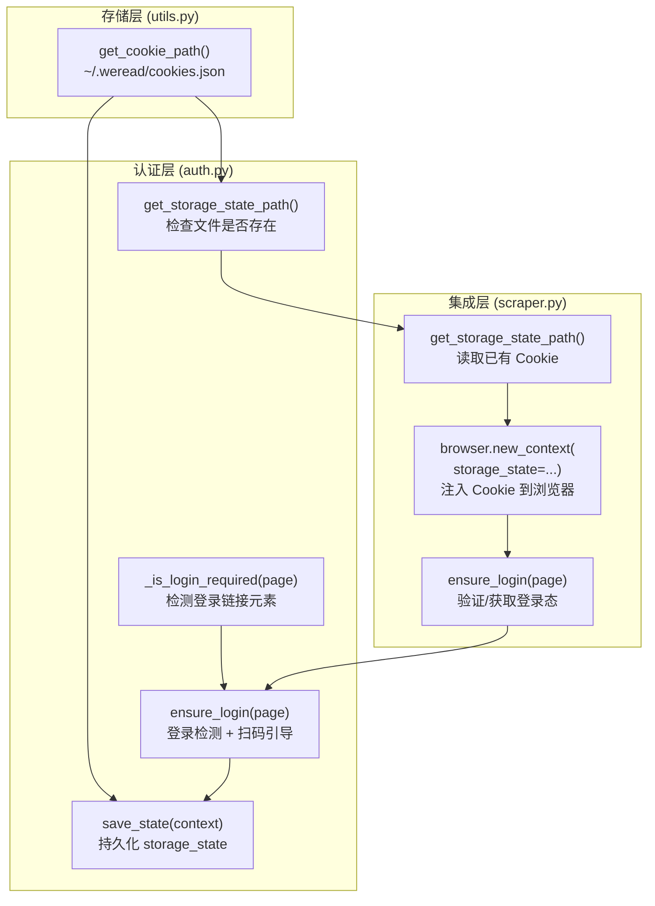
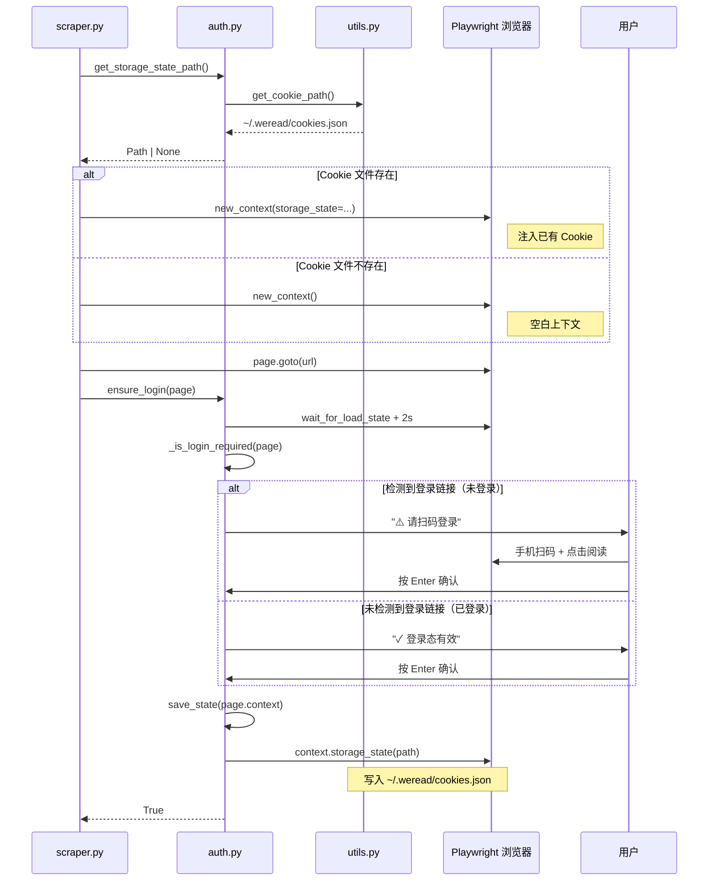

本文深入剖析 weread-scrapy 项目中 **登录状态管理** 的完整实现机制——从 Cookie 文件的持久化存储策略，到浏览器上下文的状态注入与恢复，再到基于页面元素检测的扫码登录引导流程。整个认证体系横跨 `auth.py`、`utils.py` 和 `scraper.py` 三个模块，以 Playwright 的 `storage_state` API 为核心枢纽，构建了一条"首次扫码 → Cookie 持久化 → 后续免登录"的自动化链路。

Sources: [auth.py](src/weread/auth.py#L1-L48), [utils.py](src/weread/utils.py#L18-L21), [scraper.py](src/weread/scraper.py#L453-L467)

## 架构全景：三层协作的认证管线

登录状态管理并非一个孤立的模块，而是由三个层次各司其职协作完成。**存储层**（`utils.py`）负责 Cookie 文件的路径解析与目录创建；**认证层**（`auth.py`）封装登录检测、状态保存和扫码引导的核心逻辑；**集成层**（`scraper.py`）在浏览器启动时注入已有状态，在页面加载后触发认证流程。这种分层设计使得认证逻辑可以独立于抓取逻辑进行测试和维护。

Sources: [auth.py](src/weread/auth.py#L1-L8), [utils.py](src/weread/utils.py#L18-L21), [scraper.py](src/weread/scraper.py#L14)

Sources: [auth.py](src/weread/auth.py#L14-L47), [utils.py](src/weread/utils.py#L18-L21), [scraper.py](src/weread/scraper.py#L446-L467)

## Cookie 持久化机制

### 存储路径与目录结构

Cookie 文件统一存储在用户主目录下的 `~/.weread/cookies.json`。`get_cookie_path()` 函数不仅返回路径，还会通过 `mkdir(parents=True, exist_ok=True)` 确保 `.weread` 目录存在。这种"懒创建"策略意味着首次运行时无需手动创建配置目录，系统会自动完成初始化。这个路径被 `auth.py` 中的 `get_storage_state_path()` 和 `save_state()` 两个函数共同引用，形成了一致的存储契约。

Sources: [utils.py](src/weread/utils.py#L18-L21)

### Playwright storage_state 格式

值得注意的是，`save_state()` 保存的并非单纯的 Cookie 列表，而是 Playwright 的 **storage_state** 完整快照——它同时包含 `cookies` 和 `origins`（localStorage）两部分数据。这意味着微信读书的登录态不仅依赖 Cookie，还可能涉及 localStorage 中的 token 或 session 信息。这种完整快照策略确保了恢复登录态时的可靠性，不会因为遗漏 localStorage 数据而导致登录失效。

Sources: [auth.py](src/weread/auth.py#L19-L21)

### 状态读取与条件注入

`get_storage_state_path()` 是一个关键的"门卫"函数：它调用 `get_cookie_path()` 获取路径后，通过 `path.exists()` 判断文件是否存在。只有当文件存在时才返回路径，否则返回 `None`。这个 `None` 值在 `scraper.py` 中被用于条件分支——当 `state_path` 为真值时，才将 `storage_state` 参数传入 `browser.new_context()`。首次使用时没有 Cookie 文件，浏览器以空白状态启动；后续运行时自动注入已保存的登录态。

Sources: [auth.py](src/weread/auth.py#L14-L16), [scraper.py](src/weread/scraper.py#L453-L461)

## 登录检测原理

### 页面元素探测策略

`_is_login_required()` 通过 Playwright 的 Locator API 检测页面上是否存在登录相关元素。它使用的 CSS 选择器是 `a:has-text('登录'), .navBar_link_Login`——这是一个复合选择器，同时覆盖了两种可能的登录入口：文本内容包含"登录"的链接元素，以及微信读书导航栏中特定类名的登录按钮。`locator().count() > 0` 的判断方式意味着只要页面上存在任意一个匹配元素，即认为用户未登录。这种双重选择器策略提高了检测的鲁棒性，避免因微信读书前端改版导致单一选择器失效。

Sources: [auth.py](src/weread/auth.py#L10-L11), [auth.py](src/weread/auth.py#L24-L25)

### 检测时机与前置等待

`ensure_login()` 在执行检测前做了两层等待：先调用 `page.wait_for_load_state("networkidle")` 等待网络请求全部完成，再通过 `page.wait_for_timeout(2000)` 额外等待 2 秒。这个 2 秒的硬编码等待是一个务实的防御性设计——微信读书页面在 `networkidle` 之后可能仍有动态内容渲染（如 Vue/React 框架的 hydration 过程），登录按钮可能在 DOM 已加载但尚未渲染可见时被遗漏。两秒的缓冲期大幅降低了误判风险。

Sources: [auth.py](src/weread/auth.py#L28-L30)

## 扫码登录流程详解

### 完整登录时序

以下流程图展示了从浏览器启动到登录完成的完整时序，涵盖"有 Cookie"和"无 Cookie"两条路径的分支逻辑：

Sources: [auth.py](src/weread/auth.py#L28-L47), [scraper.py](src/weread/scraper.py#L446-L467)

### 扫码交互的阻塞式设计

`ensure_login()` 采用 `input()` 阻塞等待用户确认——这是一种简洁但有效的同步方案。无论是否需要扫码登录，函数都会暂停并等待用户按 Enter 确认。这个设计背后有一个重要的考虑：即使用户已经登录，微信读书的阅读页仍然需要用户手动导航到目标页面（尤其是从书籍详情页进入阅读页），因此"确认已在阅读页"的提示在两种场景下都是必要的。`KeyboardInterrupt` 和 `EOFError` 两个异常的捕获确保了用户可以通过 Ctrl+C 优雅退出，而不是产生未处理的异常堆栈。

Sources: [auth.py](src/weread/auth.py#L28-L47)

### 状态保存的时机

`save_state()` 在用户确认后、函数返回前被调用。这个时序至关重要——它确保了保存的 storage_state 快照包含了扫码登录后的完整认证数据。`context.storage_state()` 是 Playwright 提供的原生 API，它会将当前浏览器上下文中所有 Cookie 和 localStorage 数据序列化为 JSON 格式写入指定路径。由于该操作发生在用户确认之后，保存的状态快照一定是经过认证的、有效的。

Sources: [auth.py](src/weread/auth.py#L19-L21), [auth.py](src/weread/auth.py#L46)

## 异常处理与错误传播

### LoginExpiredError 的触发与传播

`ensure_login()` 在用户取消操作时抛出 `LoginExpiredError`，该异常继承自项目自定义的 `WereadError` 基类。异常从 `auth.py` → `scraper.py` → `cli.py` 三层传播，最终在 CLI 入口被捕获并转换为用户友好的错误提示 `"✗ 登录失败，请重新运行并扫码登录"`。这种"底层抛异常、顶层做展示"的模式遵循了关注点分离原则——认证模块只负责检测和抛出，展示逻辑完全交给 CLI 层。

Sources: [errors.py](src/weread/errors.py#L1-L5), [auth.py](src/weread/auth.py#L36-L44), [cli.py](src/weread/cli.py#L81-L83)

### 异常传播链路

| 层级 | 模块 | 行为 |
|------|------|------|
| 抛出层 | `auth.py` L36-44 | 用户 Ctrl+C → `raise LoginExpiredError("用户取消了登录")` |
| 透传层 | `scraper.py` L467 | `ensure_login(page)` 异常自然向上传播 |
| 捕获层 | `cli.py` L81-83 | `except LoginExpiredError` → 打印友好提示 → `sys.exit(1)` |

Sources: [auth.py](src/weread/auth.py#L36-L38), [cli.py](src/weread/cli.py#L81-L83)

## 模块职责速查表

| 函数 | 所属模块 | 职责 | 输入 | 输出 |
|------|---------|------|------|------|
| `get_cookie_path()` | `utils.py` | 返回 Cookie 文件路径，确保目录存在 | 无 | `Path (~/.weread/cookies.json)` |
| `get_storage_state_path()` | `auth.py` | 检查 Cookie 文件是否存在 | 无 | `Path \| None` |
| `save_state(context)` | `auth.py` | 持久化浏览器状态到文件 | `BrowserContext` | `None` |
| `_is_login_required(page)` | `auth.py` | 检测页面是否需要登录 | `Page` | `bool` |
| `ensure_login(page)` | `auth.py` | 完整登录检测与引导流程 | `Page` | `bool` |

Sources: [auth.py](src/weread/auth.py#L14-L47), [utils.py](src/weread/utils.py#L18-L21)

## 设计权衡与局限性

### 阻塞式交互的取舍

`ensure_login()` 使用 `input()` 进行同步阻塞等待，这意味着在自动化场景（如 CI/CD 管线）中，扫码登录流程无法自动完成。这是一个有意的设计权衡——微信读书的扫码登录机制本身就要求真人操作（手机微信扫码），因此自动化该步骤并无实际意义。阻塞式设计在交互式使用场景下反而提供了更好的用户体验，因为用户可以在浏览器中从容完成操作而不必担心超时。

Sources: [auth.py](src/weread/auth.py#L28-L47)

### 无 Cookie 主动刷新机制

当前的持久化方案仅在使用时读取和保存，**没有主动的 Cookie 刷新或过期检测机制**。如果微信读书的登录态在两次运行之间过期，系统会通过 `_is_login_required()` 检测到并重新引导扫码。这是一种"被动过期检测"策略——不做主动预防，而是在需要时处理。对于使用频率不高的场景，这种策略简单可靠；但对于需要频繁批量抓取的场景，可能需要额外的 Cookie 有效性预热检查。

Sources: [auth.py](src/weread/auth.py#L24-L25), [auth.py](src/weread/auth.py#L14-L16)

## 延伸阅读

- 登录后的浏览器上下文配置与反检测策略详见 [Playwright 浏览器自动化：启动配置与反检测策略](7-playwright-liu-lan-qi-zi-dong-hua-qi-dong-pei-zhi-yu-fan-jian-ce-ce-lue)
- 登录成功后的章节抓取流程参见 [章节遍历与翻页逻辑](10-zhang-jie-bian-li-yu-fan-ye-luo-ji)
- 异常体系的完整设计思路参见 [自定义异常体系与错误处理策略](5-zi-ding-yi-yi-chang-ti-xi-yu-cuo-wu-chu-li-ce-lue)
- 工具函数模块的路径管理策略参见 [工具函数模块：文件名清洗与路径管理](6-gong-ju-han-shu-mo-kuai-wen-jian-ming-qing-xi-yu-lu-jing-guan-li)