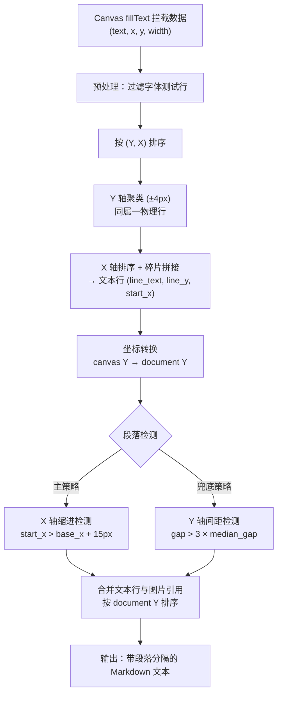
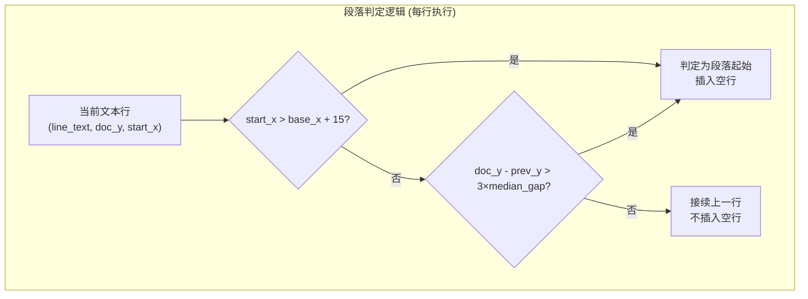

微信读书通过 Canvas `fillText` 渲染书籍内容，这意味着我们拦截到的是离散的文本碎片（text, x, y, width），而非结构化的 HTML 段落。**段落识别算法**的核心使命是将这些碎片重建为语义完整的段落——它需要在两个层级上完成结构化：先将同一行的碎片拼接为文本行（行重组），再将文本行切分为段落（段落检测）。整个算法采用 **X 轴缩进检测（主策略）+ Y 轴间距分析（兜底策略）** 的双重判定机制，确保在排版规范的书籍和排版异常的场景下均能正确识别段落边界。

Sources: [scraper.py](src/weread/scraper.py#L87-L289)

## 算法全景：从碎片到段落的数据流

在深入每个阶段之前，先建立对算法全局流程的认知。以下流程图展示了从 Canvas 原始数据到最终段落数据的完整转换链路：

Sources: [scraper.py](src/weread/scraper.py#L104-L289)

## 第一阶段：文本行重组算法

### 原始数据预处理

Canvas 拦截脚本在每个 `fillText` 调用时记录四个值：文本内容 `text`、X 坐标、Y 坐标和文本渲染宽度 `w`（通过 `measureText` 计算）。预处理阶段需要完成两项工作：**过滤字体测试行**和**构建标准化条目列表**。

微信读书在每次页面加载时会渲染一行固定的字体测试文本（`abcdefghijklmnopqrstuvwxyz...`），用于测量字符宽度。算法通过一个 `skip` 标志位跳过所有以该前缀开头的条目——一旦遇到第一个非测试文本，标志位即关闭，后续文本不再受此过滤影响。

Sources: [scraper.py](src/weread/scraper.py#L32-L43) · [scraper.py](src/weread/scraper.py#L122-L137)

### Y 轴聚类：同一物理行的判定

经过预处理后的条目按 `(y, x)` 二级排序，算法以 **±4px 容差**作为 Y 轴聚类阈值：遍历排序后的条目，当新条目的 Y 值与当前聚类中心 `cur_y` 的偏差超过 4 像素时，即认为进入新的物理行。这个容差值的选择基于排版实践——同一行文本的 `fillText` 调用通常会有微小的亚像素偏移（由字体度量、Canvas 渲染管线引入），但不会超过 4 像素。

Sources: [scraper.py](src/weread/scraper.py#L139-L159)

### X 轴碎片拼接

同一物理行内的多个 `fillText` 碎片按 X 坐标排序后，由 `_join_line_fragments` 函数完成拼接。该函数的拼接逻辑极为精确：维护一个 `prev_end` 指针（前一个碎片的 `x + w`），计算当前碎片与前碎片的 X 间距 `gap`。当 `gap > 2` 时插入一个空格——这个阈值设计巧妙地处理了中英文混排场景：中文文字碎片紧密排列时 gap 接近 0，不加空格；而中英文之间或标点后的间隔大于 2px 时，自动插入空格。

Sources: [scraper.py](src/weread/scraper.py#L87-L101)

以下表格展示了碎片拼接的典型场景：

| 场景 | 碎片序列 | X 间距 | 拼接结果 |
|------|----------|--------|----------|
| 中文连续文本 | `("认知", 50, ...)`, `("觉醒", 100, ...)` | gap ≈ 0 | `认知觉醒` |
| 中英文混排 | `("本章将", 50, ...)`, `("explain", 110, ...)` | gap > 2 | `本章将 explain` |
| 单碎片行 | `("一句话。")` | — | `一句话。`（直接返回） |

Sources: [scraper.py](src/weread/scraper.py#L87-L101)

### 坐标空间转换

Canvas 内部的 Y 坐标是相对于 Canvas 元素自身的局部坐标，需要加上 Canvas 元素在文档中的偏移量才能得到文档全局 Y 坐标。算法通过 `getBoundingClientRect().top + window.scrollY` 计算主 Canvas 的文档偏移 `canvas_top`，然后将所有文本行的 Y 值加上该偏移——这使得文本行可以与 DOM 图片元素按统一的文档坐标进行排序和合并。

Sources: [scraper.py](src/weread/scraper.py#L161-L168) · [scraper.py](src/weread/scraper.py#L237-L238)

## 第二阶段：段落检测核心算法

### 主策略：X 轴缩进检测

中文书籍的传统排版规则是**段落首行缩进两个字符**。Canvas 渲染忠实反映这一排版——首行文本的 X 起始坐标会明显大于后续行。算法利用这一特征实现主策略：

1. 收集所有文本行的 `start_x` 值，取最小值作为 **`base_x`**（代表正文非缩进行的标准左边界）
2. 设定 **`indent_threshold = 15`**（像素），当某行的 `start_x > base_x + indent_threshold` 时，判定为段落起始行

这个 15px 阈值的选择经过了精度权衡：中文字符在典型阅读字号下宽度约为 14-16px，缩进两个字符即约 28-32px，15px 的阈值既能可靠区分缩进行与非缩进行，又能容忍行首微小的 X 坐标抖动。

Sources: [scraper.py](src/weread/scraper.py#L243-L246) · [scraper.py](src/weread/scraper.py#L273-L276)

### 兜底策略：Y 轴间距分析

当书籍排版不遵循首行缩进规则（例如代码段落、列表、英文混排等），X 轴缩进检测会失效。此时算法启用 **Y 轴间距分析**作为兜底策略：

1. 收集所有文本行的 Y 坐标，去重后排序
2. 计算相邻 Y 坐标之间的间距集合 `gaps`
3. 对 `gaps` 排序后取中位数 `median_gap`，代表**正文行间距的典型值**
4. 设定段落阈值 `y_para_threshold = median_gap × 3`——当两行之间的 Y 间距超过 3 倍行距时，判定为段落分隔

中位数的统计方法对异常值具有天然的鲁棒性：即使文档中存在少数超大间距（如章节标题前的空距），也不会显著影响行间距中位数。三倍乘数则确保只有真正的段落间隔（而非行间距的正常波动）才触发分段。当行数少于 3 时，算法退化使用固定阈值 `100px`。

Sources: [scraper.py](src/weread/scraper.py#L248-L254) · [scraper.py](src/weread/scraper.py#L277-L279)

### 双策略协同逻辑

两种策略在 `_collect_chapter_content` 的主循环中以 **OR 逻辑** 协同工作——只要任一策略判定为段落起始，即插入空行分隔。这意味着：

- 标准缩进排版：X 轴缩进检测足以识别所有段落边界，Y 轴分析作为安全兜底
- 无缩进排版：Y 轴间距分析承担主要判定职责
- 混合排版：两种策略互补覆盖各自擅长的场景

Sources: [scraper.py](src/weread/scraper.py#L263-L283)

Sources: [scraper.py](src/weread/scraper.py#L272-L283)

## 第三阶段：文本与图片的融合排序

完成段落检测后，算法将文本行和图片引用统一放入一个混合列表，按文档 Y 坐标排序。图片元素的特殊处理规则为：在图片前后各插入一个空行，并重置 `prev_text_y`（因为图片中断了文本流的 Y 轴连续性，不应将图片前的文本 Y 用于图片后第一行的间距比较）。这个细节至关重要——如果不重置，图片高度导致的 Y 间距跳变可能被误判为段落分隔，造成重复空行。

Sources: [scraper.py](src/weread/scraper.py#L256-L289)

## 关键参数速查

| 参数 | 值 | 作用域 | 选取依据 |
|------|----|--------|----------|
| `Y_CLUSTER_TOLERANCE` | 4px | 行重组 Y 轴聚类 | 同行碎片亚像素偏移上界 |
| `X_GAP_THRESHOLD` | 2px | 碎片拼接空格插入 | 中文连续文字间距阈值 |
| `indent_threshold` | 15px | 缩进检测 | 中文字符宽度下界的近似值 |
| `y_para_threshold` | `median_gap × 3` | Y 轴间距检测 | 3 倍行距的统计显著性阈值 |
| `y_para_threshold`（退化） | 100px | Y 轴间距检测（行数<3） | 合理的绝对段落间距常量 |

Sources: [scraper.py](src/weread/scraper.py#L87-L101) · [scraper.py](src/weread/scraper.py#L243-L254)

## 后处理：格式化引擎的段落收尾

段落识别算法的输出是以空行分隔的 Markdown 文本，由 [Markdown 生成：文本格式化与图片资源管理](14-markdown-sheng-cheng-wen-ben-ge-shi-hua-yu-tu-pian-zi-yuan-guan-li) 中的 `_format_chapter_text` 函数进行二次收尾：它将双空行（`\n\n+`）作为段落分隔符重新切分，将每个段落内的物理行拼接为连续文本（中文不加空格），最终输出规范的单层 `"\n\n"` 分隔格式。EPUB 转换器中的 HTML 生成也采用了类似的段落切分逻辑。

Sources: [converter.py](src/weread/converter.py#L14-L29) · [converter.py](src/weread/converter.py#L100-L117)

## 延伸阅读

- 了解 Canvas 拦截机制如何产生本算法的输入数据：[Canvas 文字拦截原理：fillText 钩子与文本行重组算法](8-canvas-wen-zi-lan-jie-yuan-li-filltext-gou-zi-yu-wen-ben-xing-zhong-zu-suan-fa)
- 了解段落识别后的下游格式化处理：[Markdown 生成：文本格式化与图片资源管理](14-markdown-sheng-cheng-wen-ben-ge-shi-hua-yu-tu-pian-zi-yuan-guan-li) 和 [EPUB 构建：电子书结构与图片嵌入](15-epub-gou-jian-dian-zi-shu-jie-gou-yu-tu-pian-qian-ru)
- 了解图片提取如何与段落识别协同：[Canvas 图片提取：drawImage 钩子与 DOM 图片双重采集](9-canvas-tu-pian-ti-qu-drawimage-gou-zi-yu-dom-tu-pian-shuang-zhong-cai-ji)