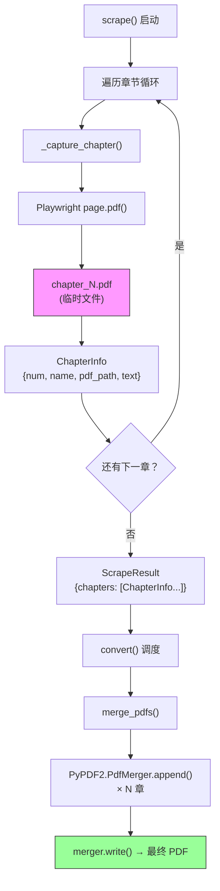

本项目采用 **"分章采集、统一合并"** 的两阶段策略来生成最终 PDF 电子书：抓取阶段由 Playwright 将每一章渲染为独立的单页 PDF 文件，转换阶段再由 `PyPDF2.PdfMerger` 按章节顺序将这些碎片拼接为一本完整的书。这种设计将 **内容抓取** 与 **格式组装** 解耦——每一章的 PDF 是一个自包含的中间产物，既可用于合并，也可独立校验。本文将从数据模型、单章 PDF 生成、合并引擎实现、错误处理策略和测试验证五个维度，完整拆解这一机制。

Sources: [converter.py](src/weread/converter.py#L1-L11), [scraper.py](src/weread/scraper.py#L405-L416)

## 整体数据流：从章节采集到合并输出

理解 PDF 合并的关键在于看清数据在模块间的流转路径。抓取器（`scraper`）负责遍历书的每一个章节，每次循环都会渲染当前页面并通过 Playwright 的 `page.pdf()` 将其保存为临时文件 `chapter_N.pdf`，同时将文件路径写入 `ChapterInfo` 数据结构。当所有章节遍历完毕后，`ScrapeResult` 携带着完整的章节列表进入转换器（`converter`），由 `merge_pdfs` 函数完成最终的拼接输出。

下面的流程图展示了这一从 URL 到合并 PDF 的完整数据流：



Sources: [scraper.py](src/weread/scraper.py#L435-L492), [converter.py](src/weread/converter.py#L142-L170)

## 数据模型：章节信息与抓取结果

PDF 合并的输入是 `ScrapeResult` 对象，其中 `chapters` 字段是一个有序的 `ChapterInfo` 列表。合并函数仅依赖两个字段：**`pdf_path`**（每章 PDF 的临时文件路径）和列表的天然顺序（由 `chapter_num` 递增保证）。`text` 字段在 PDF 合并流程中不参与运算，它服务于 Markdown 和 EPUB 的文本转换路径。

```python
@dataclass
class ChapterInfo:
    num: int          # 章节序号，从 1 开始递增
    name: str         # 章节标题
    pdf_path: Path    # 单章 PDF 的临时文件路径
    text: str = ""    # 章节文本内容（PDF 合并不使用）

@dataclass
class ScrapeResult:
    book_name: str
    chapters: list[ChapterInfo] = field(default_factory=list)
    skipped: list[str] = field(default_factory=list)
    temp_dir: str = ""   # 临时目录，存放 chapter_N.pdf 和 images/
```

值得注意的是，`chapters` 列表的顺序即为目标 PDF 的页面顺序——抓取循环按 `chapter_num = 1, 2, 3, ...` 依次 `append`，天然保证了正序排列。`skipped` 列表记录因渲染超时而跳过的章节，这些章节不参与合并，意味着最终 PDF 可能存在章节缺失。

Sources: [scraper.py](src/weread/scraper.py#L419-L433)

## 单章 PDF 生成：Playwright 页面打印

合并的每一个"零件"都是 Playwright 在抓取阶段即时生成的。`_capture_chapter` 函数在完成文本和图片采集后，调用 `page.pdf()` 将当前浏览器页面打印为 PDF 文件。这里的参数选择直接影响最终合并 PDF 的视觉效果：

| 参数 | 值 | 作用 |
|------|------|------|
| `path` | `chapter_{num}.pdf` | 输出到临时目录，按章节编号命名 |
| `print_background` | `True` | 保留页面背景色和 Canvas 渲染内容 |
| `width` | `800px` | 固定页面宽度，与浏览器视口一致 |
| `height` | `{scrollHeight}px` | 页面高度自适应实际内容长度 |
| `margin` | 全部 `0` | 无边距，内容占满整页 |
| `media` | `screen` | 使用屏幕媒体查询样式（`emulate_media`） |

**高度自适应**是这一方案的核心设计：`scrollHeight` 取自 `document.documentElement.scrollHeight`，确保每个章节生成一个高度恰好容纳全部内容的单页 PDF。这意味着不同章节的 PDF 页面高度可能差异很大（短章节可能 2000px，长章节可能 10000px），但每一章内部不会出现分页断裂。

`emulate_media(media="screen")` 的调用确保 Playwright 使用屏幕样式表而非打印样式表——因为微信读书的内容是通过 Canvas 渲染的，屏幕样式才能正确呈现。

Sources: [scraper.py](src/weread/scraper.py#L333-L416)

## 合并引擎：PyPDF2.PdfMerger 的使用

`merge_pdfs` 是整个 PDF 合并的核心函数，其实现极为简洁——仅 10 行有效代码，却完成了从 N 个独立文件到单一 PDF 的完整转换：

```python
def merge_pdfs(result: ScrapeResult, output_path: Path) -> None:
    try:
        merger = PyPDF2.PdfMerger()
        for ch in result.chapters:
            merger.append(str(ch.pdf_path))
        with open(output_path, "wb") as f:
            merger.write(f)
        merger.close()
    except Exception as e:
        raise ConvertError("pdf", str(e)) from e
```

这里选择 **`PdfMerger`** 而非 `PdfWriter` 是一个关键的设计决策。两者的核心区别在于操作粒度：

| 特性 | `PdfMerger` | `PdfWriter` |
|------|-------------|-------------|
| 操作粒度 | 文件级（整体追加） | 页面级（逐页添加） |
| 使用方式 | `merger.append(file_path)` | `writer.add_page(page)` |
| 适用场景 | 多文件按序拼接 | 精细页面操作（插入、删除、重排） |
| 代码复杂度 | 低——直接传入路径 | 高——需先读取再逐页操作 |

在本项目中，每章 PDF 是一个完整的不可分割单元（单页、无内部断裂），使用 `PdfMerger.append()` 直接按路径追加是最自然的选择。`append` 方法内部会自动打开文件、读取所有页面并按顺序追加到合并队列中。

**资源管理**方面，代码使用显式的 `merger.close()` 调用来释放内部文件句柄。合并操作通过 `with open(output_path, "wb")` 确保输出文件的正确写入和关闭。`PdfMerger` 本身也支持上下文管理器（`with` 语法），但当前实现选择了显式 `close`，功能等价。

Sources: [converter.py](src/weread/converter.py#L32-L41)

## 错误处理策略：统一异常包装

合并函数的 `try/except` 块捕获所有异常并转换为 `ConvertError`，这是项目统一错误处理体系的一环。`ConvertError` 继承自 `WereadError`，携带 `format_name` 字段标识失败的具体格式：

```python
class ConvertError(WereadError):
    def __init__(self, format_name: str, reason: str):
        self.format_name = format_name
        super().__init__(f"Failed to convert to {format_name}: {reason}")
```

可能触发异常的场景包括：章节 PDF 临时文件被意外删除（`FileNotFoundError`）、PDF 文件损坏导致 `PyPDF2` 解析失败、输出路径无写入权限（`PermissionError`）等。无论底层抛出什么异常，上层调用者（`convert` 函数）都能统一捕获 `ConvertError`，打印友好的错误信息并继续尝试其他格式的转换，不会因为单一格式失败而中断整个流程。

Sources: [converter.py](src/weread/converter.py#L32-L41), [errors.py](src/weread/errors.py#L14-L18)

## 调度入口：convert() 函数的 PDF 分支

`merge_pdfs` 并不被直接调用，而是通过统一调度函数 `convert()` 间接触发。当用户指定输出格式包含 `pdf` 时，`convert` 构造输出路径 `{book_name}.pdf` 并调用 `merge_pdfs`。调度函数的设计确保了三种格式（PDF、EPUB、Markdown）可以并行生成、互不干扰：

```python
for fmt in formats:
    out_path = output_dir / f"{safe_name}.{fmt}"
    try:
        if fmt == "pdf":
            merge_pdfs(result, out_path)
        elif fmt == "epub":
            convert_to_epub(result, out_path)
        elif fmt == "md":
            convert_to_markdown(result, out_path)
    except ConvertError as e:
        print(f"   ✗ {fmt} 转换失败: {e}")
```

每个格式的转换独立运行在自己的 `try` 块中。如果 PDF 合并失败，`ConvertError` 被捕获后仅打印警告，循环继续处理 EPUB 和 Markdown。最终返回的 `outputs` 字典仅包含成功生成的格式及其路径，调用者据此判断是否有任何产出。

Sources: [converter.py](src/weread/converter.py#L142-L170), [cli.py](src/weread/cli.py#L60-L79)

## 临时文件生命周期

章节 PDF 存放在 `tempfile.mkdtemp(prefix="weread_")` 创建的临时目录中，其生命周期由 CLI 层管理：

1. **创建**：`scrape()` 启动时创建临时目录 [scraper.py](src/weread/scraper.py#L441)
2. **写入**：每章抓取完成后，`page.pdf()` 将单章 PDF 写入 `temp_dir/chapter_N.pdf` [scraper.py](src/weread/scraper.py#L405-L414)
3. **读取**：`merge_pdfs` 从临时目录读取所有章节 PDF 进行合并 [converter.py](src/weread/converter.py#L35-L36)
4. **清理**：`cli.py` 的 `finally` 块执行 `shutil.rmtree(result.temp_dir)` 清除所有临时文件 [cli.py](src/weread/cli.py#L97-L99)

即使在用户中断（`KeyboardInterrupt`）的场景下，清理逻辑也会在保存已有内容后执行。这意味着 `merge_pdfs` 执行时临时文件一定是可用的——如果临时目录被提前清理，那将是代码逻辑错误而非竞态条件。

Sources: [cli.py](src/weread/cli.py#L84-L99), [scraper.py](src/weread/scraper.py#L440-L444)

## 测试验证策略

`TestMergePdfs` 测试类通过构造模拟的 `ScrapeResult` 来验证合并逻辑的正确性。测试使用 `PdfWriter` 生成包含空白页的虚拟 PDF 作为章节输入，避免了对真实浏览器和微信读书的依赖：

| 测试用例 | 验证内容 | 关键断言 |
|----------|----------|----------|
| `test_merge_creates_file` | 合并后文件存在且非空 | `out.exists()` + `st_size > 0` |
| `test_merge_page_count` | 页数与章节数一致 | `len(reader.pages) == 3` |

页面计数测试尤为重要——它直接验证了 `PdfMerger.append()` 的核心语义：每个章节 PDF 的全部页面都被完整保留到合并结果中。3 个章节各含 1 页空白 PDF，合并后应恰好 3 页。

测试辅助函数 `_make_result` 构造了完整的测试夹具：创建 `count` 个 `ChapterInfo`，每个指向一个真实的空白 PDF 文件，并填充模拟文本。这种设计使得测试既不依赖网络，也不依赖浏览器，可以快速、稳定地运行。

Sources: [test_converter.py](tests/test_converter.py#L1-L46)

## 设计权衡与局限性

当前实现选择了 **简洁性优先** 的策略，这带来了一些值得注意的特性与局限：

**优势方面**，`PdfMerger.append()` 的文件级操作使代码极其简洁，每个章节作为原子单元参与合并，不存在页面错位的风险。抓取与合并的两阶段分离也使得中间产物（单章 PDF）可以独立校验——如果某章内容异常，可以直接打开对应的 `chapter_N.pdf` 排查。

**局限方面**，每章生成单页 PDF 意味着最终合并 PDF 的每一"页"高度各异，在标准 PDF 阅读器中可能体验不佳（无法按固定页面大小翻页）。此外，合并后的 PDF 缺乏书签/目录元数据——章节标题信息（`ChapterInfo.name`）未被写入 PDF 的 outline 结构，读者无法通过目录快速跳转。最后，由于跳过的章节（`skipped`）不参与合并，最终 PDF 可能存在章节缺失，用户需通过 CLI 的警告信息了解具体情况。

若需进一步了解其他格式的转换实现，可继续阅读 [Markdown 生成：文本格式化与图片资源管理](14-markdown-sheng-cheng-wen-ben-ge-shi-hua-yu-tu-pian-zi-yuan-guan-li) 和 [EPUB 构建：电子书结构与图片嵌入](15-epub-gou-jian-dian-zi-shu-jie-gou-yu-tu-pian-qian-ru)。要理解 PDF 合并的上游数据如何产生，可参考 [章节遍历与翻页逻辑](10-zhang-jie-bian-li-yu-fan-ye-luo-ji) 和 [Canvas 文字拦截原理：fillText 钩子与文本行重组算法](8-canvas-wen-zi-lan-jie-yuan-li-filltext-gou-zi-yu-wen-ben-xing-zhong-zu-suan-fa)。多格式并行调度的完整机制则在 [统一转换入口：多格式并行转换机制](16-tong-zhuan-huan-ru-kou-duo-ge-shi-bing-xing-zhuan-huan-ji-zhi) 中详述。