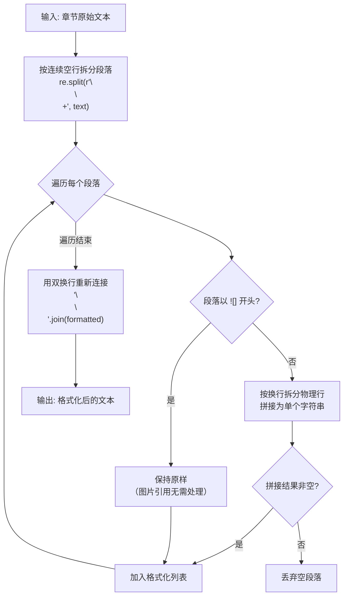
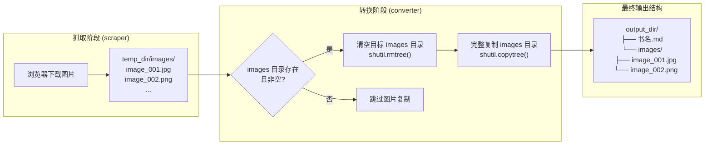

Markdown 转换模块是将抓取结果转化为可读性最佳的纯文本格式的核心引擎。它接收来自 [Canvas 文字拦截原理](8-canvas-wen-zi-lan-jie-yuan-li-filltext-gou-zi-yu-wen-ben-xing-zhong-zu-suan-fa) 和 [Canvas 图片提取](9-canvas-tu-pian-ti-qu-drawimage-gou-zi-yu-dom-tu-pian-shuang-zhong-cai-ji) 的原始章节文本，经过段落重排与图片引用整理，最终输出一份结构清晰的 Markdown 文件及其配套图片资源目录。整个流程由 `convert_to_markdown()` 主函数和 `_format_chapter_text()` 格式化辅助函数协作完成，涵盖三个关键职责：文档结构组装、物理行合并与图片资源迁移。

Sources: [converter.py](src/weread/converter.py#L1-L64)

## 输入数据模型：从抓取到转换的数据契约

Markdown 转换器的输入是 `ScrapeResult` 数据类，它由 [整体架构](4-zheng-ti-jia-gou-cong-url-dao-dian-zi-shu-de-wan-zheng-shu-ju-liu) 中的 `scrape()` 函数产出。该数据结构承载了转换所需的全部信息：

| 字段 | 类型 | 说明 |
|---|---|---|
| `book_name` | `str` | 书名，用作 Markdown 一级标题 |
| `chapters` | `list[ChapterInfo]` | 有序章节列表 |
| `temp_dir` | `str` | 临时目录路径，内含 `images/` 子目录 |
| `skipped` | `list[str]` | 跳过章节的记录（Markdown 不使用） |

每个 `ChapterInfo` 包含四个字段：`num`（章节序号）、`name`（章节标题）、`pdf_path`（PDF 路径，Markdown 不使用）、`text`（原始章节文本）。其中 `text` 字段是转换器最核心的输入——它是一个由 [段落识别算法](12-duan-luo-shi-bie-suan-fa-suo-jin-jian-ce-yu-y-zhou-jian-ju-fen-xi) 生成的预格式化字符串，段落之间以空行 `\n\n` 分隔，图片以 Markdown 语法 `` 内嵌于文本流中。

Sources: [scraper.py](src/weread/scraper.py#L419-L433), [scraper.py](src/weread/scraper.py#L256-L289)

## 文本格式化：物理行合并算法

`_format_chapter_text()` 函数解决一个核心问题：Canvas 渲染产生的文本行是按视觉位置切割的物理行，需要将同一逻辑段落内的物理行无缝拼接。其处理逻辑如下：



**关键设计决策**：物理行合并时使用 `"".join()` 而非 `" ".join()`，这是针对中文文本的刻意选择——中文排版中行尾不存在空格，物理行截断点是字符边界而非词边界，直接拼接即可还原完整语句。这种设计对中英混排同样有效，因为英文单词若在一行末尾被截断，下一个物理行会以空格开头（由 [段落识别算法](12-duan-luo-shi-bie-suan-fa-suo-jin-jian-ce-yu-y-zhou-jian-ju-fen-xi) 中的 X 坐标间隙检测保证）。图片段落以 `

## 文档结构组装：从章节列表到完整 Markdown

`convert_to_markdown()` 是 Markdown 生成的入口函数，负责将 `ScrapeResult` 组装为符合 Markdown 规范的完整文档。其组装流程遵循一个清晰的层级结构：

```
# {book_name}          ← 一级标题（书名）

## {chapter_1_name}    ← 二级标题（章节名）
{formatted_text_1}     ← 格式化后的正文

## {chapter_2_name}
{formatted_text_2}

...                    ← 依次遍历所有章节
```

该函数的实现逻辑可拆解为四个阶段：

| 阶段 | 操作 | 代码位置 |
|---|---|---|
| **标题行生成** | `f"# {result.book_name}\n"` 写入书名作为一级标题 | L46 |
| **章节遍历** | 遍历 `result.chapters`，为每章生成 `## {ch.name}\n` | L47-L53 |
| **正文处理** | 有文本则调用 `_format_chapter_text()`，无文本则输出 `*(此章无内容)*` | L49-L52 |
| **文件写入** | 用 UTF-8 编码将拼接后的内容写入目标路径 | L54 |

空章节的处理体现了防御性设计思想——当 `ch.text` 为空字符串或 `None` 时，输出斜体占位文本 `*(此章无内容)*`，确保生成的 Markdown 文件中每个章节标题下都有可见内容，避免出现连续标题导致的渲染异常。

Sources: [converter.py](src/weread/converter.py#L44-L64)

## 图片资源管理：从临时目录到输出目录的迁移

Markdown 中的图片引用使用相对路径 ``，这意味着图片文件必须位于 Markdown 文件同级目录下的 `images/` 文件夹中。图片资源管理分为两个阶段——**抓取阶段下载**与**转换阶段迁移**：



迁移逻辑包含两个重要的防御性检查：第一，通过 `src_images.exists()` 确认临时图片目录确实存在；第二，通过 `any(src_images.iterdir())` 确认目录非空——这避免了无图片书籍产生空 `images/` 目录。如果目标 `images/` 目录已存在（例如重复导出同一本书），会先执行 `shutil.rmtree()` 清理旧文件，再通过 `shutil.copytree()` 完整复制，确保图片资源始终与最新抓取结果一致。

Sources: [converter.py](src/weread/converter.py#L56-L62), [scraper.py](src/weread/scraper.py#L70-L84)

## 异常处理与错误传播

Markdown 转换的异常处理遵循项目统一的 [自定义异常体系](5-zi-ding-yi-yi-chang-ti-xi-yu-cuo-wu-chu-li-ce-lue)。`convert_to_markdown()` 将所有操作包裹在 `try/except` 块中，捕获全部异常并转换为 `ConvertError`：

```python
except Exception as e:
    raise ConvertError("markdown", str(e)) from e
```

这里使用 `from e` 保留原始异常链，便于调试时追溯根本原因。可能触发异常的场景包括：输出路径无写入权限（`PermissionError`）、磁盘空间不足（`OSError`）、图片目录复制失败等。在 [统一转换入口](16-tong-zhuan-huan-ru-kou-duo-ge-shi-bing-xing-zhuan-huan-ji-zhi) 的 `convert()` 函数中，`ConvertError` 会被单独捕获并打印错误信息，不会阻断其他格式的转换——即使 Markdown 生成失败，PDF 和 EPUB 仍可正常输出。

Sources: [converter.py](src/weread/converter.py#L63-L64), [errors.py](src/weread/errors.py#L14-L18), [converter.py](src/weread/converter.py#L166-L168)

## 转换测试验证策略

测试模块通过 `_make_result()` 工厂函数构建模拟的 `ScrapeResult` 对象，其中每个章节的 `text` 字段包含用换行符分隔的模拟正文。`TestConvertToMarkdown` 测试类验证了两个核心行为：文件成功创建（`out.exists()`）和章节结构正确（`"## 第1章" in content`、`"第1章的正文内容" in content`）。这种测试设计专注于接口契约而非内部实现——验证输入与输出的映射关系，不依赖具体的格式化逻辑细节，确保未来重构 `_format_chapter_text()` 时测试用例无需修改。

Sources: [test_converter.py](tests/test_converter.py#L48-L57)

## 延伸阅读

Markdown 转换是三种输出格式中逻辑最简洁的实现。对比其他格式的转换策略，可以更深入地理解本模块的设计取舍：

- [EPUB 构建：电子书结构与图片嵌入](15-epub-gou-jian-dian-zi-shu-jie-gou-yu-tu-pian-qian-ru) — EPUB 需要将图片内嵌到电子书包内，图片处理更为复杂
- [统一转换入口：多格式并行转换机制](16-tong-zhuan-huan-ru-kou-duo-ge-shi-bing-xing-zhuan-huan-ji-zhi) — 三种格式共享统一的调用与错误处理框架
- [段落识别算法：缩进检测与 Y 轴间距分析](12-duan-luo-shi-bie-suan-fa-suo-jin-jian-ce-yu-y-zhou-jian-ju-fen-xi) — Markdown 转换器所消费的段落结构的生产端