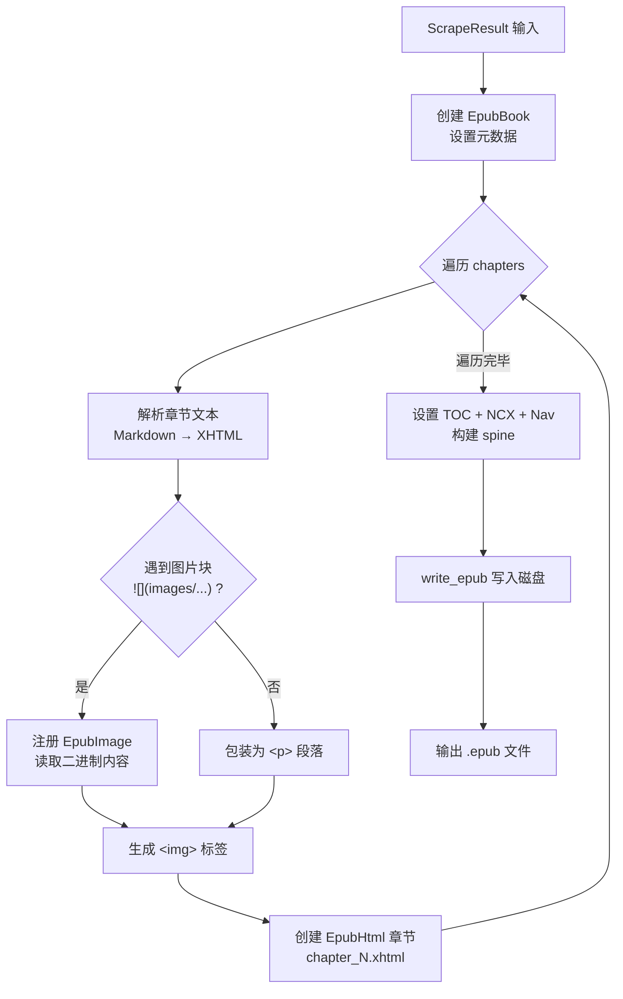
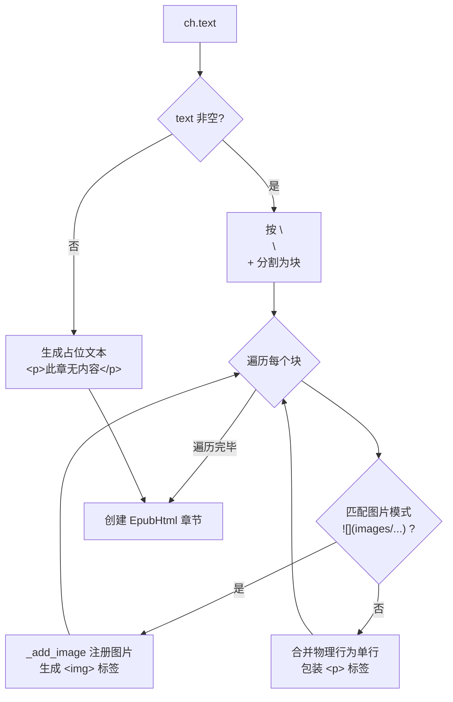

本文深入解析 weread-scrapy 项目中 EPUB 电子书的构建过程——从抓取结果（`ScrapeResult`）到最终 `.epub` 文件的完整转换管线。你将了解 ebooklib 库如何被编排来生成符合标准的电子书，以及图片资源如何被嵌入到 EPUB 容器中。

Sources: [converter.py](src/weread/converter.py#L67-L139)

## 数据模型：EPUB 的输入源

EPUB 构建函数 `convert_to_epub` 接收两个参数：`ScrapeResult`（抓取结果）和 `output_path`（输出路径）。理解输入数据结构是理解构建逻辑的前提。

抓取结果由两个核心 dataclass 组成：

| 数据类 | 字段 | 类型 | EPUB 构建中的角色 |
|---|---|---|---|
| `ScrapeResult` | `book_name` | `str` | 书名，映射为 EPUB 的 `title` 和 `identifier` |
| `ScrapeResult` | `chapters` | `list[ChapterInfo]` | 遍历生成各 XHTML 章节 |
| `ScrapeResult` | `temp_dir` | `str` | 定位 `images/` 子目录，读取图片二进制数据 |
| `ChapterInfo` | `num` | `int` | 生成 `chapter_{num}.xhtml` 文件名 |
| `ChapterInfo` | `name` | `str` | 章节标题，用于 XHTML 的 `<h1>` 和目录条目 |
| `ChapterInfo` | `text` | `str` | Markdown 风格文本，需解析转换为 XHTML |

每个 `ChapterInfo.text` 字段存储的是一种轻量 Markdown 格式：文本段落以 `\n\n` 分隔，图片以 `` 标记。这个格式在 [Canvas 文字拦截原理：fillText 钩子与文本行重组算法](8-canvas-wen-zi-lan-jie-yuan-li-filltext-gou-zi-yu-wen-ben-xing-zhong-zu-suan-fa) 和 [Canvas 图片提取：drawImage 钩子与 DOM 图片双重采集](9-canvas-tu-pian-ti-qu-drawimage-gou-zi-yu-dom-tu-pian-shuang-zhong-cai-ji) 中由抓取阶段生成。

Sources: [scraper.py](src/weread/scraper.py#L419-L432)

## 整体构建流程

`convert_to_epub` 函数遵循一个清晰的阶段式架构：**元数据初始化 → 图片预注册 → 章节内容转换 → 电子书骨架组装 → 写入磁盘**。以下流程图展示了这一管线：



整个函数被包裹在 `try/except` 块中，任何异常都会被包装为 `ConvertError("epub", ...)` 向上抛出，但已有的 `ConvertError` 会被原样透传，避免双层嵌套。

Sources: [converter.py](src/weread/converter.py#L67-L139), [errors.py](src/weread/errors.py#L14-L18)

## 元数据初始化

EPUB 电子书需要基本的元数据标识。函数使用 ebooklib 的 `EpubBook` API 进行三层设置：

```python
book = epub.EpubBook()
book.set_identifier(f"weread-{result.book_name}")
book.set_title(result.book_name)
book.set_language("zh")
```

- **identifier**：采用 `weread-` 前缀加书名的格式，确保在电子书管理器中具有唯一性
- **title**：直接使用抓取阶段获取的 `book_name`
- **language**：硬编码为 `"zh"`（中文），这与微信读书的内容语言一致

Sources: [converter.py](src/weread/converter.py#L69-L72)

## 图片预注册机制

EPUB 标准要求所有资源（包括图片）必须作为独立 item 注册到电子书的 manifest 中，然后才能在 XHTML 内容中引用。本项目采用了一种**惰性注册**（lazy registration）策略：在遍历章节文本时遇到图片引用才触发注册，而非预先批量加载所有图片。

### 媒体类型映射表

项目维护了一个扩展名到 MIME 类型的映射字典，覆盖了微信读书中常见的图片格式：

| 扩展名 | MIME 类型 | 说明 |
|---|---|---|
| `.jpg` / `.jpeg` | `image/jpeg` | 最常见格式 |
| `.png` | `image/png` | 含透明通道的图片 |
| `.gif` | `image/gif` | 动图 |
| `.webp` | `image/webp` | 新格式 |
| 其他 | `image/jpeg` | 兜底默认值 |

### 去重策略

通过 `added_images: set[str]` 集合跟踪已注册的文件名。当多个章节引用同一张图片时（例如书籍的装饰性插图），只会注册一次。这个设计基于一个前提：图片文件名在抓取阶段已经保证唯一——由 [Canvas 图片提取](9-canvas-tu-pian-ti-qu-drawimage-gou-zi-yu-dom-tu-pian-shuang-zhong-cai-ji) 中的 `_download_image` 函数从 URL 路径提取或 MD5 哈希生成。

### 注册函数详解

```python
def _add_image(fname: str) -> None:
    if fname in added_images or not images_dir.exists():
        return
    img_path = images_dir / fname
    if not img_path.exists():
        return
    ext = img_path.suffix.lower().lstrip(".")
    img_item = epub.EpubImage()
    img_item.uid = f"img_{re.sub(r'[^a-zA-Z0-9]', '_', fname)}"
    img_item.file_name = f"images/{fname}"
    img_item.media_type = _MEDIA_TYPES.get(ext, "image/jpeg")
    img_item.content = img_path.read_bytes()
    book.add_item(img_item)
    added_images.add(fname)
```

函数有三层守卫条件（已注册、目录不存在、文件不存在），确保鲁棒性。`uid` 通过正则替换非字母数字字符为下划线，生成符合 EPUB 规范的合法标识符。图片在 EPUB 容器内的路径统一为 `images/{fname}`，与 XHTML 中的 `` 路径保持一致。

Sources: [converter.py](src/weread/converter.py#L74-L95)

## 章节文本到 XHTML 的转换

这是 EPUB 构建的核心逻辑——将 Markdown 风格的文本转换为合法的 XHTML 片段。转换遵循一个简洁的模式匹配策略：



### 图片块识别

使用正则 `re.fullmatch(r"!\[\]\(images/([^)]+)\)", block)` 进行**完整匹配**（而非搜索）。这意味着一个块必须恰好是一个 Markdown 图片引用，不能包含其他文本。匹配成功后提取文件名，触发图片注册，并生成带 `max-width:100%` 样式的 `` 标签：

```python
html_parts.append(
    f''
)
```

`max-width:100%` 样式确保图片在电子阅读器中不会溢出屏幕宽度，这是一个关键的响应式设计考虑。

### 文本块处理

对于非图片的文本块，执行与 `_format_chapter_text` 相同的物理行合并逻辑：将 `block.splitlines()` 得到的各行去除首尾空白后直接拼接（中文文本不需要空格分隔）。合并后的文本被包装在 `<p>` 标签中：

```python
joined = "".join(line.strip() for line in block.splitlines() if line.strip())
if joined:
    html_parts.append(f"<p>{joined}</p>")
```

### 空章节处理

当 `ch.text` 为空时，生成 `<p>此章无内容</p>` 占位文本，保证每个章节的 XHTML 文件都有合法内容，避免电子阅读器解析异常。

Sources: [converter.py](src/weread/converter.py#L97-L128)

## 电子书骨架组装

所有章节转换完成后，需要组装 EPUB 的结构性元素——目录、导航和阅读顺序：

```python
book.toc = chapters_epub
book.add_item(epub.EpubNcx())
book.add_item(epub.EpubNav())
book.spine = ["nav"] + chapters_epub
```

这三个组件各有职责：

| 组件 | 作用 | EPUB 规范对应 |
|---|---|---|
| `book.toc` | 目录（Table of Contents） | EPUB 3 Navigation Document / EPUB 2 NCX |
| `EpubNcx()` | NCX 导航文件，供 EPUB 2 阅读器使用 | `toc.ncx` |
| `EpubNav()` | 导航文档，供 EPUB 3 阅读器使用 | `nav.xhtml` |
| `book.spine` | 定义线性阅读顺序 | `content.opf` 中的 `<spine>` 元素 |

spine 以 `"nav"` 开头（导航页），后跟所有章节按顺序排列。这确保读者在电子阅读器中翻页时能按正确顺序浏览全书。`chapters_epub` 列表的顺序与 `result.chapters` 一致，即抓取阶段 [章节遍历与翻页逻辑](10-zhang-jie-bian-li-yu-fan-ye-luo-ji) 中的遍历顺序。

每个 `EpubHtml` 章节对象的 `file_name` 采用 `chapter_{ch.num}.xhtml` 格式，`lang` 设为 `"zh"`，内容由 `<h1>` 标题和转换后的 XHTML 片段拼接而成。

Sources: [converter.py](src/weread/converter.py#L121-L135)

## 最终写入与错误处理

组装完成后，`epub.write_epub(str(output_path), book)` 将整个电子书写入磁盘。该函数会自动生成 `META-INF/container.xml`、`content.opf` 等标准 EPUB 容器文件，并将所有资源（XHTML、图片、导航文件）打包为符合规范的 `.epub` 文件（本质上是 ZIP 格式）。

错误处理采用双层策略：
- `ConvertError` 被原样透传（`except ConvertError: raise`），保留原始错误上下文
- 其他所有异常被包装为 `ConvertError("epub", str(e))`，统一由 [自定义异常体系与错误处理策略](5-zi-ding-yi-yi-chang-ti-xi-yu-cuo-wu-chu-li-ce-lue) 中的机制处理

Sources: [converter.py](src/weread/converter.py#L135-L139)

## 测试验证策略

项目的 EPUB 测试专注于**端到端验证**——构造模拟数据，执行完整转换流程，验证输出文件的基本合法性：

```python
def test_creates_epub_file(self, tmp_path):
    result = _make_result(tmp_path, count=2)
    out = tmp_path / "book.epub"
    convert_to_epub(result, out)
    assert out.exists()
    assert out.stat().st_size > 0
```

`_make_result` 辅助函数创建包含 2-3 个章节的 `ScrapeResult`，每章带有文本内容和虚拟 PDF 路径。测试验证生成的 EPUB 文件确实存在且非空。这种测试策略的优势在于：它覆盖了从数据输入到文件输出的完整管线，确保 ebooklib 的调用链不会因参数错误而中断。

更深入的测试策略讨论请参阅 [转换器单元测试：PDF、Markdown、EPUB 验证策略](18-zhuan-huan-qi-dan-yuan-ce-shi-pdf-markdown-epub-yan-zheng-ce-lue)。

Sources: [test_converter.py](tests/test_converter.py#L60-L67), [test_converter.py](tests/test_converter.py#L19-L27)

## 设计权衡与延伸阅读

本项目的 EPUB 构建采用了一种**直写模式**（write-through pattern）——不引入中间抽象层，直接从 Markdown 文本生成 XHTML。这使得代码简洁易读，但也意味着如果未来需要支持更复杂的排版（如表格、代码块、脚注），当前的块级解析逻辑需要扩展。

图片的惰性注册是一个值得注意的设计选择：它将图片管理与章节遍历耦合在一起，避免了预先扫描所有图片的开销，但也意味着如果图片文件在抓取阶段损坏或缺失，问题只会在注册时被静默跳过（`if not img_path.exists(): return`），而不会产生警告。

要了解 EPUB 构建如何被上层调度机制编排，请继续阅读 [统一转换入口：多格式并行转换机制](16-tong-zhuan-huan-ru-kou-duo-ge-shi-bing-xing-zhuan-huan-ji-zhi)。