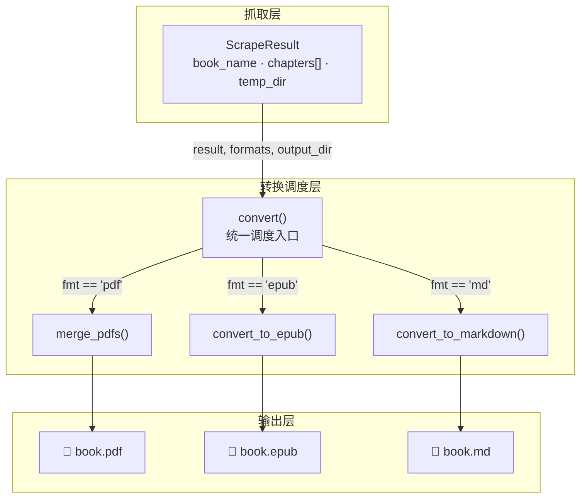
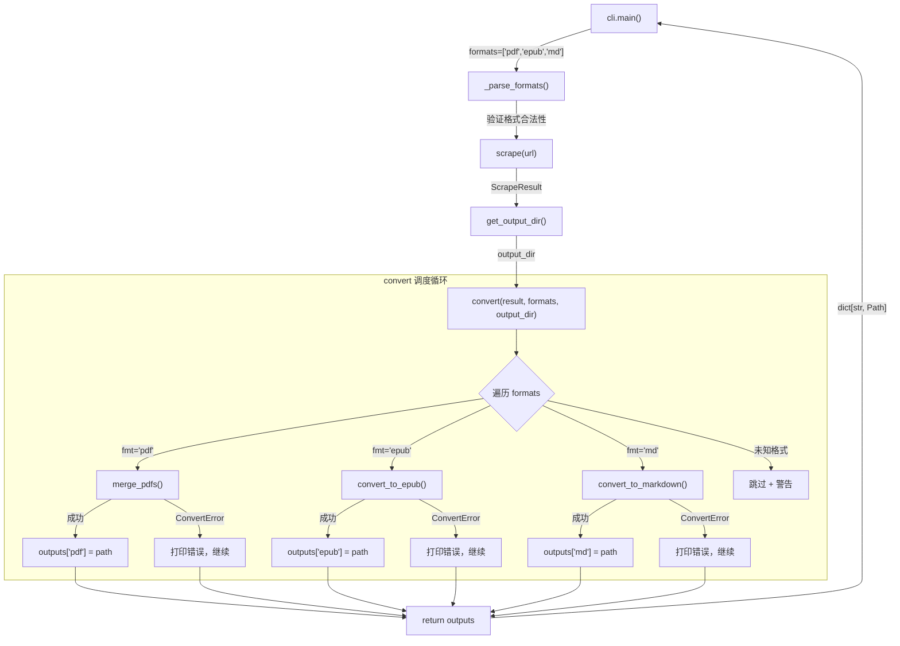

在完成了抓取阶段的工作后，`ScrapeResult` 中已经积累了整本书的章节文本、PDF 页面路径和图片资源。然而这些原始数据并不能直接交付给用户——它们需要被转换为可读的电子书格式。`convert()` 函数正是这一转换过程的**统一调度中心**：它接收抓取结果和用户指定的格式列表，将任务分发到三个独立的格式转换器，并通过容错机制确保单格式失败不会阻断其他格式的生成。本文将深入解析这个多格式并行转换机制的调度逻辑、格式路由策略和错误隔离设计。

Sources: [converter.py](src/weread/converter.py#L142-L170), [cli.py](src/weread/cli.py#L68)

## 架构定位：转换层在数据流中的位置

在整体数据流中，转换层位于**抓取层与输出层之间**。抓取层（`scraper.py`）负责从微信读书提取原始数据并封装为 `ScrapeResult`，转换层（`converter.py`）则负责将这个统一的数据模型转换为用户可消费的文件格式。下面的架构图展示了 `convert()` 函数作为调度核心的位置关系：



`convert()` 函数的签名设计体现了它的调度本质——它不关心具体格式如何生成，只负责**格式路由、路径构建和异常隔离**。三个格式转换器（`merge_pdfs`、`convert_to_epub`、`convert_to_markdown`）各自拥有完全独立的实现逻辑，互不依赖。

Sources: [converter.py](src/weread/converter.py#L142-L170)

## convert() 核心调度逻辑

`convert()` 函数的实现仅约 20 行代码，但其设计蕴含了三个关键决策：输出路径构建、格式路由和错误隔离。

### 输出路径构建

函数以 `book_name` 作为文件名前缀，直接拼接用户指定的扩展名生成输出路径：

```python
safe_name = result.book_name or "book"
out_path = output_dir / f"{safe_name}.{fmt}"
```

当 `book_name` 为空时，使用 `"book"` 作为兜底文件名，确保路径构建不会失败。`output_dir` 由 CLI 层通过 `get_output_dir()` 预先创建（该函数会自动处理文件名清洗和目录创建），因此 `convert()` 无需关心目录是否存在的问题。

Sources: [converter.py](src/weread/converter.py#L147-L151), [utils.py](src/weread/utils.py#L24-L31)

### 格式路由与分发

函数通过一个 `for` 循环遍历用户指定的格式列表，使用 `if/elif/else` 结构将每种格式路由到对应的转换器：

| 格式字符串 | 路由目标 | 输出文件 |
|-----------|---------|---------|
| `"pdf"` | `merge_pdfs(result, out_path)` | `{book_name}.pdf` |
| `"epub"` | `convert_to_epub(result, out_path)` | `{book_name}.epub` |
| `"md"` | `convert_to_markdown(result, out_path)` | `{book_name}.md` |
| 其他 | 打印警告并 `continue` | 跳过 |

这种路由模式的优势在于**可扩展性**——添加新格式只需增加一个 `elif` 分支和对应的转换函数，不影响现有的调度逻辑。

Sources: [converter.py](src/weread/converter.py#L150-L165)

### 错误隔离机制

这是 `convert()` 最重要的设计特性。每个格式的转换都被包裹在独立的 `try/except ConvertError` 块中：

```python
for fmt in formats:
    try:
        # ... 格式转换 ...
        outputs[fmt] = out_path
    except ConvertError as e:
        print(f"   ✗ {fmt} 转换失败: {e}")
```

这意味着**单个格式转换失败不会阻断其他格式的生成**。例如，当用户指定 `-f pdf,epub,md` 时，如果 EPUB 生成过程中抛出 `ConvertError`，循环会捕获异常、打印错误信息，然后继续处理 Markdown 格式。函数最终返回一个 `dict[str, Path]`，其中只包含**成功转换的格式**。

Sources: [converter.py](src/weread/converter.py#L167-L168)

## 三个格式转换器的数据依赖

尽管三个转换器共享同一个 `ScrapeResult` 输入，但它们对数据的使用方式各有侧重。下表对比了每个转换器所依赖的 `ScrapeResult` 字段：

| 转换器 | `book_name` | `chapters[].name` | `chapters[].text` | `chapters[].pdf_path` | `temp_dir/images/` |
|--------|:-----------:|:-----------------:|:-----------------:|:---------------------:|:------------------:|
| `merge_pdfs` | ✗ | ✗ | ✗ | **必须** | ✗ |
| `convert_to_markdown` | **必须** | **必须** | **必须** | ✗ | 有则复制 |
| `convert_to_epub` | **必须** | **必须** | **必须** | ✗ | 有则嵌入 |

这一对比揭示了一个重要特征：**PDF 合并与其他两个转换器在数据依赖上是正交的**。`merge_pdfs` 只需要每个章节的 `pdf_path`（由 Playwright 的 `page.pdf()` 在抓取阶段生成），而 Markdown 和 EPUB 则依赖 `text` 和 `images/` 目录。这意味着即使在抓取阶段文本提取失败（`text` 为空），PDF 合并仍然可以独立完成。

Sources: [converter.py](src/weread/converter.py#L32-L64), [converter.py](src/weread/converter.py#L67-L139)

## 共享文本格式化：_format_chapter_text()

`_format_chapter_text()` 是转换模块内部的一个辅助函数，它的职责是将抓取阶段产出的**原始文本行**重组为规范的段落结构。虽然它目前只被 `convert_to_markdown()` 直接调用，但 EPUB 转换器中也有类似的内联处理逻辑。

该函数的处理流程分为两步：

1. **段落分割**：以连续空行（`\n\n+`）作为段落边界，将文本拆分为多个段落单元
2. **行内合并**：对每个非图片段落，将其中的物理换行全部去除，拼接为单行

```python
# 图片段落保持原样
if para.startswith(":
    formatted.append(para)
# 文本段落合并物理行
else:
    joined = "".join(line.strip() for line in para.splitlines() if line.strip())
```

这一设计的合理性在于：抓取阶段产出的文本行是按照 Canvas 绘制行逐行拼接的，同一自然段落内的换行是**物理排版换行**而非**语义段落分隔**。中文文本行间拼接无需空格，因此直接 `"".join()` 即可。而图片引用（``）则保持原样，因为它们已经是完整的 Markdown 语法单元。

Sources: [converter.py](src/weread/converter.py#L14-L29)

## ConvertError 的异常传播链

每个格式转换器都遵循统一的异常处理模式——在最外层 `try/except` 中捕获所有异常，并将其包装为 `ConvertError` 重新抛出：

```python
def merge_pdfs(result, output_path):
    try:
        # ... PDF 合并逻辑 ...
    except Exception as e:
        raise ConvertError("pdf", str(e)) from e
```

`ConvertError` 继承自 `WereadError`，携带 `format_name` 和 `reason` 两个上下文信息。这种异常包装模式有两个作用：一是**统一异常类型**，使得 `convert()` 只需捕获 `ConvertError` 一种类型；二是**保留原始异常链**（通过 `from e`），方便调试时追踪根因。

值得注意的例外是 `convert_to_epub()` 中的这段代码：

```python
except ConvertError:
    raise  # 直接透传已有的 ConvertError
except Exception as e:
    raise ConvertError("epub", str(e)) from e
```

这里先判断异常是否已经是 `ConvertError`（例如内部 `_add_image` 调用可能间接抛出），如果是则直接透传，避免对异常进行重复包装。

Sources: [converter.py](src/weread/converter.py#L40-L41), [converter.py](src/weread/converter.py#L136-L139), [errors.py](src/weread/errors.py#L14-L18)

## 完整调度流程图

以下流程图展示了从 CLI 入口到多格式输出的完整调用链路，包括错误隔离的处理路径：



Sources: [cli.py](src/weread/cli.py#L56-L79), [converter.py](src/weread/converter.py#L142-L170)

## 返回值设计与 CLI 消费

`convert()` 返回的 `dict[str, Path]` 映射了每个**成功格式**到其输出文件路径。CLI 层根据返回值判断最终状态：

- **`outputs` 非空**：打印成功信息 `✅ 全部完成，文件已保存到 {output_dir}/`
- **`outputs` 为空**：所有格式转换均失败，以退出码 1 终止进程

这种设计使得 CLI 可以精确地反映转换结果——部分成功时用户仍然能获得已生成的文件，而全部失败时则明确告知用户。

Sources: [cli.py](src/weread/cli.py#L75-L79)

## 与格式特定实现的关联

`convert()` 本身不包含任何格式生成逻辑，它是一个纯粹的调度器。每种格式的具体实现细节在对应的专题页面中深入讨论：

- **PDF 合并**：使用 `PyPDF2.PdfMerger` 将各章节 PDF 按顺序拼接 → [PDF 合并：多章节 PDF 拼接实现](13-pdf-he-bing-duo-zhang-jie-pdf-pin-jie-shi-xian)
- **Markdown 生成**：文本格式化与图片目录复制 → [Markdown 生成：文本格式化与图片资源管理](14-markdown-sheng-cheng-wen-ben-ge-shi-hua-yu-tu-pian-zi-yuan-guan-li)
- **EPUB 构建**：eBookLib 构建 XHTML 章节与图片嵌入 → [EPUB 构建：电子书结构与图片嵌入](15-epub-gou-jian-dian-zi-shu-jie-gou-yu-tu-pian-qian-ru)

如需了解转换层的测试策略，请参阅 [转换器单元测试：PDF、Markdown、EPUB 验证策略](18-zhuan-huan-qi-dan-yuan-ce-shi-pdf-markdown-epub-yan-zheng-ce-lue)。