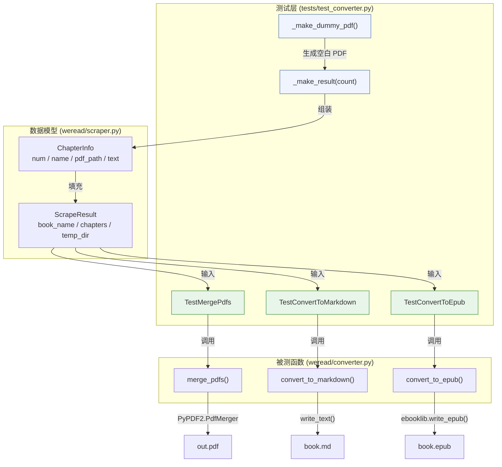

转换器单元测试聚焦于验证 `weread.converter` 模块中三大格式输出函数（`merge_pdfs`、`convert_to_markdown`、`convert_to_epub`）在典型输入下的正确性。测试策略的核心思想是：**用最小化的合成数据模拟真实抓取结果，在隔离的临时文件系统中验证输出文件的存在性、结构完整性和内容准确性**。本文将逐一拆解测试夹具的设计哲学、每个测试类的验证维度，以及当前测试覆盖的边界与局限。

Sources: [test_converter.py](tests/test_converter.py#L1-L67), [converter.py](src/weread/converter.py#L1-L171)

## 测试数据构建：工厂函数与合成模型

测试的起点是两个工厂函数——`_make_dummy_pdf` 和 `_make_result`——它们共同构建了一套不依赖真实浏览器抓取的可控测试数据。`_make_dummy_pdf` 使用 PyPDF2 的 `PdfWriter` 创建仅包含一个空白页（200×300 点）的微型 PDF 文件，其体积极小但具备完整的 PDF 结构。`_make_result` 则在此基础上批量生成 `ChapterInfo` 对象，每个章节携带独立的 PDF 路径和预设文本内容（如 `"第1章的正文内容。\n这是第二段。"`），最终组装成一个 `ScrapeResult` 实例。

这种设计的关键优势在于**确定性**：工厂函数的输出完全由参数控制，不涉及网络请求、文件系统状态或随机因素，使得测试可在任何环境中稳定复现。`ScrapeResult` dataclass 是连接抓取层与转换层的数据契约，其 `book_name`、`chapters`、`temp_dir` 三个字段刚好覆盖了所有三个转换函数的输入需求。默认生成 3 个章节（`count=3`），而部分测试通过 `count=2` 减少数据量以加速执行。

Sources: [test_converter.py](tests/test_converter.py#L12-L28), [scraper.py](src/weread/scraper.py#L419-L432)

## pytest tmp_path 隔离机制

所有测试方法均使用 pytest 内置的 `tmp_path` fixture 作为输出目录。`tmp_path` 每次测试调用时自动创建一个唯一的临时目录，测试结束后自动清理，确保**测试之间零状态污染**。这一机制替代了手动 `tempfile.mkdtemp()` + `shutil.rmtree()` 的模式，代码更简洁且异常安全。值得注意的是，`_make_result(tmp_path)` 将 `tmp_path` 既作为 PDF 源文件目录（通过 `tmp_path / f"chapter_{i}.pdf"`），又作为 `ScrapeResult.temp_dir` 传入转换函数，模拟了真实流程中 `temp_dir` 同时承载章 PDF 和图片资源的场景。

Sources: [test_converter.py](tests/test_converter.py#L31-L36)

## TestMergePdfs：PDF 合并验证

`TestMergePdfs` 包含两个测试用例，分别从**文件系统**和**文档结构**两个维度验证 `merge_pdfs` 的行为。

| 测试方法 | 验证维度 | 断言内容 |
|---|---|---|
| `test_merge_creates_file` | 文件系统层面 | 输出文件存在且大小 > 0 |
| `test_merge_page_count` | PDF 文档结构 | 合并后页数 == 章节数（3 页） |

`test_merge_creates_file` 是最基础的存在性测试——确认 `merge_pdfs` 执行后确实在指定路径产出了一个非空文件。`test_merge_page_count` 则深入一步，使用 `PyPDF2.PdfReader` 解析合并后的 PDF，验证其页数与源章节数一致。这一断言之所以有效，是因为 `_make_dummy_pdf` 每次只生成一个单页 PDF，所以 3 个章节合并后必须恰好产生 3 页。这种**基于文档内部结构的断言**比纯文件大小检查更可靠，能捕捉到"文件生成但内容缺失"这类隐蔽问题。

在实现层面，`merge_pdfs` 使用 `PyPDF2.PdfMerger` 逐一 `append` 各章节的 PDF 文件，最终写入目标路径。测试通过确认该流程不抛异常且产出正确结构的文件来验证其健壮性。

Sources: [test_converter.py](tests/test_converter.py#L30-L46), [converter.py](src/weread/converter.py#L32-L41)

## TestConvertToMarkdown：Markdown 内容验证

`TestConvertToMarkdown` 的单一测试用例 `test_creates_md_file` 采用了**内容嗅探**策略——不仅检查文件是否存在，还读取文件全文并验证关键内容片段的存在性。测试生成 2 个章节（`count=2`），然后断言输出 Markdown 中同时包含 `## 第1章` 和 `## 第2章` 章节标题，以及 `第1章的正文内容` 正文片段。

这里的断言设计精确匹配了 `convert_to_markdown` 的输出格式：书名以 `# ` 一级标题开头，每个章节名以 `## ` 二级标题呈现，正文紧跟其后。通过检查 `## 第1章` 而非模糊的 `第1章`，测试同时验证了 Markdown 标题语法（`##`）的正确插入。值得注意的是，测试没有对 `_format_chapter_text` 的段落合并行为做细粒度验证（例如 `\n` 拼接后的输出格式），这是当前测试的一个可扩展方向。

Sources: [test_converter.py](tests/test_converter.py#L48-L58), [converter.py](src/weread/converter.py#L44-L64)

## TestConvertToEpub：EPUB 生成验证

`TestConvertToEpub` 的 `test_creates_epub_file` 是三个测试类中断言粒度最粗的——仅验证输出 EPUB 文件的存在性和非空性。这与 EPUB 格式的复杂性有关：EPUB 本质上是一个 ZIP 包，内部包含 XHTML 章节文件、元数据（OPF）、导航（NCX/NAV）、图片资源等，直接解析其内部结构需要额外的依赖库支持。

当前断言确保了 `convert_to_epub` 的核心流程（创建 `EpubBook`、设置元数据、添加章节、写入文件）能无异常完成。`convert_to_epub` 的实现是最复杂的转换函数——它需要将文本中的图片引用（``）转换为 XHTML `` 标签、将文本段落包装为 `
` 标签、构建目录和书脊（spine），并通过 `ebooklib` 的 `write_epub` 序列化。**仅检查文件非空**意味着测试覆盖了"管道通畅"但未覆盖"内容正确"——如果 `write_epub` 写出了一个格式错误但体积非零的文件，当前测试无法捕获。

Sources: [test_converter.py](tests/test_converter.py#L60-L67), [converter.py](src/weread/converter.py#L67-L139)

## 测试架构总览

下图展示了测试代码与被测模块之间的调用关系和数据流向：

Sources: [test_converter.py](tests/test_converter.py#L1-L67)

## 验证策略对比与覆盖度分析

三个测试类的验证深度存在明显梯度，下表对此进行了系统性对比：

| 验证维度 | TestMergePdfs | TestConvertToMarkdown | TestConvertToEpub |
|---|---|---|---|
| 文件存在性 | ✅ | ✅ | ✅ |
| 文件非空 | ✅ `st_size > 0` | —（内容读取隐含验证） | ✅ `st_size > 0` |
| 内部结构验证 | ✅ 页数 == 3 | ✅ 关键文本片段存在 | ❌ |
| 多章节覆盖 | 3 章 | 2 章 | 2 章 |
| 图片资源处理 | — | ❌ 未测试 | ❌ 未测试 |
| 异常路径测试 | ❌ | ❌ | ❌ |
| 空章节处理 | ❌ | ❌ | ❌ |

可以看出，**PDF 测试的验证深度最高**（文件 + 结构双重断言），**Markdown 测试居中**（内容嗅探），**EPUB 测试最浅**（仅文件存在性）。这一梯度反映了三种格式验证的技术难度递增：PDF 有成熟的 Python 解析库（PyPDF2），Markdown 是纯文本易于字符串匹配，而 EPUB 的内部结构验证需要额外的 ZIP 解析或专门的 EPUB 检验工具。

Sources: [test_converter.py](tests/test_converter.py#L30-L67)

## 测试未覆盖的边界场景

当前的测试设计以**正向路径**（happy path）为核心，以下场景尚未被覆盖，可作为后续扩展方向：

- **空章节列表**：`ScrapeResult` 的 `chapters` 为空列表时，三个转换函数的行为未定义。`merge_pdfs` 可能生成一个零页 PDF，`convert_to_markdown` 可能仅输出书名标题行，`convert_to_epub` 可能生成一个无章节的空壳电子书。
- **章节文本为空**：`ChapterInfo.text` 默认为空字符串，`convert_to_markdown` 应输出 `*(此章无内容)*`，`convert_to_epub` 应输出 `
此章无内容
`——这一分支逻辑未被测试覆盖。
- **图片资源集成**：`_make_result` 不创建 `images/` 目录，因此 `convert_to_markdown` 的图片复制逻辑和 `convert_to_epub` 的图片嵌入逻辑完全未被触发。
- **`ConvertError` 异常传播**：三个转换函数均有 try/except 块将底层异常包装为 `ConvertError`，但测试未验证错误路径是否正确触发。
- **特殊字符处理**：章节名或正文中包含 HTML 特殊字符（`<`, `>`, `&`）时，EPUB 的 XHTML 内容可能出现未转义问题。

Sources: [converter.py](src/weread/converter.py#L44-L139), [errors.py](src/weread/errors.py#L14-L19)

## 延伸阅读

- 测试基础设施的运行方式与框架选型，参见 [测试框架与运行方式](17-ce-shi-kuang-jia-yu-yun-xing-fang-shi)
- 被测转换函数的完整实现细节，参见 [PDF 合并：多章节 PDF 拼接实现](13-pdf-he-bing-duo-zhang-jie-pdf-pin-jie-shi-xian)、[Markdown 生成：文本格式化与图片资源管理](14-markdown-sheng-cheng-wen-ben-ge-shi-hua-yu-tu-pian-zi-yuan-guan-li)、[EPUB 构建：电子书结构与图片嵌入](15-epub-gou-jian-dian-zi-shu-jie-gou-yu-tu-pian-qian-ru)
- 工具函数的边界用例测试，参见 [工具函数单元测试：文件名清洗边界用例](19-gong-ju-han-shu-dan-yuan-ce-shi-wen-jian-ming-qing-xi-bian-jie-yong-li)