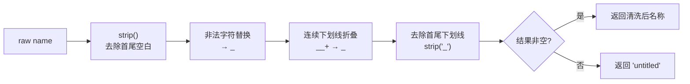
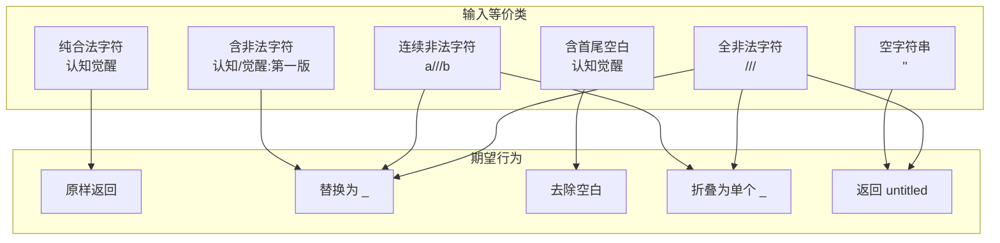

单元测试不仅是对代码行为的验证，更是对 **需求边界** 的精确描述。本文深入剖析 `test_utils.py` 中针对 `sanitize_filename` 函数的 6 个测试用例，揭示每个用例如何精准覆盖清洗管道中的关键分支——从纯中文正常路径到全非法字符的极端退化，逐层构建一份可追溯的质量契约。

Sources: [test_utils.py](tests/test_utils.py#L1-L26), [utils.py](src/weread/utils.py#L1-L32)

## 被测函数：sanitize_filename 清洗管道

在分析测试用例之前，必须先理解被测函数的处理流程。`sanitize_filename` 是一个纯函数，接收原始书名字符串，经过四步确定性变换后返回一个安全的文件名。其核心逻辑可以用以下管道图表示：



源码中定义了两个编译期正则常量来驱动上述管道：`_ILLEGAL_CHARS` 匹配 Windows 与 Unix 文件系统均禁止的字符集（`<>:"/\|?*` 及控制字符 `\x00-\x1f`），`_MULTI_UNDERSCORE` 将一个或多个连续下划线折叠为单个下划线。管道末尾的空值兜底确保函数永远不会返回空字符串，而是以 `"untitled"` 作为语义明确的默认值。

Sources: [utils.py](src/weread/utils.py#L6-L15)

## 测试结构总览

`test_utils.py` 仅导入 `sanitize_filename` 一个函数，采用 **扁平函数式** 组织风格（非 `class TestXxx`），共 6 个独立测试用例。这种结构选择与被测函数的纯函数特性一致——无状态、无副作用、无 fixture 依赖，每个用例自包含断言。

| 测试函数 | 覆盖管道步骤 | 输入 | 期望输出 | 边界类型 |
|---|---|---|---|---|
| `test_sanitize_normal_name` | 全流程（正常路径） | `"认知觉醒"` | `"认知觉醒"` | 中文无特殊字符 |
| `test_sanitize_strips_illegal_chars` | 非法字符替换 | `"认知/觉醒:第一版"` | `"认知_觉醒_第一版"` | 混合非法字符 |
| `test_sanitize_strips_whitespace` | strip() | `"  认知觉醒  "` | `"认知觉醒"` | 首尾空白 |
| `test_sanitize_collapses_underscores` | 非法替换 + 折叠 | `"a///b"` | `"a_b"` | 连续非法字符 |
| `test_sanitize_empty_string` | 空值兜底 | `""` | `"untitled"` | 空字符串 |
| `test_sanitize_only_illegal_chars` | 全流程（退化路径） | `"///"` | `"untitled"` | 全非法字符 |

Sources: [test_utils.py](tests/test_utils.py#L1-L26)

## 逐用例深度解析

### 正常路径：中文字符原样保留

```python
def test_sanitize_normal_name():
    assert sanitize_filename("认知觉醒") == "认知觉醒"
```

这是最基础的 **冒烟测试**（Smoke Test），验证函数对合法输入的恒等性——不含非法字符、不含首尾空白、不含连续特殊字符的纯中文字符串应当原样返回。此用例覆盖了管道中所有步骤的"无操作"分支：`strip()` 无变化、正则替换无匹配、`strip("_")` 无变化、非空判断走 `True` 分支。

Sources: [test_utils.py](tests/test_utils.py#L4-L5)

### 非法字符替换：斜杠与冒号的场景

```python
def test_sanitize_strips_illegal_chars():
    assert sanitize_filename('认知/觉醒:第一版') == "认知_觉醒_第一版"
```

此用例聚焦于 `_ILLEGAL_CHARS` 正则的匹配能力。输入包含 `/` 和 `:` 两个在文件系统中具有特殊语义的字符——`/` 是路径分隔符，`:` 在 Windows 上用于驱动器标识符（如 `C:`）。两者被替换为 `_`，产生三个用下划线分隔的语义片段。注意 `/` 和 `:` 在输入中不相邻，因此替换后不会产生连续下划线，`_MULTI_UNDERSCORE` 折叠步骤实际上无操作。这是一个精准的 **单一步骤覆盖** 设计。

Sources: [test_utils.py](tests/test_utils.py#L8-L9)

### 空白处理：strip() 的首尾裁剪

```python
def test_sanitize_strips_whitespace():
    assert sanitize_filename("  认知觉醒  ") == "认知觉醒"
```

验证管道第一步 `name.strip()` 的行为。前导和尾随空格被完全移除，中间内容保持不变。此用例隐含一个重要的设计意图：清洗函数处理的是 **用户可能意外引入的空白**（如从网页复制书名时带入的不可见字符），而非中间空白（如 `"认知 觉醒"` 将被保留原样）。

Sources: [test_utils.py](tests/test_utils.py#L12-L13)

### 连续非法字符折叠：多步协同

```python
def test_sanitize_collapses_underscores():
    assert sanitize_filename("a///b") == "a_b"
```

这是唯一一个 **跨步骤协同验证** 用例。三个连续的 `/` 首先被 `_ILLEGAL_CHARS` 正则逐一替换为 `_`，产生 `"a___b"`；随后 `_MULTI_UNDERSCORE` 将三个连续下划线折叠为单个 `_`，得到 `"a_b"`。此用例验证了管道步骤 2（替换）和步骤 3（折叠）之间的交互逻辑——如果只测试单步，可能遗漏"替换产生的连续下划线未被折叠"这类缺陷。同时，使用 ASCII 字符 `a`、`b` 作为锚点确保首尾 `_strip("_")` 不会影响结果，聚焦于中间段的折叠行为。

Sources: [test_utils.py](tests/test_utils.py#L16-L17)

### 空字符串退化：默认值兜底

```python
def test_sanitize_empty_string():
    assert sanitize_filename("") == "untitled"
```

空字符串是函数的 **零元输入边界**。管道处理链中：`strip()` 返回 `""`，后续正则替换无匹配对象，`strip("_")` 仍为 `""`，最终命中 `name if name else "untitled"` 的 `else` 分支。此用例确保函数对"完全无内容"的输入具有确定的、语义明确的输出，而非返回空字符串导致后续文件系统操作失败。

Sources: [test_utils.py](tests/test_utils.py#L20-L21)

### 全非法字符退化：多步联合消耗

```python
def test_sanitize_only_illegal_chars():
    assert sanitize_filename("///") == "untitled"
```

这是最极端的 **全退化路径** 用例。输入 `"///"` 经过替换变为 `"___"`，折叠后变为 `"_"`，最终被 `strip("_")` 完全移除变为 `""`，命中 `"untitled"` 兜底。此用例与上一个空字符串用例的区别在于：它验证了 **非空输入经过完整管道处理后退化为空值** 的路径。如果移除 `strip("_")` 步骤，此用例将返回 `"_"` 而非 `"untitled"`——测试将立即捕获这一回归缺陷。

Sources: [test_utils.py](tests/test_utils.py#L24-L25)

## 覆盖度分析：等价类与边界值视角

从等价类划分（Equivalence Partitioning）角度审视，6 个测试用例系统覆盖了输入空间的五个关键等价类：

| 等价类 | 代表用例 | 验证要点 |
|---|---|---|
| 纯合法字符 | `test_sanitize_normal_name` | 恒等性：输出 = 输入 |
| 合法 + 非法字符混合 | `test_sanitize_strips_illegal_chars` | 非法字符被替换，合法部分不变 |
| 包含首尾空白 | `test_sanitize_strips_whitespace` | strip() 行为正确性 |
| 含连续非法字符 | `test_sanitize_collapses_underscores` | 替换→折叠的步骤交互 |
| 空或全非法 | `test_sanitize_empty_string` / `test_sanitize_only_illegal_chars` | 兜底值 `"untitled"` |



值得注意的是，当前测试对控制字符（`\x00-\x1f`）和 Windows 保留字符（`<>\"|?*`）缺少独立用例覆盖。`_ILLEGAL_CHARS` 正则覆盖了这些字符，但测试中只显式验证了 `/` 和 `:` 的替换行为。若需要更严格的覆盖度，可补充针对 `<>\"\\|?*` 以及控制字符的专项测试。

Sources: [utils.py](src/weread/utils.py#L6), [test_utils.py](tests/test_utils.py#L1-L26)

## 测试风格与项目约定的关系

对比本项目的两个测试文件，可以观察到有意的 **风格分层**：

| 维度 | test_utils.py | test_converter.py |
|---|---|---|
| 组织形式 | 扁平函数 | 类分组（`class TestXxx`） |
| Fixture 依赖 | 无 | pytest `tmp_path` |
| 外部依赖 | 无（纯 Python assert） | PyPDF2、临时文件 |
| 测试对象特征 | 纯函数，无 I/O | 文件系统 I/O |
| 用例数量 | 6 个 | 4 个（3 个类） |

`test_utils.py` 选择扁平函数风格，是因为 `sanitize_filename` 作为纯函数天然适合这种极简表达——每个测试就是一个 `assert` 语句，无初始化开销、无清理逻辑、无状态共享。这种风格让测试的意图和断言一目了然，是 **纯函数测试的最佳实践**。

Sources: [test_utils.py](tests/test_utils.py#L1-L26), [test_converter.py](tests/test_converter.py#L1-L67)

## 运行方式

本项目的测试配置定义在 `pyproject.toml` 的 `[tool.pytest.ini_options]` 段中，`testpaths = ["tests"]` 指定了测试发现路径。单独运行工具函数测试的命令为：

```bash
pytest tests/test_utils.py -v
```

`-v` 标志会以详细模式输出每个测试函数的名称和结果（`PASSED` / `FAILED`），便于快速定位失败用例。关于完整的测试框架配置和运行方式，参见 [测试框架与运行方式](17-ce-shi-kuang-jia-yu-yun-xing-fang-shi)。

Sources: [pyproject.toml](pyproject.toml#L24-L25)

## 延伸阅读

- **上游函数实现细节**：理解 `sanitize_filename` 的正则设计和管道逻辑，参见 [工具函数模块：文件名清洗与路径管理](6-gong-ju-han-shu-mo-kuai-wen-jian-ming-qing-xi-yu-lu-jing-guan-li)
- **同一级别的转换器测试**：对比不同模块的测试策略差异，参见 [转换器单元测试：PDF、Markdown、EPUB 验证策略](18-zhuan-huan-qi-dan-yuan-ce-shi-pdf-markdown-epub-yan-zheng-ce-lue)
- **被测函数的下游消费者**：`sanitize_filename` 的返回值如何被 `get_output_dir` 和 scraper 流程使用，参见 [整体架构：从 URL 到电子书的完整数据流](4-zheng-ti-jia-gou-cong-url-dao-dian-zi-shu-de-wan-zheng-shu-ju-liu)