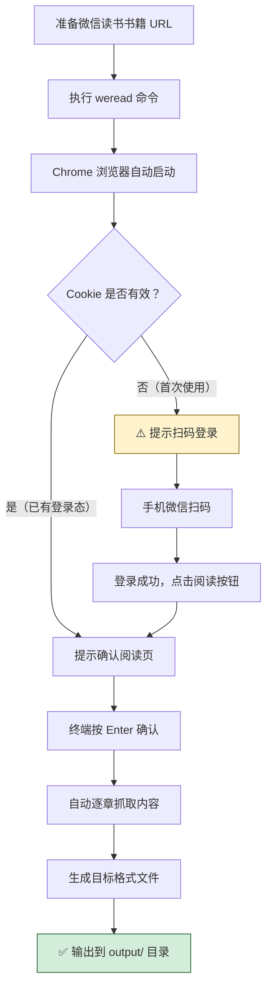

本文档是 **weread-scrapy** 的快速上手指南，将引导你从零开始完成环境搭建、安装依赖、首次执行导出，并了解常见的故障排除手段。阅读完成后，你将能够独立使用该工具将微信读书上的已购书籍导出为 PDF、EPUB 或 Markdown 文件。

Sources: [README.md](README.md), [pyproject.toml](pyproject.toml#L1-L26)

## 环境前提

在安装 weread-scrapy 之前，请确认你的开发环境满足以下最低要求：

| 依赖项 | 最低版本 | 说明 |
|--------|---------|------|
| **Python** | >= 3.9 | 项目使用 `from __future__ import annotations` 等现代语法 |
| **pip / pipx** | 最新稳定版 | pipx 推荐用于全局安装 CLI 工具，pip 用于源码开发安装 |
| **Google Chrome** | 任意稳定版 | 工具通过 `channel="chrome"` 启动本地 Chrome 浏览器，**必须预装** |
| **Git** | 任意版本 | 源码安装时需要 |

> **为什么必须安装 Chrome？** weread-scrapy 使用 Playwright 驱动真实浏览器来渲染微信读书的 Canvas 内容。代码中明确指定了 `channel="chrome"`（使用系统安装的 Chrome）而非 Playwright 自带的 Chromium，这意味着你需要在本机安装 Chrome 浏览器。如果你使用 macOS，Chrome 通常安装在 `/Applications/Google Chrome.app`。

Sources: [pyproject.toml](pyproject.toml#L10), [scraper.py](src/weread/scraper.py#L447-L450)

## 安装方式

weread-scrapy 提供两种安装路径，你可以根据使用场景选择：

### 方式一：pipx 全局安装（推荐日常使用）

如果你只需要命令行工具而不关心源码，pipx 是最简洁的安装方式：

```bash
pipx install git+https://github.com/monkeychen/weread-helper.git
```

安装完成后，`weread` 命令将自动注册到系统 PATH 中，可在任意目录直接调用。pipx 会为该工具创建独立的虚拟环境，不会污染你的全局 Python 包。

### 方式二：源码开发安装（推荐开发者）

如果你计划阅读源码、参与开发或进行调试，建议从源码安装：

```bash
# 1. 克隆仓库
git clone https://github.com/monkeychen/weread-helper.git
cd weread-scrapy

# 2. 创建并激活虚拟环境（推荐）
python -m venv .venv
source .venv/bin/activate   # macOS/Linux
# .venv\Scripts\activate    # Windows

# 3. 以可编辑模式安装项目（含所有依赖）
pip install -e .

# 4. 安装 Playwright 浏览器驱动
playwright install chromium
```

`pip install -e .` 以「可编辑模式」安装，你对 `src/weread/` 下源码的任何修改都会立即生效，无需重新安装。项目声明了三个核心运行时依赖——`playwright>=1.43`（浏览器自动化）、`PyPDF2>=3.0`（PDF 处理）、`ebooklib>=0.18`（EPUB 构建），它们会被自动解析并安装。`playwright install chromium` 这一步用于下载 Playwright 需要的浏览器驱动二进制文件。

Sources: [pyproject.toml](pyproject.toml#L12-L16), [pyproject.toml](pyproject.toml#L18-L19), [pyproject.toml](pyproject.toml#L21-L23)

## 安装验证

安装完成后，通过以下命令确认一切就绪：

```bash
# 验证 CLI 是否可用
weread --version
# 预期输出: weread 0.1.0

# 查看帮助信息
weread --help
```

`weread` 命令行入口定义在 `pyproject.toml` 的 `[project.scripts]` 段，它指向 [cli.py](src/weread/cli.py#L38) 中的 `main()` 函数。`--version` 读取的是 [__init__.py](src/weread/__init__.py#L1) 中定义的 `__version__ = "0.1.0"`。如果你看到版本号输出，说明安装成功。

Sources: [pyproject.toml](pyproject.toml#L18-L19), [\_\_init\_\_.py](src/weread/__init__.py#L1), [cli.py](src/weread/cli.py#L38-L55)

## 首次使用：完整流程

首次运行 weread-scrapy 时，你需要完成一次扫码登录。以下是完整的操作流程：



### 第一步：获取书籍 URL

打开微信读书网页版 (weread.qq.com)，找到你想导出的书籍，进入阅读页面。从浏览器地址栏复制完整的 URL，格式应如下：

```
https://weread.qq.com/web/reader/xxxxxxxxx
```

工具在 [cli.py](src/weread/cli.py#L14-L16) 中通过正则表达式 `^https?://weread\.qq\.com/web/reader/` 校验 URL 格式。如果 URL 不匹配，会立即报错退出。

### 第二步：执行导出命令

```bash
# 最简用法：导出为 PDF（默认格式）
weread https://weread.qq.com/web/reader/xxx
```

命令执行后，Chrome 浏览器会自动以**非无头模式**（可见窗口）启动，并打开你提供的微信读书页面。浏览器启动时会注入反自动化检测参数 `--disable-blink-features=AutomationControlled`，并使用伪装的 User-Agent，以降低被识别为自动化工具的风险。

Sources: [cli.py](src/weread/cli.py#L14-L16), [scraper.py](src/weread/scraper.py#L23-L29), [scraper.py](src/weread/scraper.py#L446-L451)

### 第三步：完成登录

首次使用时，浏览器打开页面后会检测到未登录状态。终端会显示如下提示：

```
⚠️  检测到未登录，请在浏览器中扫码登录
   登录后请手动点击「阅读」按钮进入阅读页
   确认已在阅读页后按 Enter 继续（Ctrl+C 取消）...
```

此时你需要：1）拿出手机打开微信，扫描浏览器中显示的二维码；2）扫码成功后，在浏览器中点击进入书籍的阅读页面；3）回到终端，按 **Enter** 键确认。

登录成功后，Cookie 会被自动保存到 `~/.weread/cookies.json`。后续运行时，工具会自动加载该文件复用登录态，**无需重复扫码**。如果 Cookie 仍然有效，终端只会提示你确认已进入阅读页：

```
   ✓ 登录态有效，请确认已进入阅读页
   确认已在阅读页后按 Enter 继续（Ctrl+C 取消）...
```

Sources: [auth.py](src/weread/auth.py#L28-L47), [utils.py](src/weread/utils.py#L18-L21)

### 第四步：等待抓取完成

按 Enter 确认后，工具将自动执行以下操作：

1. **读取书名** —— 从浏览器页面标题中提取
2. **逐章抓取** —— 自动滚动页面触发 Canvas 渲染，拦截 `fillText` 和 `drawImage` 获取文字与图片
3. **翻页遍历** —— 每章抓取完毕后，自动查找并点击「下一章」按钮
4. **格式转换** —— 所有章节抓取完成后，根据指定格式生成输出文件

终端会实时显示抓取进度：

```
🔍 正在打开微信读书...
📖 开始抓取《你的书名》
   [1] 第一章标题 ✓
   [2] 第二章标题 ✓
   [3] 第三章标题 ✓
📦 生成 PDF...
   ✓ output/你的书名/你的书名.pdf

✅ 全部完成，文件已保存到 output/你的书名/
```

Sources: [scraper.py](src/weread/scraper.py#L465-L490), [cli.py](src/weread/cli.py#L60-L79)

## 常用命令速查

掌握基本用法后，以下是你最常使用的命令形式：

| 命令 | 用途 |
|------|------|
| `weread <URL>` | 导出为 PDF（默认格式） |
| `weread <URL> -f pdf,epub,md` | 同时导出 PDF + EPUB + Markdown 三种格式 |
| `weread <URL> -f epub` | 仅导出 EPUB |
| `weread <URL> -o ~/Books/` | 指定输出到 `~/Books/<书名>/` 目录 |
| `weread <URL> -f md -o ./notes/` | 导出 Markdown 到指定目录 |
| `weread --version` | 查看当前版本号 |
| `weread --help` | 查看完整帮助信息 |

**输出目录规则**：如果不指定 `-o` 参数，文件默认保存到当前工作目录下的 `output/<书名>/`。书名会经过文件名清洗处理（特殊字符替换为下划线），确保在所有操作系统上都能安全创建目录。

Sources: [cli.py](src/weread/cli.py#L38-L55), [utils.py](src/weread/utils.py#L10-L31)

## 输出文件说明

一次成功的导出后，你会在输出目录中看到以下文件结构：

```
output/
└── 书名/
    ├── 书名.pdf          # PDF 格式（所有章节合并）
    ├── 书名.epub         # EPUB 格式（含章节目录与图片）
    ├── 书名.md           # Markdown 格式（含章节标题与图片引用）
    └── images/           # 书中提取的图片资源
        ├── image1.jpg
        └── image2.png
```

| 格式 | 文件特点 | 适用场景 |
|------|---------|---------|
| **PDF** | 所有章节拼接为一份完整 PDF，保留原始渲染效果 | 打印、归档、在电脑/平板上阅读 |
| **EPUB** | 标准电子书格式，含目录与嵌入图片，语言标记为中文 | 在 Kindle、Apple Books 等阅读器上使用 |
| **Markdown** | 纯文本格式，章节用 `##` 标题分隔，图片以相对路径引用 | 笔记整理、二次编辑、AI 处理 |

Sources: [converter.py](src/weread/converter.py#L32-L170), [utils.py](src/weread/utils.py#L24-L31)

## 常见问题与故障排除

| 问题 | 原因 | 解决方法 |
|------|------|---------|
| `✗ 无效的微信读书 URL` | 提供的 URL 格式不正确 | 确保以 `https://weread.qq.com/web/reader/` 开头 |
| `✗ 登录失败，请重新运行并扫码登录` | Cookie 过期或用户取消了登录 | 删除 `~/.weread/cookies.json` 后重新运行 |
| `✗ 未抓取到任何章节` | 页面未正确加载或登录态异常 | 检查是否已进入阅读页，确认书籍是否已购买 |
| 浏览器无法启动 | 未安装 Chrome 浏览器 | 安装 Google Chrome 后重试 |
| `⚠ 跳过了 N 个章节` | 部分章节渲染超时 | 通常是网络问题，可重新运行重试 |
| `Ctrl+C` 中断后部分内容丢失 | 用户主动中断 | 工具会尝试保存已抓取的章节，查看终端提示的输出路径 |

关于 Cookie 过期的处理：登录态存储在 `~/.weread/cookies.json`，微信读书的 Cookie 有效期有限。如果运行时提示登录失败，手动删除该文件后重新执行命令即可触发扫码登录流程。如果需要手动清理：

```bash
rm ~/.weread/cookies.json
```

Sources: [cli.py](src/weread/cli.py#L81-L99), [auth.py](src/weread/auth.py#L14-L16), [errors.py](src/weread/errors.py#L1-L18)

## 下一步

恭喜你完成了 weread-scrapy 的安装与首次使用！接下来，推荐按以下顺序继续阅读：

- **[命令行参数与输出格式详解](3-ming-ling-xing-can-shu-yu-shu-chu-ge-shi-xiang-jie)** —— 深入了解所有 CLI 参数、格式选项和输出路径的完整配置
- **[整体架构：从 URL 到电子书的完整数据流](4-zheng-ti-jia-gou-cong-url-dao-dian-zi-shu-de-wan-zheng-shu-ju-liu)** —— 理解工具的三阶段流水线架构（抓取 → 解析 → 转换），为阅读源码打下基础

如果你对某个具体模块感兴趣，可以直接跳转到目录中的对应页面。