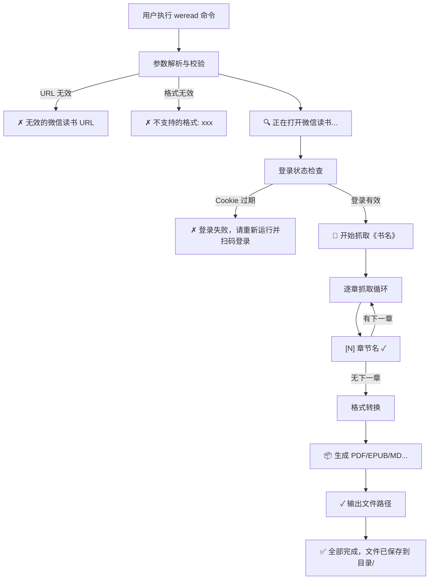

`weread` 命令行工具是将微信读书书籍导出为本地电子书的核心入口。本文将系统梳理该命令支持的每一个参数、URL 校验规则、输出格式的行为差异，以及命令执行过程中你将在终端看到的状态提示。掌握这些细节后，你将能够精准控制导出行为，应对各种使用场景。

Sources: [cli.py](src/weread/cli.py#L1-L100), [pyproject.toml](pyproject.toml#L18-L19)

## 基本命令结构

安装完成后，`weread` 命令即可在终端直接使用。其入口点在 `pyproject.toml` 中注册为 `weread.cli:main`，工具基于 Python 标准库 `argparse` 构建。最基本的用法只需提供一个微信读书阅读页 URL：

```bash
weread https://weread.qq.com/web/reader/xxxxx
```

此时工具将使用默认参数：输出格式为 PDF，输出目录为 `./output/<书名>/`。完整的命令结构如下：

```bash
weread <URL> [-f 格式] [-o 输出目录] [-v]
```

Sources: [pyproject.toml](pyproject.toml#L18-L19), [cli.py](src/weread/cli.py#L38-L55)

## 参数详解

下表汇总了 `weread` 命令支持的所有参数：

| 参数 | 短选项 | 类型 | 默认值 | 说明 |
|------|--------|------|--------|------|
| `url` | — | 位置参数 | （必填） | 微信读书阅读页 URL |
| `--format` | `-f` | 字符串 | `pdf` | 输出格式，逗号分隔，可选值：`pdf`、`epub`、`md` |
| `--output` | `-o` | 路径 | `None` | 自定义输出目录；默认为 `./output/<书名>/` |
| `--version` | `-v` | 标志 | — | 显示版本号后退出（当前版本 `0.1.0`） |

Sources: [cli.py](src/weread/cli.py#L38-L54), [__init__.py](src/weread/__init__.py#L1)

### URL 参数：唯一的必填项

`url` 是唯一的位置参数，必须放在命令最前面。工具通过正则表达式对 URL 进行格式校验，合法 URL 必须以 `https://weread.qq.com/web/reader/` 开头（支持 `http` 或 `https` 协议）。如果 URL 不匹配该模式，程序会立即报错并退出，提示正确的 URL 格式：

```
✗ 无效的微信读书 URL
  正确格式: https://weread.qq.com/web/reader/...
```

Sources: [cli.py](src/weread/cli.py#L14-L16), [cli.py](src/weread/cli.py#L30-L35)

### --format / -f：选择输出格式

`--format` 参数控制导出的文件格式，支持逗号分隔的多格式同时导出。格式值不区分大小写（内部会统一转为小写）。合法值集合为 `{pdf, epub, md}`。如果传入了不支持的格式，程序会列出无效格式并提示所有合法选项后退出：

```
✗ 不支持的格式: docx
  支持的格式: epub, md, pdf
```

**三种格式的行为差异：**

| 格式 | 输出文件 | 是否包含图片 | 实现方式 |
|------|----------|-------------|---------|
| `pdf` | `<书名>.pdf` | ✅ 内嵌于页面 | 各章节 PDF 逐个拼接合并 |
| `epub` | `<书名>.epub` | ✅ 作为资源嵌入 | 构建 XHTML 章节并打包为电子书 |
| `md` | `<书名>.md` + `images/` 目录 | ✅ Markdown 引用本地图片 | 纯文本格式化，图片文件复制到同级目录 |

**使用示例：**

```bash
# 仅导出 PDF（默认）
weread https://weread.qq.com/web/reader/xxxxx

# 同时导出 PDF 和 Markdown
weread https://weread.qq.com/web/reader/xxxxx -f pdf,md

# 导出全部三种格式
weread https://weread.qq.com/web/reader/xxxxx -f pdf,epub,md
```

Sources: [cli.py](src/weread/cli.py#L17-L27), [cli.py](src/weread/cli.py#L44-L47), [converter.py](src/weread/converter.py#L142-L170)

### --output / -o：自定义输出目录

默认情况下，输出文件保存在 `./output/<书名>/` 目录下，其中 `<书名>` 会经过文件名清洗处理（将 `<>:"/\|?*` 等非法字符替换为下划线，合并连续下划线）。如果指定了 `--output` 参数，输出路径将变为 `<自定义目录>/<书名>/`。目录不存在时会自动递归创建。

```bash
# 默认输出到 ./output/深入理解计算机系统/
weread https://weread.qq.com/web/reader/xxxxx

# 自定义输出到 ~/books/ 目录，最终保存为 ~/books/深入理解计算机系统/
weread https://weread.qq.com/web/reader/xxxxx -o ~/books/
```

Sources: [cli.py](src/weread/cli.py#L48-L51), [utils.py](src/weread/utils.py#L6-L15), [utils.py](src/weread/utils.py#L24-L31)

## 命令执行流程与终端输出

当你执行 `weread` 命令时，终端会实时显示带有 **emoji 图标前缀** 的状态消息，帮助你了解当前进度。以下是完整的执行流程及对应的终端输出：



各阶段对应的终端输出含义：

| 阶段 | 终端输出 | 含义 |
|------|---------|------|
| 打开浏览器 | `🔍 正在打开微信读书...` | Playwright 正在启动浏览器并加载目标页面 |
| 开始抓取 | `📖 开始抓取《书名》` | 已成功识别书名，开始逐章抓取 |
| 章节完成 | `[N] 章节名 ✓` | 第 N 章内容抓取成功 |
| 章节跳过 | `[N] ⚠ 跳过: 原因` | 该章节渲染超时或加载失败，已跳过 |
| 格式转换 | `📦 生成 PDF...` | 正在进行对应格式的转换 |
| 单格式完成 | `✓ 输出路径` | 该格式文件已成功生成 |
| 全部完成 | `✅ 全部完成，文件已保存到 目录/` | 所有格式转换成功 |
| 转换失败 | `✗ fmt 转换失败: 原因` | 某一格式转换出错（其他格式不受影响） |

Sources: [cli.py](src/weread/cli.py#L56-L99), [scraper.py](src/weread/scraper.py#L465-L484), [converter.py](src/weread/converter.py#L153-L166)

## 错误处理与中断恢复

工具对多种异常场景做了细粒度处理，确保用户在不同情况下都能获得有意义的反馈：

**登录过期**：当 Cookie 失效且用户未完成扫码登录时，程序捕获 `LoginExpiredError`，提示 `✗ 登录失败，请重新运行并扫码登录` 后退出。这是因为抓取操作必须在已登录状态下进行。

**用户中断（Ctrl+C）**：如果你在抓取过程中按下 `Ctrl+C`，工具会检测是否已有部分章节被抓取。如果有，它会自动将已抓取的内容保存为文件，然后清理临时目录。这意味着即使中途取消，你也不会丢失已经抓取的内容。

```bash
# 用户中断时的终端输出示例
⚠ 用户中断
   已抓取 5 章，正在保存已有内容...
   部分结果已保存到 output/书名/
```

**一般错误**：所有自定义异常（如章节加载超时、格式转换失败）都继承自 `WereadError`，程序会以 `✗ 错误信息` 的形式输出后退出。格式转换错误是**格式级别隔离**的——如果 PDF 转换失败，EPUB 和 Markdown 仍然会继续尝试生成。

Sources: [cli.py](src/weread/cli.py#L81-L99), [errors.py](src/weread/errors.py#L1-L19)

## 输出文件结构

根据你选择的格式不同，最终的输出目录会包含不同的文件。假设导出一本名为"深入理解计算机系统"的书，各格式的输出结构如下：

| 格式 | 文件结构 | 说明 |
|------|---------|------|
| `-f pdf` | `output/深入理解计算机系统/深入理解计算机系统.pdf` | 单一 PDF 文件，所有章节按序合并 |
| `-f epub` | `output/深入理解计算机系统/深入理解计算机系统.epub` | 标准 EPUB 电子书，含目录和图片资源 |
| `-f md` | `output/深入理解计算机系统/深入理解计算机系统.md` + `output/深入理解计算机系统/images/` | Markdown 文件 + 图片目录，图片以相对路径引用 |
| `-f pdf,epub,md` | 以上全部文件 | 三种格式并存于同一目录 |

**Markdown 格式的特殊说明**：Markdown 文件中图片引用格式为 ``，需要将 `images/` 目录与 `.md` 文件保持在同一层级，否则图片将无法正常显示。

Sources: [converter.py](src/weread/converter.py#L44-L64), [converter.py](src/weread/converter.py#L142-L170), [utils.py](src/weread/utils.py#L24-L31)

## 常用命令速查

```bash
# 最简用法：导出为 PDF
weread https://weread.qq.com/web/reader/xxxxx

# 导出为 Markdown（适合笔记整理）
weread https://weread.qq.com/web/reader/xxxxx -f md

# 导出为 EPUB（适合电子阅读器）
weread https://weread.qq.com/web/reader/xxxxx -f epub

# 同时导出所有格式
weread https://weread.qq.com/web/reader/xxxxx -f pdf,epub,md

# 指定输出目录
weread https://weread.qq.com/web/reader/xxxxx -f pdf -o ~/my-books/

# 查看版本号
weread -v
```

Sources: [cli.py](src/weread/cli.py#L38-L55)

## 下一步阅读

掌握了命令行参数和输出格式后，你可以继续深入了解工具的内部工作原理：

- 想了解从输入 URL 到生成电子书的完整数据流，请阅读 [整体架构：从 URL 到电子书的完整数据流](4-zheng-ti-jia-gou-cong-url-dao-dian-zi-shu-de-wan-zheng-shu-ju-liu)
- 想了解各种错误是如何被分类和处理的，请阅读 [自定义异常体系与错误处理策略](5-zi-ding-yi-yi-chang-ti-xi-yu-cuo-wu-chu-li-ce-lue)
- 想了解文件名清洗和输出路径是如何安全处理的，请阅读 [工具函数模块：文件名清洗与路径管理](6-gong-ju-han-shu-mo-kuai-wen-jian-ming-qing-xi-yu-lu-jing-guan-li)