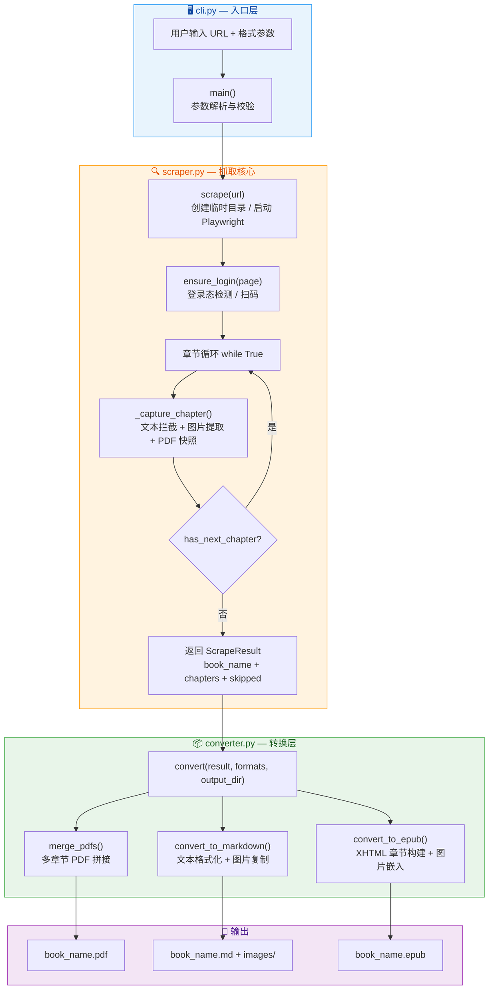
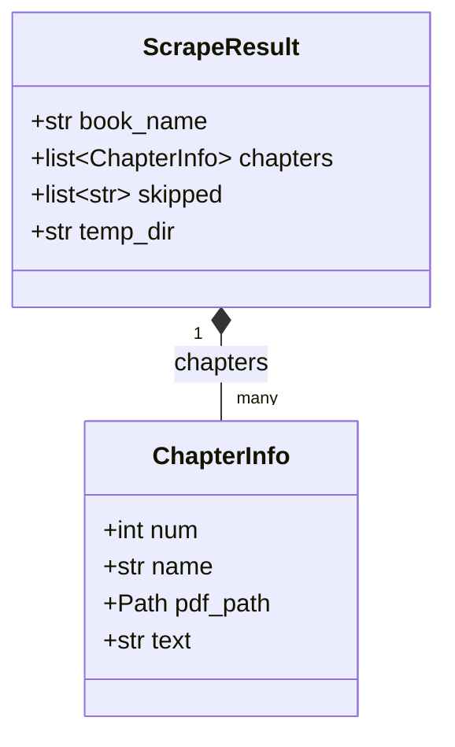

本文从宏观视角剖析 weread-scrapy 的完整数据管线——用户在终端输入一个微信读书 URL 后，系统如何依次完成**命令解析 → 浏览器启动 → Canvas 文字拦截 → 章节遍历 → 多格式转换 → 文件输出**这一端到端流程。理解这条数据流是深入阅读后续各子模块文档的前提。

## 模块全景与职责划分

weread-scrapy 由 6 个核心模块组成，每个模块承担单一且明确的职责。下表概括了各模块的角色及其在数据流中的位置：

| 模块 | 核心职责 | 数据流位置 | 产出物 |
|------|---------|-----------|--------|
| `cli.py` | 命令行参数解析与流程编排 | 入口层 | 调用参数 |
| `auth.py` | 登录状态检测与 Cookie 持久化 | 抓取前置 | 浏览器会话 |
| `scraper.py` | Playwright 浏览器控制与内容抓取 | 抓取核心 | `ScrapeResult` |
| `converter.py` | PDF 合并 / Markdown / EPUB 格式转换 | 转换层 | 输出文件 |
| `errors.py` | 统一异常层级定义 | 全局 | 异常类型 |
| `utils.py` | 文件名清洗、路径管理 | 基础设施 | 安全路径 |

这 6 个模块的依赖关系形成了清晰的**单向数据流**——从 `cli.py` 发起调用，经 `scraper.py` 抓取原始数据，最终由 `converter.py` 完成格式转换，过程中依赖 `auth.py`、`errors.py`、`utils.py` 提供的基础服务。

Sources: [cli.py](src/weread/cli.py#L1-L12), [scraper.py](src/weread/scraper.py#L1-L16), [converter.py](src/weread/converter.py#L1-L11), [auth.py](src/weread/auth.py#L1-L8), [errors.py](src/weread/errors.py#L1-L19), [utils.py](src/weread/utils.py#L1-L5)

## 端到端数据流全景图

下图展示了从用户输入到最终输出的完整数据流，其中每个节点对应一个模块中的关键函数，箭头表示数据传递方向：

Sources: [cli.py main()](src/weread/cli.py#L38-L99), [scraper.py scrape()](src/weread/scraper.py#L435-L492), [converter.py convert()](src/weread/converter.py#L142-L170)

## 核心数据结构：ScrapeResult 与 ChapterInfo

**`ScrapeResult`** 和 **`ChapterInfo`** 是贯穿整个数据流的两个核心数据类，它们在 `scraper.py` 中定义，是抓取层与转换层之间的**唯一契约接口**。

**`ScrapeResult`** 封装了一本书的完整抓取结果：`book_name` 是从页面标题中提取的书名；`chapters` 是有序的章节列表；`skipped` 记录因渲染超时等原因被跳过的章节；`temp_dir` 指向临时工作目录，在程序退出时由 `cli.py` 的 `finally` 块负责清理。

**`ChapterInfo`** 描述单个章节的抓取产出：`num` 是章节序号（从 1 开始递增）；`name` 是经过去重和清洗的章节标题；`pdf_path` 指向该章节的独立 PDF 快照文件；`text` 是从 Canvas `fillText` 钩子中提取并经过段落识别后的 Markdown 文本。

这两个数据类的设计遵循了**数据与行为分离**的原则——`scraper.py` 负责填充数据，`converter.py` 根据数据结构选择性地消费 `pdf_path`（PDF 合并）或 `text`（Markdown/EPUB 生成）。

Sources: [scraper.py ScrapeResult](src/weread/scraper.py#L419-L432), [scraper.py ChapterInfo](src/weread/scraper.py#L419-L424)

## 阶段一：命令行入口与参数校验

`cli.py` 中的 `main()` 函数是整个程序的入口点。它通过 `argparse` 解析三个参数：必填的微信读书 URL、可选的输出格式（逗号分隔，默认 `pdf`）和可选的输出目录。URL 校验使用正则表达式 `^https?://weread\.qq\.com/web/reader/` 确保输入合法性，格式校验则限定在 `{pdf, epub, md}` 三个值之内。

校验通过后，`main()` 按顺序执行三个操作：调用 `scrape(url)` 获取 `ScrapeResult`；调用 `get_output_dir()` 确定输出路径；调用 `convert()` 执行格式转换。这三个函数调用构成了数据流的主干，错误处理则通过 `try/except` 捕获自定义异常层级中的各类错误——`LoginExpiredError` 提示重新登录、`WereadError` 显示通用错误信息。值得注意的是，`KeyboardInterrupt` 被单独捕获以实现**中断时保存已抓取内容**的优雅降级机制。

Sources: [cli.py main()](src/weread/cli.py#L38-L99), [cli.py URL 校验](src/weread/cli.py#L14-L35)

## 阶段二：浏览器启动与 Canvas 钩子注入

`scrape()` 函数是抓取层的核心引擎。它首先创建临时目录和 `images/` 子目录，随后启动 Playwright Chromium 浏览器实例。浏览器启动配置包含两项反检测措施：通过 `--disable-blink-features=AutomationControlled` 命令行参数移除自动化标识，以及设置真实的 Chrome User-Agent 字符串。

在创建浏览器上下文时，系统会检查 `~/.weread/cookies.json` 是否存在以决定是否加载已保存的登录状态。随后通过 `context.add_init_script()` 注入一段关键的 **Canvas 拦截脚本**（`_CANVAS_INTERCEPT`），这段脚本在页面任何 JavaScript 执行前运行，它通过重写 `CanvasRenderingContext2D.prototype.fillText` 和 `drawImage` 方法，将微信读书 Canvas 渲染的文字和图片信息分别记录到 `window.__wr_text_log__` 和 `window.__wr_img_log__` 两个全局数组中。这一注入是整个内容抓取策略的基石——微信读书使用 Canvas 渲染书籍内容而非传统 DOM，因此必须从 Canvas API 层面进行拦截。

Sources: [scraper.py scrape()](src/weread/scraper.py#L435-L467), [scraper.py Canvas 拦截脚本](src/weread/scraper.py#L32-L59), [scraper.py 浏览器配置](src/weread/scraper.py#L23-L29)

## 阶段三：章节遍历与内容采集

完成登录后，`scrape()` 进入**章节循环**：调用 `_capture_chapter()` 抓取当前章节内容，然后通过 `_has_next_chapter()` 判断是否存在下一章。如果底部出现"下一章"按钮则点击并继续循环，否则退出。

每次 `_capture_chapter()` 调用执行以下工作流：首先记录当前日志数组长度（`text_start`/`img_start`），确保只捕获本章节新产生的内容；然后等待页面渲染完成（通过 CSS 选择器 `.readerChapterContent` 和 `networkidle` 状态双重判断）；接着调用 `_collect_chapter_content()` 执行内容采集，该函数的内部流程为——**滚动触发渲染 → 过滤字体测试行 → 按 Y 坐标分组文本行 → 检测段落边界 → 合并文本与图片 → 生成 Markdown 文本**；最后通过 `page.pdf()` 生成该章节的 PDF 快照。

采集失败（如渲染超时）的章节不会中断整体流程，而是被记录到 `result.skipped` 列表中，用户在最终输出时可以看到哪些章节被跳过了。

Sources: [scraper.py scrape() 章节循环](src/weread/scraper.py#L472-L489), [scraper.py _capture_chapter()](src/weread/scraper.py#L333-L416), [scraper.py _collect_chapter_content()](src/weread/scraper.py#L104-L289)

## 阶段四：多格式并行转换

`convert()` 函数接收 `ScrapeResult`、格式列表和输出目录三个参数，遍历用户指定的格式列表，对每个格式调用对应的转换函数：

| 格式 | 转换函数 | 数据来源 | 输出文件 |
|------|---------|---------|---------|
| PDF | `merge_pdfs()` | `chapter.pdf_path` | `book_name.pdf` |
| Markdown | `convert_to_markdown()` | `chapter.text` + `images/` | `book_name.md` + `images/` |
| EPUB | `convert_to_epub()` | `chapter.text` + `images/` | `book_name.epub` |

三种格式对 `ChapterInfo` 的消费方式截然不同：**PDF 合并**直接拼接各章节已有的 PDF 快照文件，零文本处理；**Markdown 生成**将各章节的 `text` 字段组装为带标题层级的 Markdown 文件，并将临时目录中的图片复制到输出目录；**EPUB 构建**则需要将 Markdown 文本转为 XHTML 段落，将图片注册为 Epub 资源，并构建目录（TOC）和书脊（spine）。

三种格式转换相互独立，任何一种格式的失败不会影响其他格式的生成——`convert()` 内部通过 `try/except ConvertError` 单独捕获每种格式的异常，最终返回成功格式的文件路径映射。

Sources: [converter.py convert()](src/weread/converter.py#L142-L170), [converter.py merge_pdfs()](src/weread/converter.py#L32-L41), [converter.py convert_to_markdown()](src/weread/converter.py#L44-L64), [converter.py convert_to_epub()](src/weread/converter.py#L67-L139)

## 异常体系与生命周期管理

`errors.py` 定义了三层异常结构：基类 `WereadError` 提供统一的捕获入口；`LoginExpiredError` 标识登录失败；`ChapterLoadError` 携带章节编号和名称的上下文信息；`ConvertError` 记录失败的具体格式名称。这种分层设计让 `cli.py` 能够针对不同错误类型给出差异化的用户提示。

临时目录的生命周期管理遵循**创建于抓取开始、销毁于程序退出**的原则。`scrape()` 通过 `tempfile.mkdtemp()` 创建临时目录，路径存储在 `ScrapeResult.temp_dir` 中。`cli.py` 的 `finally` 块确保无论程序正常结束、异常退出还是用户中断，临时目录都会被 `shutil.rmtree()` 清理——唯一的例外是用户中断时已抓取内容的保存操作完成后才清理，实现了数据安全与资源清洁的平衡。

Sources: [errors.py 异常层级](src/weread/errors.py#L1-L19), [cli.py 生命周期管理](src/weread/cli.py#L81-L99)

## 架构设计总结

weread-scrapy 的架构遵循了**管道-过滤器**（Pipeline-Filter）模式：数据从入口流向出口，经过一系列独立的处理阶段，每个阶段通过 `ScrapeResult` 这一统一的数据结构传递信息。这种设计带来三个显著优势：

1. **抓取与转换解耦**——`ScrapeResult` 作为中间契约，使得抓取策略的修改不影响转换逻辑，反之亦然
2. **格式转换独立**——三种输出格式的生成互不依赖，可以灵活组合
3. **错误隔离**——单个章节的失败或单个格式的转换错误不会导致整体流程崩溃

Sources: [scraper.py ScrapeResult 定义](src/weread/scraper.py#L427-L432), [converter.py 转换入口](src/weread/converter.py#L142-L170), [cli.py 主流程编排](src/weread/cli.py#L38-L99)

---

**继续深入阅读：** 架构中的每个子模块都有其独立的技术细节，建议按以下顺序继续探索：

- **错误处理机制**：→ [自定义异常体系与错误处理策略](5-zi-ding-yi-yi-chang-ti-xi-yu-cuo-wu-chu-li-ce-lue)
- **基础设施模块**：→ [工具函数模块：文件名清洗与路径管理](6-gong-ju-han-shu-mo-kuai-wen-jian-ming-qing-xi-yu-lu-jing-guan-li)
- **浏览器控制细节**：→ [Playwright 浏览器自动化：启动配置与反检测策略](7-playwright-liu-lan-qi-zi-dong-hua-qi-dong-pei-zhi-yu-fan-jian-ce-ce-lue)
- **Canvas 文字拦截原理**：→ [Canvas 文字拦截原理：fillText 钩子与文本行重组算法](8-canvas-wen-zi-lan-jie-yuan-li-filltext-gou-zi-yu-wen-ben-xing-zhong-zu-suan-fa)