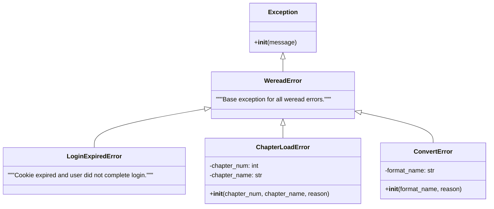
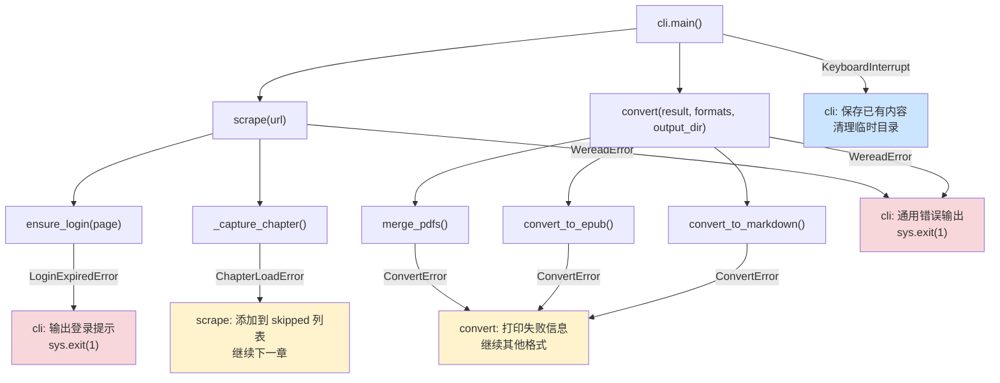

本文深入解析 `weread-scrapy` 项目的自定义异常层次结构及其在各模块中的错误处理策略。项目采用**基类统一定义、按场景派生、分层捕获处理**的三层设计，确保从浏览器自动化到格式转换的完整数据流中，每一类故障都能被精确识别、优雅降级并给出清晰的诊断信息。

Sources: [errors.py](src/weread/errors.py#L1-L19)

## 异常层次结构：三层继承体系

整个项目定义了一个精简但职责明确的异常体系，所有自定义异常均继承自统一的基类 `WereadError`，按照故障域分为三个派生类：

这个设计的核心原则是：**基类提供统一的 `except WereadError` 捕获入口，派生类携带丰富的上下文信息以支持精确诊断**。注意 `LoginExpiredError` 没有额外属性——它只需要表示"登录未完成"这个布尔事实；而 `ChapterLoadError` 和 `ConvertError` 则分别携带章节编号、格式名称等结构化元数据，使得上层处理逻辑可以据此决定恢复策略。

Sources: [errors.py](src/weread/errors.py#L1-L19)

## 异常定义详解

### WereadError — 全局基类

`WereadError` 作为整个异常体系的根节点，本身不携带额外属性，仅作为类型标记存在。它的核心价值体现在 CLI 入口处——`cli.py` 通过 `except WereadError` 实现对所有业务异常的统一兜底捕获，确保任何未被精细处理的子类异常都能以一致的格式输出错误信息并退出，而非抛出原始 Python traceback。

Sources: [errors.py](src/weread/errors.py#L1-L2), [cli.py](src/weread/cli.py#L94-L96)

### LoginExpiredError — 登录态失效

`LoginExpiredError` 在 `auth.py` 的 `ensure_login()` 函数中触发，触发场景是用户在扫码登录交互中按下 `Ctrl+C` 或输入 EOF。它被设计为一个轻量级的信号异常——不需要携带额外上下文，因为登录失败本身就是一个二值状态：成功或未完成。在 CLI 层，它享有独立的 `except` 分支，输出特定的引导提示"登录失败，请重新运行并扫码登录"，而非通用的错误消息。

Sources: [errors.py](src/weread/errors.py#L4-L5), [auth.py](src/weread/auth.py#L28-L44)

### ChapterLoadError — 章节渲染失败

`ChapterLoadError` 是信息密度最高的异常类。它在构造时接收三个参数：`chapter_num`（章节序号）、`chapter_name`（章节名称）和 `reason`（失败原因），并自动拼接为人类可读的错误消息，例如 `"Chapter 3 (第三章：容器化部署): 渲染超时，重试后仍失败"`。这种设计使得异常对象既是错误信号，也是诊断报告——调用方可以直接 `str(e)` 获取完整上下文，无需额外拼装日志。

Sources: [errors.py](src/weread/errors.py#L7-L12), [scraper.py](src/weread/scraper.py#L359-L361)

### ConvertError — 格式转换失败

`ConvertError` 保存 `format_name` 属性标识失败的输出格式（`pdf`、`markdown` 或 `epub`），并通过 `from e` 语法链式保留原始异常（exception chaining）。这种设计让调用方可以同时获取高层语义信息（"EPUB 转换失败"）和底层技术细节（底层库抛出的具体错误）。值得注意的是，`convert_to_epub()` 函数在内部单独 `except ConvertError: raise` 以防止自身的异常被外层 `except Exception` 误捕获并二次包装。

Sources: [errors.py](src/weread/errors.py#L14-L18), [converter.py](src/weread/converter.py#L136-L139)

## 错误处理策略：分层捕获与优雅降级

项目的错误处理并非简单的 try-catch 嵌套，而是按照**模块职责边界**分层设计，每一层只处理自己能理解的故障，其余向上传播。以下流程图展示了从 CLI 入口到具体操作的完整异常传播路径：

Sources: [cli.py](src/weread/cli.py#L60-L99), [scraper.py](src/weread/scraper.py#L473-L488), [converter.py](src/weread/converter.py#L142-L170)

### 策略一：重试机制（scraper 层）

在 `_capture_chapter()` 中，章节渲染采用有限重试策略：当 `_wait_for_render()` 超时抛出异常时，页面会被重新加载（`page.reload()`），同时重置 Canvas 日志的起始偏移量（因为全量重载会重新执行初始化脚本）。重试次数由常量 `_MAX_RETRY = 1` 控制，即最多尝试 2 次（初始 + 1 次重试）。只有当所有重试耗尽后，才抛出 `ChapterLoadError`。

Sources: [scraper.py](src/weread/scraper.py#L353-L364)

### 策略二：跳过降级（scrape 循环）

`scrape()` 的章节遍历循环中，`ChapterLoadError` 被 **局部捕获而非向上传播**。失败的章节会被记录到 `result.skipped` 列表中，以字符串形式保存完整的错误描述。这意味着即使某些章节渲染失败，抓取流程仍会继续处理后续章节——这是一种 **最大努力交付（best-effort delivery）** 策略。最终在 CLI 层，跳过的章节数量和详情会被汇总展示给用户。

Sources: [scraper.py](src/weread/scraper.py#L473-L488)

### 策略三：格式隔离（convert 入口）

`convert()` 函数对每种输出格式执行独立的 try-except，这意味着 **一个格式的转换失败不会影响其他格式**。例如，如果 EPUB 生成因图片缺失而抛出 `ConvertError`，PDF 和 Markdown 的生成仍会正常执行。这种隔离设计在 CLI 层产生了两种退出路径：如果所有格式都失败则输出"所有格式转换均失败"并以退出码 1 结束；如果至少一个格式成功则正常完成。

Sources: [converter.py](src/weread/converter.py#L150-L170), [cli.py](src/weread/cli.py#L75-L79)

### 策略四：中断保护（CLI 层）

`KeyboardInterrupt` 在 CLI 层享有特殊处理：如果用户在抓取过程中按下 Ctrl+C，系统会检查是否已有部分章节数据。如果有，则触发 `convert()` 保存已有内容，确保用户的等待不会完全白费。此外，`finally` 块确保无论执行路径如何（正常完成、异常退出、用户中断），临时目录都会被清理，避免残留 `weread_` 前缀的临时文件。

Sources: [cli.py](src/weread/cli.py#L84-L99)

## 异常处理策略对比

| 策略 | 适用异常 | 处理层 | 行为 | 用户感知 |
|------|----------|--------|------|----------|
| 重试机制 | 章节渲染超时 | `_capture_chapter()` | 重新加载页面，重置日志偏移 | 无感知（自动恢复） |
| 跳过降级 | `ChapterLoadError` | `scrape()` | 记录到 `skipped` 列表，继续下一章 | 汇总展示跳过的章节 |
| 格式隔离 | `ConvertError` | `convert()` | 打印失败信息，继续其他格式 | 部分文件生成成功 |
| 中断保护 | `KeyboardInterrupt` | `cli.main()` | 保存已有章节，清理临时目录 | 部分结果已保存提示 |
| 统一兜底 | `WereadError` | `cli.main()` | 输出错误信息，以退出码 1 结束 | 清晰的错误消息 |

Sources: [cli.py](src/weread/cli.py#L60-L99), [scraper.py](src/weread/scraper.py#L353-L364), [converter.py](src/weread/converter.py#L150-L170)

## 异常链与上下文保留

`ConvertError` 在所有转换函数中均通过 `raise ConvertError(...) from e` 语法抛出，这利用了 Python 的 **exception chaining** 机制：`__cause__` 属性被自动设置为原始异常，使得调试时可以看到完整的异常链。同时，`convert_to_epub()` 函数内部有一个关键模式——`except ConvertError: raise` 放在 `except Exception` 之前，确保已被包装为 `ConvertError` 的异常不会在内层被再次捕获和包装。

Sources: [converter.py](src/weread/converter.py#L32-L41), [converter.py](src/weread/converter.py#L64), [converter.py](src/weread/converter.py#L136-L139)

## 设计决策总结

整个异常体系遵循以下设计原则：**异常定义集中、异常抛出分散、异常捕获分层**。`errors.py` 作为唯一的异常定义文件，仅 19 行代码就定义了完整的异常层次；各模块按职责抛出对应的异常类型；而捕获逻辑则根据恢复能力分布在不同的调用层级中——能重试的重试，能跳过的跳过，能降级的降级，都不能的才向上传播到 CLI 统一处理。这种设计使得每层代码只需关心自己能处理的故障场景，避免了过度防御性的异常处理导致的代码膨胀。

如果你希望了解异常体系在整个数据流中的具体位置，建议阅读 [整体架构：从 URL 到电子书的完整数据流](4-zheng-ti-jia-gou-cong-url-dao-dian-zi-shu-de-wan-zheng-shu-ju-liu)；对于异常所涉及的文件路径和临时目录管理机制，参见 [工具函数模块：文件名清洗与路径管理](6-gong-ju-han-shu-mo-kuai-wen-jian-ming-qing-xi-yu-lu-jing-guan-li)。