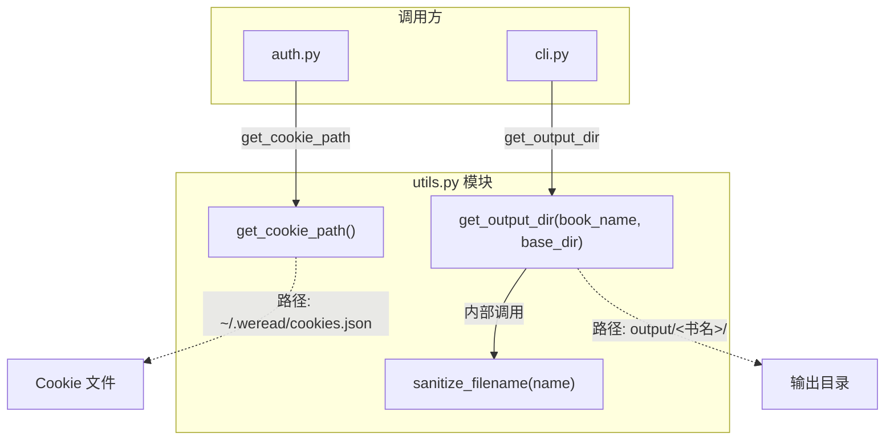
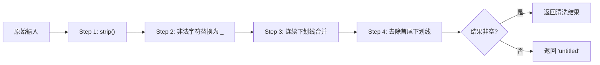

在整个微信读书导出工具的架构中，[utils.py](src/weread/utils.py) 是一个精巧但不可或缺的基础模块。它只包含 **三个函数** 和 **两个预编译正则**，却承担着跨越文件系统安全边界的核心职责：将用户不可控的书籍名称（可能包含各种操作系统不允许的字符）安全地转化为合法的文件名，并在此基础上管理 Cookie 持久化路径与输出目录的创建。这个模块被 [auth.py](src/weread/auth.py) 和 [cli.py](src/weread/cli.py) 直接引用，是登录状态管理和文件输出的基础设施层。

Sources: [utils.py](src/weread/utils.py#L1-L32), [auth.py](src/weread/auth.py#L8), [cli.py](src/weread/cli.py#L12)

## 模块架构总览

下图展示了 `utils.py` 中三个函数的职责划分以及它们在系统中的调用关系。**`sanitize_filename`** 是整个模块的核心 —— 它不仅被 `get_output_dir` 内部调用，其设计哲学（安全优先、绝不抛异常）也贯穿了模块中所有路径管理函数的实现思路。

Sources: [utils.py](src/weread/utils.py#L1-L32), [auth.py](src/weread/auth.py#L14-L21), [cli.py](src/weread/cli.py#L67-L68)

## 预编译正则表达式：模块级常量

模块顶部定义了两个预编译的正则表达式对象，它们在模块加载时一次性编译完成，之后所有函数调用共享同一份编译结果。这种设计避免了每次函数调用时的重复编译开销，是 Python 中使用 `re` 模块的最佳实践之一。

| 常量名 | 正则模式 | 用途 |
|--------|---------|------|
| `_ILLEGAL_CHARS` | `[<>:"/\\|?*\x00-\x1f]` | 匹配 Windows/macOS/Linux 三大平台上文件名中不允许出现的字符 |
| `_MULTI_UNDERSCORE` | `_+` | 匹配一个或多个连续下划线，用于将多个下划线合并为一个 |

`_ILLEGAL_CHARS` 覆盖的字符集包括：尖括号 `<>`、冒号 `:`、双引号 `"`、正斜杠 `/`、反斜杠 `\`、竖线 `|`、问号 `?`、星号 `*`，以及 ASCII 控制字符（`\x00` 到 `\x1f`，即 0-31 号字符）。以 `_` 开头的命名约定（Python 中的"受保护"约定）表明这两个常量只在模块内部使用，不属于公开 API。

Sources: [utils.py](src/weread/utils.py#L6-L7)

## sanitize_filename：文件名清洗函数

`sanitize_filename` 是本模块最核心的函数，它接收一个任意字符串，经过四步清洗管线（Pipeline）后返回一个文件系统安全的名称。整个处理流程**绝不抛出异常**——即使输入是最极端的情况（空字符串或全部由非法字符组成），也能优雅地返回 `"untitled"` 作为兜底值。

下面用一个表格展示每一步处理的具体效果：

| 清洗步骤 | 代码 | 输入示例 | 处理后结果 |
|---------|------|---------|-----------|
| 1. 去除首尾空白 | `name.strip()` | `"  认知觉醒  "` | `"认知觉醒"` |
| 2. 替换非法字符 | `_ILLEGAL_CHARS.sub("_", name)` | `"认知/觉醒:第一版"` | `"认知_觉醒_第一版"` |
| 3. 合并连续下划线 | `_MULTI_UNDERSCORE.sub("_", name)` | `"a///b"` | `"a_b"` |
| 4. 去除首尾下划线 | `name.strip("_")` | `"_书名_"` | `"书名"` |
| 5. 空值兜底 | `name if name else "untitled"` | `""` 或 `"///"` | `"untitled"` |

注意步骤 2 和步骤 3 之间存在隐含的因果关系：当输入 `"a///b"` 时，步骤 2 先将 `/` 替换为 `_`，变成 `"a___b"`，然后步骤 3 将三个下划线合并为一个，最终得到 `"a_b"`。这种"先替换再合并"的两阶段策略确保了无论原始字符串中有多少非法字符相邻，输出中最多只出现单个下划线。

Sources: [utils.py](src/weread/utils.py#L10-L15)

## get_cookie_path：Cookie 持久化路径管理

`get_cookie_path` 函数负责确定 Cookie 文件的存储位置，并确保该目录存在。它始终返回 `~/.weread/cookies.json` 这个固定路径 —— 其中 `~` 代表当前用户的家目录。

函数体虽然只有两行，但包含了两个关键操作：

- **路径构建**：`Path.home() / ".weread" / "cookies.json"` 使用 `pathlib.Path` 的 `/` 运算符进行跨平台安全的路径拼接
- **目录创建**：`path.parent.mkdir(parents=True, exist_ok=True)` 确保在返回路径之前，`.weread` 目录一定存在。`parents=True` 允许递归创建父目录，`exist_ok=True` 保证目录已存在时不抛异常

`get_cookie_path` 被 [登录状态管理：Cookie 持久化与扫码登录流程](11-deng-lu-zhuang-tai-guan-li-cookie-chi-jiu-hua-yu-sao-ma-deng-lu-liu-cheng) 中介绍的 `auth.py` 模块在两个场景下调用：一是检查 Cookie 文件是否存在（`get_storage_state_path`），二是保存新的登录状态（`save_state`）。

Sources: [utils.py](src/weread/utils.py#L18-L21), [auth.py](src/weread/auth.py#L14-L21)

## get_output_dir：输出目录管理

`get_output_dir` 是 `sanitize_filename` 和 `pathlib.Path` 的组合应用，它根据书籍名称生成一个安全的输出目录路径，并自动创建该目录。函数接受两个参数：

| 参数 | 类型 | 默认值 | 说明 |
|------|------|--------|------|
| `book_name` | `str` | （必填） | 书籍原始名称，可能包含任意字符 |
| `base_dir` | `str \| None` | `None` | 自定义输出根目录；为 `None` 时使用默认的 `"output"` 目录 |

函数的执行逻辑分为三步：

1. **名称清洗**：调用 `sanitize_filename(book_name)` 将书名转化为安全字符串 `safe_name`
2. **路径构建**：根据 `base_dir` 是否提供，构建 `base_dir/safe_name` 或 `output/safe_name` 的路径
3. **目录创建**：`out.mkdir(parents=True, exist_ok=True)` 确保目录存在

举例说明：当 `book_name = "深入理解计算机系统（原书第3版）"` 且 `base_dir = None` 时，函数将创建并返回 `output/深入理解计算机系统（原书第3版）/` 目录。由于中文书名通常不包含非法字符，清洗步骤往往不会改变名称。但当书名包含特殊符号（如冒号、斜杠）时，清洗步骤就变得至关重要——例如 `"Git/GitHub 实践"` 将被清洗为 `"Git_GitHub 实践"`。

Sources: [utils.py](src/weread/utils.py#L24-L31), [cli.py](src/weread/cli.py#L67-L68)

## 设计哲学：安全优先与防御式编程

`utils.py` 的整体设计体现了三个一致的工程原则：

**第一，绝对不抛异常。** 三个函数的返回值类型都是 `Path` 或 `str`，不存在任何异常路径。`sanitize_filename` 用 `"untitled"` 兜底空值；`get_cookie_path` 和 `get_output_dir` 使用 `exist_ok=True` 避免目录已存在时的异常。这使得调用方无需额外的 try-except 包装，代码更简洁。

**第二，幂等性。** 多次调用同一函数并传入相同参数，结果完全一致。`mkdir(parents=True, exist_ok=True)` 保证重复创建目录不会报错；`sanitize_filename` 对已经清洗过的名称再次清洗也不会改变结果。

**第三，单一职责的内聚性。** 每个函数只做一件事：`sanitize_filename` 只负责字符串清洗，不涉及文件系统操作；`get_cookie_path` 和 `get_output_dir` 只负责路径管理和目录创建，不做内容读写。这种清晰的职责边界使函数易于测试和复用。

Sources: [utils.py](src/weread/utils.py#L1-L32)

## 模块依赖关系

从依赖视角来看，`utils.py` 是项目中依赖层级最低的模块之一。它只依赖 Python 标准库的 `re` 和 `pathlib`，不依赖项目内的任何其他模块。反过来，它被两个上层模块所依赖：

| 调用方 | 导入的函数 | 使用场景 |
|--------|-----------|---------|
| [auth.py](src/weread/auth.py#L8) | `get_cookie_path` | 登录状态检查与保存时定位 Cookie 文件 |
| [cli.py](src/weread/cli.py#L12) | `get_output_dir` | 主流程中根据书名创建输出目录 |

值得注意的是，虽然 `sanitize_filename` 在 `get_output_dir` 内部被间接使用，但它在测试文件 [test_utils.py](tests/test_utils.py#L1) 中也被直接导入并进行了详尽的边界测试。这说明 `sanitize_filename` 作为独立的公开 API，其稳定性对整个系统至关重要——关于它的测试策略详见 [工具函数单元测试：文件名清洗边界用例](19-gong-ju-han-shu-dan-yuan-ce-shi-wen-jian-ming-qing-xi-bian-jie-yong-li)。

Sources: [utils.py](src/weread/utils.py#L1-L4), [auth.py](src/weread/auth.py#L8), [cli.py](src/weread/cli.py#L12), [test_utils.py](tests/test_utils.py#L1)

## 延伸阅读

- 如果你想了解文件名清洗后输出目录在完整抓取流程中的角色，请阅读 [整体架构：从 URL 到电子书的完整数据流](4-zheng-ti-jia-gou-cong-url-dao-dian-zi-shu-de-wan-zheng-shu-ju-liu)
- 如果你想深入了解 `get_cookie_path` 在登录流程中的具体使用方式，请阅读 [登录状态管理：Cookie 持久化与扫码登录流程](11-deng-lu-zhuang-tai-guan-li-cookie-chi-jiu-hua-yu-sao-ma-deng-lu-liu-cheng)
- 如果你想查看 `sanitize_filename` 面对各种极端输入时的测试用例，请阅读 [工具函数单元测试：文件名清洗边界用例](19-gong-ju-han-shu-dan-yuan-ce-shi-wen-jian-ming-qing-xi-bian-jie-yong-li)