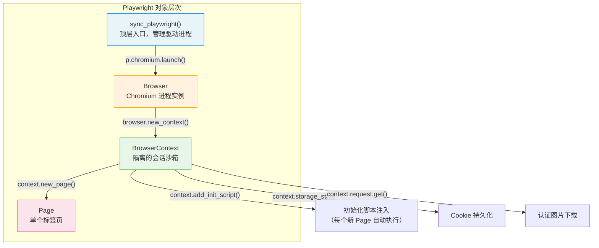
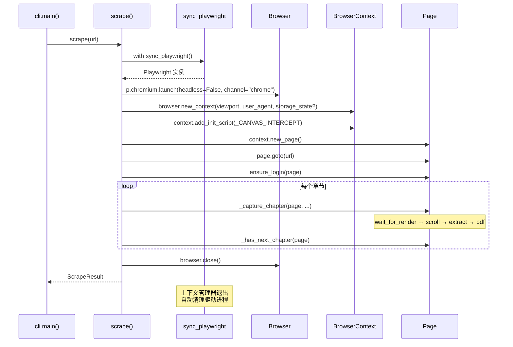

本文深入剖析 weread-scrapy 项目中 Playwright 浏览器自动化的完整技术栈——从 Chromium 进程的启动参数、BrowserContext 的隔离配置，到反自动化检测的工程实现。这些机制是整个抓取管线的基石：它决定了后续 Canvas 拦截脚本能否在微信读书的渲染环境中正确注入、章节内容能否被完整触发渲染。理解本页内容后，读者将掌握项目为何选择"有头浏览器 + 初始化脚本注入"这一架构路径，以及每一项配置参数背后的工程权衡。

Sources: [scraper.py](src/weread/scraper.py#L1-L29), [cli.py](src/weread/cli.py#L60-L62)

## 三层对象模型：Browser → Context → Page

Playwright 的同步 API 围绕三个核心抽象构建，本项目严格遵循这一层次结构。理解它们的职责边界，是读懂后续所有配置逻辑的前提。



**Browser** 是 Chromium 进程的封装。本项目通过 `p.chromium.launch()` 启动，`headless=False` 参数确保进程以可见窗口模式运行——这不是疏忽，而是设计选择：微信读书的 Canvas 渲染引擎在有头模式下行为更稳定，且登录环节需要用户扫码交互。

**BrowserContext** 是会话隔离单元，相当于一个"无痕窗口"。它承载了三项关键职责：自定义视口尺寸与 User-Agent、从 `storage_state` 恢复登录态、以及通过 `add_init_script()` 注册全局注入脚本。每个 Context 拥有独立的 Cookie 存储和网络请求上下文，因此 `context.request.get()` 能复用页面的认证状态下载图片资源。

**Page** 是具体的标签页操作接口，负责页面导航、DOM 查询、JavaScript 执行等。本项目在 Page 层面完成章节渲染等待、内容提取和 PDF 导出。

Sources: [scraper.py](src/weread/scraper.py#L446-L463)

## 浏览器启动配置详解

`scrape()` 函数是整个抓取流程的入口，浏览器启动发生在其内部的 `with sync_playwright()` 上下文管理器中。启动参数的选择直接影响微信读书页面的渲染行为和反检测能力。

| 参数 | 值 | 作用 | 工程权衡 |
|------|------|------|----------|
| `headless` | `False` | 以可见窗口模式运行 Chromium | 牺牲服务器部署便利性，换取 Canvas 渲染稳定性与扫码登录能力 |
| `channel` | `"chrome"` | 使用系统安装的 Chrome 而非 Playwright 内置 Chromium | Chrome 拥有更真实的浏览器指纹（字体列表、WebGL 特征），降低被识别风险 |
| `args` | `_BROWSER_ARGS` | 传递 Chromium 命令行开关 | 反自动化检测的核心防线 |

`channel="chrome"` 这一参数值得特别说明。Playwright 默认使用其自带的 Chromium 构建，虽然版本较新，但其二进制文件在指纹特征上与用户日常使用的 Chrome 存在差异——例如字体枚举结果、WebGL 渲染器字符串、插件列表等。通过指定 `channel="chrome"`，Playwright 会定位系统 PATH 中的 Google Chrome 可执行文件来启动，这使浏览器指纹更接近真实用户环境。

Sources: [scraper.py](src/weread/scraper.py#L447-L451), [scraper.py](src/weread/scraper.py#L23-L25)

## 反自动化检测策略

现代 Web 平台检测浏览器自动化的手段多种多样，微信读书所依赖的腾讯反爬体系同样具备此类能力。本项目采用两层防御策略：**Chromium 层面的特征消除**和**HTTP 层面的身份伪装**。

### 第一层：AutomationControlled 特征消除

```
_BROWSER_ARGS = [
    "--disable-blink-features=AutomationControlled",
]
```

这是最关键的一条启动参数。Chromium 内核在检测到自身处于自动化控制模式时，会在全局对象上暴露 `navigator.webdriver = true` 属性，并通过 `window.chrome.runtime` 等接口暴露自动化特征。`--disable-blink-features=AutomationControlled` 从 Blink 渲染引擎层面关闭这些特征标记，使 `navigator.webdriver` 返回 `undefined` 而非 `true`。

这一参数需要在进程启动时传递（即 `launch()` 调用），而非运行时动态修改，因为它是 Chromium 初始化阶段的特性开关。

Sources: [scraper.py](src/weread/scraper.py#L23-L25)

### 第二层：User-Agent 身份伪装

```python
_USER_AGENT = (
    "Mozilla/5.0 (Macintosh; Intel Mac OS X 10_15_7) "
    "AppleWebKit/537.36 (KHTML, like Gecko) Chrome/125.0.0.0 Safari/537.36"
)
```

User-Agent 字符串通过 BrowserContext 级别注入，确保所有在该 Context 下创建的 Page 都使用相同的 UA。该字符串模拟了 macOS Chrome 125 的标准指纹。选择 UA 与 `channel="chrome"` 保持一致是必要的——如果 UA 声称是 Chrome 但实际运行 Chromium，某些检测脚本会通过 `navigator.userAgent` 与 Chrome 特有 API（如 `window.chrome` 对象）的不一致性来识别自动化环境。

值得注意的是，UA 的版本号（Chrome/125）是静态硬编码的。在长期运行场景下，这可能与实际 Chrome 版本产生偏差，但对于当前的单次抓取场景而言，这种静态策略已足够。

Sources: [scraper.py](src/weread/scraper.py#L26-L29), [scraper.py](src/weread/scraper.py#L456)

### 反检测策略全景

| 检测维度 | 防御手段 | 生效层级 | 配置位置 |
|----------|----------|----------|----------|
| `navigator.webdriver` | `--disable-blink-features=AutomationControlled` | Browser 启动参数 | `_BROWSER_ARGS` |
| HTTP 请求头 UA | 自定义 User-Agent 字符串 | BrowserContext 配置 | `_USER_AGENT` |
| 浏览器二进制指纹 | `channel="chrome"` 使用系统 Chrome | Browser 启动参数 | `launch()` 调用 |
| 自动化行为模式 | `headless=False` 有头模式 | Browser 启动参数 | `launch()` 调用 |

Sources: [scraper.py](src/weread/scraper.py#L23-L29), [scraper.py](src/weread/scraper.py#L447-L451)

## BrowserContext 会话配置

BrowserContext 是 Playwright 的"隔离沙箱"概念。本项目通过 `browser.new_context(**context_kwargs)` 创建，配置了四个关键维度：

```python
context_kwargs: dict = {
    "viewport": {"width": 800, "height": 1200},
    "user_agent": _USER_AGENT,
}
if state_path:
    context_kwargs["storage_state"] = str(state_path)

context = browser.new_context(**context_kwargs)
context.add_init_script(_CANVAS_INTERCEPT)
```

**视口尺寸**（`viewport: {width: 800, height: 1200}`）的选择并非随意。微信读书的阅读器使用 Canvas 渲染书籍内容，文字的排版布局与视口宽度直接相关——宽度越窄，每行容纳的字符越少，产生的 `fillText` 调用越密集。800px 的宽度在内容可读性和 Canvas 拦截效率之间取得了平衡。1200px 的高度则减少了分页次数，使单次滚动能触发更多内容的渲染。

**Cookie 持久化**通过 `storage_state` 参数实现。该参数接受一个 JSON 文件路径，Playwright 在创建 Context 时自动加载其中的 Cookie 和 localStorage 数据。文件路径由 `get_storage_state_path()` 函数提供，指向 `~/.weread/cookies.json`。当文件不存在时（首次运行或 Cookie 过期后），参数被省略，触发后续的扫码登录流程。

**初始化脚本注入**是 `add_init_script(_CANVAS_INTERCEPT)` 的职责。它注册一段 JavaScript 代码，在 Context 下**每个新 Page 的任何脚本执行之前**自动运行。这意味着无论微信读书的 JavaScript 何时初始化其 Canvas 渲染引擎，`fillText` 和 `drawImage` 的钩子已经就位。关于钩子的具体实现原理，将在 [Canvas 文字拦截原理：fillText 钩子与文本行重组算法](8-canvas-wen-zi-lan-jie-yuan-li-filltext-gou-zi-yu-wen-ben-xing-zhong-zu-suan-fa) 和 [Canvas 图片提取：drawImage 钩子与 DOM 图片双重采集](9-canvas-tu-pian-ti-qu-drawimage-gou-zi-yu-dom-tu-pian-shuang-zhong-cai-ji) 中深入解析。

Sources: [scraper.py](src/weread/scraper.py#L453-L463), [auth.py](src/weread/auth.py#L14-L16), [utils.py](src/weread/utils.py#L18-L21)

## 页面导航与渲染等待策略

浏览器启动和 Context 配置完成后，执行流进入页面导航阶段：

```python
page = context.new_page()
page.goto(url, wait_until="domcontentloaded", timeout=30000)
ensure_login(page)
```

`wait_until="domcontentloaded"` 是一个关键选择。Playwright 支持多种导航等待策略（`load`、`domcontentloaded`、`networkidle`、`commit`），本项目选择了 `domcontentloaded`——即 HTML 解析完成、DOM 树构建就绪时就认为导航完成，而非等待所有资源（图片、样式表、脚本）加载完毕。这是因为微信读书的 Canvas 内容渲染是 JavaScript 驱动的异步过程，即使等待到 `load` 或 `networkidle`，Canvas 上的文字也未必已经绘制完成。真正的渲染完成判定发生在后续的 `_wait_for_render()` 函数中，通过等待特定 DOM 选择器出现来确认。

Sources: [scraper.py](src/weread/scraper.py#L465-L467), [scraper.py](src/weread/scraper.py#L292-L295)

## 浏览器生命周期与资源管理



浏览器的生命周期由 `with sync_playwright() as p:` 上下文管理器严格管控。这个 `with` 块确保了即使抓取过程中抛出异常（如 [自定义异常体系与错误处理策略](5-zi-ding-yi-yi-chang-ti-xi-yu-cuo-wu-chu-li-ce-lue) 中定义的 `ChapterLoadError`），Playwright 驱动进程也会被正确清理。

`browser.close()` 在抓取循环结束后显式调用，关闭所有 Page 和 Context，终止 Chromium 进程。此处需要注意一个微妙之处：`browser.close()` 会在 `with` 块退出前执行，`with` 块的退出仅负责清理 Playwright 自身的驱动进程（Pipe 连接）。这种双重清理机制避免了进程泄漏。

Sources: [scraper.py](src/weread/scraper.py#L446-L492)

## 认证状态的上下文传递

BrowserContext 的一个常被忽视但至关重要的能力是：**它同时承载了页面导航和 API 请求两套认证上下文**。在 `_download_image()` 函数中，图片下载通过 `context.request.get(src)` 完成——这是 Playwright 的 Context 级别 HTTP 客户端，它会自动携带该 Context 中所有的 Cookie 和认证头，无需手动设置 `Authorization` 或 `Cookie` 请求头。

```python
def _download_image(context: BrowserContext, src: str, images_dir: Path) -> Optional[str]:
    response = context.request.get(src, timeout=10000)
    if not response.ok:
        return None
    # ...
```

这意味着：当用户在页面中完成扫码登录后，Cookie 被存储在 Context 中，后续所有通过 `context.request` 发出的请求都能透明复用这个登录态。这比手动提取 Cookie 再拼接到 `requests.Session` 中要简洁得多，且避免了 Cookie 序列化/反序列化过程中可能丢失的 HttpOnly、Secure 等属性。

Sources: [scraper.py](src/weread/scraper.py#L70-L84), [scraper.py](src/weread/scraper.py#L233)

## 架构决策总结

下表总结了本项目中 Playwright 自动化的核心架构决策及其背后的理由：

| 决策 | 选择 | 替代方案 | 理由 |
|------|------|----------|------|
| 浏览器引擎 | 系统 Chrome（`channel="chrome"`） | Playwright 内置 Chromium | 真实浏览器指纹，降低检测概率 |
| 运行模式 | 有头（`headless=False`） | 无头模式 | Canvas 渲染稳定性 + 扫码登录交互 |
| 反检测手段 | `--disable-blink-features` + UA 伪装 | Stealth 插件 / CDP 协议修改 | 最小依赖，覆盖主要检测维度 |
| 视口尺寸 | 800×1200 | 全屏 / 其他尺寸 | 平衡内容密度与排版可读性 |
| JS 注入时机 | `add_init_script`（页面加载前） | `page.evaluate`（加载后） | 确保钩子在目标函数定义前就位 |
| Cookie 管理 | `storage_state` 持久化 | 手动 Cookie 操作 | 原生支持，完整保留所有 Cookie 属性 |

Sources: [scraper.py](src/weread/scraper.py#L23-L29), [scraper.py](src/weread/scraper.py#L446-L463)

## 延伸阅读

本章阐述了浏览器自动化的基础配置层。在此之上，各子模块协同完成了从内容拦截到数据重组的完整流程：

- **Canvas 拦截的具体实现**：[Canvas 文字拦截原理：fillText 钩子与文本行重组算法](8-canvas-wen-zi-lan-jie-yuan-li-filltext-gou-zi-yu-wen-ben-xing-zhong-zu-suan-fa) 详细解析 `_CANVAS_INTERCEPT` 中 `fillText` 钩子的劫持机制与文本行重组算法。
- **图片双重采集策略**：[Canvas 图片提取：drawImage 钩子与 DOM 图片双重采集](9-canvas-tu-pian-ti-qu-drawimage-gou-zi-yu-dom-tu-pian-shuang-zhong-cai-ji) 探讨 DOM 查询与 Canvas 拦截互补的图片获取方案。
- **章节遍历流程**：[章节遍历与翻页逻辑](10-zhang-jie-bian-li-yu-fan-ye-luo-ji) 覆盖从首章到末章的完整遍历机制。
- **登录态管理**：[登录状态管理：Cookie 持久化与扫码登录流程](11-deng-lu-zhuang-tai-guan-li-cookie-chi-jiu-hua-yu-sao-ma-deng-lu-liu-cheng) 解读 `ensure_login()` 的交互式登录与 `storage_state` 持久化细节。