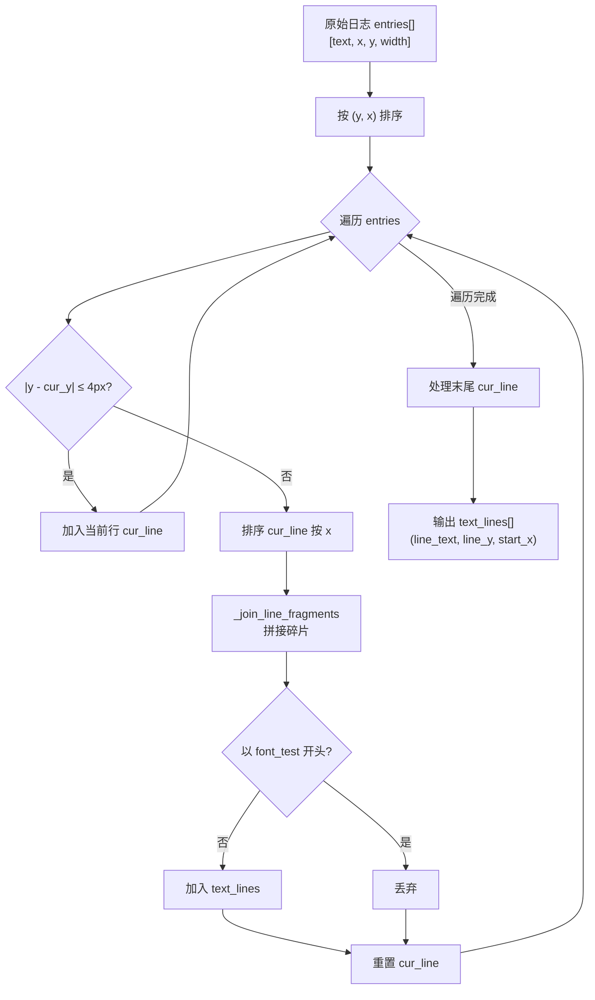
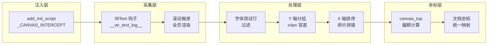

微信读书的书籍内容并非以传统 HTML 文本的形式渲染到页面上——它将整页文字绘制到 HTML5 `<canvas>` 元素中。这意味着 DOM 树里找不到任何可读文本，`page.inner_text()` 或 `page.query_selector()` 等常规 Playwright 文本提取手段全部失效。本页深入解析 weread-scrapy 如何通过 **原型链猴子补丁（monkey-patching）** 拦截 Canvas 的 `fillText` 调用，并以坐标为基础将零散的文本片段重组为完整的阅读文本行。

Sources: [scraper.py](src/weread/scraper.py#L31-L59)

## 问题背景：Canvas 渲染的文本不可达性

在微信读书的阅读器中，每一页书籍内容都由 JavaScript 调用 `CanvasRenderingContext2D.fillText()` 绘制到 Canvas 画布上。浏览器完成渲染后，Canvas 内的文本被栅格化为像素——它不再是字符数据，而是一张位图。这带来一个根本性的技术挑战：**如何从「已经画完的画」中还原出原始文本？** 正向解析（OCR 或像素分析）既昂贵又不精确，而本项目采用了一种优雅的逆向策略——在「画家落笔之前」截获他的每一次书写动作。

Sources: [scraper.py](src/weread/scraper.py#L31-L43)

## 注入时机与 init_script 机制

Playwright 的 `context.add_init_script()` 方法确保拦截脚本在页面自身的任何 JavaScript 执行之前被注入。这等价于在浏览器环境中进行了一次「预埋」——当微信读书的渲染引擎随后加载并调用 `fillText` 时，它调用的已经是我们包装过的版本，而非浏览器原生的实现。这一注入发生在 `scrape()` 主函数中：

```python
context = browser.new_context(**context_kwargs)
context.add_init_script(_CANVAS_INTERCEPT)  # ← 在所有页面脚本之前注入
page = context.new_page()
```

整个拦截脚本被定义为模块级常量 `_CANVAS_INTERCEPT`，是一段纯 JavaScript 字符串，随 `BrowserContext` 的生命周期全局生效——每一个通过该 context 创建的页面都会自动加载这段钩子代码。

Sources: [scraper.py](src/weread/scraper.py#L446-L463)

## fillText 钩子的实现原理

钩子的核心逻辑仅有十余行 JavaScript，但其设计精确地捕获了文本重组所需的全部信息：

```javascript
const _origFill = CanvasRenderingContext2D.prototype.fillText;
CanvasRenderingContext2D.prototype.fillText = function(text, x, y) {
    if (text && text.trim().length > 0) {
        const width = Math.round(this.measureText(text).width);
        window.__wr_text_log__.push([String(text), Math.round(x), Math.round(y), width]);
    }
    return _origFill.apply(this, arguments);
};
```

这段代码做了以下关键操作：

1. **保存原始引用**：将浏览器原生的 `fillText` 方法缓存到 `_origFill` 变量中，确保钩子不会破坏原始渲染行为。
2. **原型链替换**：在 `CanvasRenderingContext2D.prototype` 上覆盖 `fillText`，使得所有 Canvas 上下文实例（无论何时创建）都会经过我们的拦截逻辑。
3. **数据采集**：对每次非空的 `fillText` 调用，通过 `this.measureText(text).width` 获取文本的像素宽度，并与文本内容、X 坐标、Y 坐标一起推入全局日志数组 `__wr_text_log__`。
4. **透明转发**：`return _origFill.apply(this, arguments)` 确保原始绘制行为完全不受影响——用户看到的页面与未注入钩子时完全一致。

每条日志记录的数据结构为 `[text, x, y, width]`，这四个字段构成了后续文本行重组算法的全部输入。

Sources: [scraper.py](src/weread/scraper.py#L36-L43)

## 滚动触发：强制渲染全部内容

微信读书的 Canvas 渲染采用**视口懒加载**策略——只有滚动到可视区域的文字才会被绘制到 Canvas 上。这意味着如果只读取当前视口的日志，只能获取一屏内容。`_collect_chapter_content` 函数通过程序化滚动来强制触发完整渲染：

```python
page.evaluate("""async () => {
    const h = document.documentElement.scrollHeight;
    const step = 400;
    for (let y = 0; y < h; y += step) {
        window.scrollTo(0, y);
        await new Promise(r => setTimeout(r, 80));
    }
    window.scrollTo(0, 0);
}""")
page.wait_for_timeout(1000)
```

以 400px 为步长从页面顶部滚动到底部，每步间隔 80ms 给 Canvas 渲染留出时间。滚动完成后回滚到顶部，再等待 1000ms 确保所有异步渲染完毕。此时 `__wr_text_log__` 数组中已包含当前章节所有文本片段的完整记录。

Sources: [scraper.py](src/weread/scraper.py#L111-L120)

## 字体测试行过滤

微信读书在每次页面加载时都会在 Canvas 上绘制一条由小写字母组成的字体测量行（`"abcdefghijklmnopqrstuvwxyz..."`），用于度量各字符的字形宽度。这条测试行会混入 `__wr_text_log__` 日志中，必须在重组之前被剔除。

过滤策略采用**两阶段检测**：

1. **首条跳过模式**：设置 `skip = True` 标志位，在遇到第一条非字母表文本之前持续跳过所有以 `"a"` 开头或以 `_FONT_TEST_PREFIX` 开头的记录。
2. **结果后验证**：即使文本行已经拼接完成，仍会检查 `joined.startswith(_FONT_TEST_PREFIX)` 以排除混入正常 Y 坐标区间的残余测试行。

```python
skip = True
for item in raw_text:
    ...
    if skip:
        if text == "a" or text.startswith(_FONT_TEST_PREFIX):
            continue
        skip = False
    entries.append((text, x, y, w))
```

Sources: [scraper.py](src/weread/scraper.py#L61-L62), [scraper.py](src/weread/scraper.py#L126-L137)

## 文本行重组算法：从碎片到完整行

这是整个文本提取流程中最核心的算法。Canvas 渲染引擎可能将一行文字拆分为多个 `fillText` 调用（例如中英文混排、样式变化、换行点），因此需要根据坐标信息将这些碎片重新拼合为逻辑文本行。

### 整体流程



### Y 轴分组：±4px 容差聚类

排序后的 entries 按 Y 坐标依次处理。由于 Canvas 渲染存在亚像素级别的浮点偏差，同一逻辑行内的多个 `fillText` 调用可能产生微小不同的 Y 值。算法以 **4 像素**为容差阈值——当当前 entry 的 Y 值与当前行基准 Y 值 `cur_y` 的偏差超过 4px 时，判定为新的一行：

```python
entries.sort(key=lambda e: (e[2], e[1]))  # 先按 Y，再按 X 排序
cur_y = entries[0][2]
for text, x, y, w in entries:
    if abs(y - cur_y) > 4:   # ← 新行判定
        # 处理旧行...
        cur_line = [(text, x, y, w)]
        cur_y = y
    else:
        cur_line.append((text, x, y, w))
```

4px 阈值的设计考量：中文字体在典型阅读字号（14-18px）下，行高通常为 20-30px，相邻行之间的 Y 坐标差远大于 4px；而同一行内因渲染引擎浮点误差产生的偏差通常在 1-2px 以内。4px 恰好是一个安全的分隔线。

Sources: [scraper.py](src/weread/scraper.py#L140-L159)

### X 轴碎片拼接：间隙检测与空格插入

同一行内的多个文本碎片按 X 坐标升序排列后，由 `_join_line_fragments` 函数完成最终拼接。其核心逻辑是检测相邻碎片之间是否存在**X 轴间隙（gap）**，并在间隙超过 2 像素时插入空格：

```python
def _join_line_fragments(frags: list[tuple[str, int, int, int]]) -> str:
    parts = [frags[0][0]]
    prev_end = frags[0][1] + frags[0][3]  # x + width = 当前碎片右边界
    for text, x, _y, w in frags[1:]:
        gap = x - prev_end
        if gap > 2:
            parts.append(" ")
        parts.append(text)
        prev_end = x + w
    return "".join(parts)
```

算法维护一个 `prev_end` 变量追踪已处理碎片的最右边界（`x + width`），下一个碎片的 X 坐标与 `prev_end` 的差值即为间隙。**2px 阈值**的设计同样基于实践：同一单词/词组内的碎片间隙通常为 0（紧密排列）或 1px（亚像素取整），而词与词之间的间隙通常为 4-8px（取决于字号和字间距）。

Sources: [scraper.py](src/weread/scraper.py#L87-L101)

## Canvas 坐标到文档坐标的映射

Canvas 的坐标系原点在 `<canvas>` 元素的左上角，是一个**局部坐标空间**。而最终需要将文本行与 DOM 图片按文档流位置合并，因此必须将 Canvas 局部 Y 坐标转换为**文档全局 Y 坐标**。`_collect_chapter_content` 通过 JavaScript 获取 Canvas 元素在文档中的绝对位置：

```javascript
const canvases = Array.from(document.querySelectorAll('canvas'));
const best = canvases.reduce((a, b) =>
    (a.width * a.height > b.width * b.height) ? a : b);
return Math.round(best.getBoundingClientRect().top + window.scrollY);
```

在页面中可能存在多个 Canvas 元素（如 UI 装饰），算法选择面积最大的那个作为主内容画布，将其 `getBoundingClientRect().top + window.scrollY`（元素视口顶部 + 当前滚动偏移）作为 `canvas_top` 偏移量。后续所有文本行的文档 Y 坐标即为 `canvas_top + y`。

Sources: [scraper.py](src/weread/scraper.py#L161-L168), [scraper.py](src/weread/scraper.py#L238)

## 日志位置标记与章节隔离

在多章节连续抓取场景中，`__wr_text_log__` 和 `__wr_img_log__` 是全局累积数组——每个章节的渲染记录会追加在前一章节的记录之后。`_capture_chapter` 函数通过记录**章节渲染前的日志长度**来实现隔离：

```python
text_start = page.evaluate("window.__wr_text_log__.length")
img_start = page.evaluate("window.__wr_img_log__.length")
```

在调用 `_collect_chapter_content` 时传入这两个偏移量，函数内部通过 `all_text[text_start:]` 切片提取当前章节的新增记录。这种设计避免了对日志数组的清空操作，保证了跨章节数据的完整性。值得注意的是，当页面发生完全 reload（重试逻辑）时，init_script 会重新执行，日志数组被重置为空，此时偏移量也需归零。

Sources: [scraper.py](src/weread/scraper.py#L349-L364)

## 数据流全景



Sources: [scraper.py](src/weread/scraper.py#L31-L289)

## 关键参数速查表

| 参数 | 值 | 作用域 | 说明 |
|---|---|---|---|
| 滚动步长 | `400px` | 滚动触发 | 每次滚动的像素距离 |
| 滚动间隔 | `80ms` | 滚动触发 | 每步等待渲染的时间 |
| 滚动后等待 | `1000ms` | 滚动触发 | 全部滚动完成后的缓冲时间 |
| Y 轴分组容差 | `4px` | 行分组 | 同一行内 Y 坐标的最大偏差 |
| X 轴间隙阈值 | `2px` | 碎片拼接 | 触发空格插入的最小间距 |
| 字体测试前缀 | `"abcdefghijklmnopqrstuvwxyz"` | 过滤 | WeRead 字体测量行的特征标识 |

Sources: [scraper.py](src/weread/scraper.py#L62-L119)

## 延伸阅读

本文聚焦于文本提取的拦截与重组机制。Canvas 中的图片提取采用了独立的 `drawImage` 钩子策略，详见 [Canvas 图片提取：drawImage 钩子与 DOM 图片双重采集](9-canvas-tu-pian-ti-qu-drawimage-gou-zi-yu-dom-tu-pian-shuang-zhong-cai-ji)。重组后的文本行如何被识别为逻辑段落，则涉及缩进检测与 Y 轴间距分析，详见 [段落识别算法：缩进检测与 Y 轴间距分析](12-duan-luo-shi-bie-suan-fa-suo-jin-jian-ce-yu-y-zhou-jian-ju-fen-xi)。整个拦截脚本的注入依赖于 Playwright 浏览器自动化的启动配置，相关内容参见 [Playwright 浏览器自动化：启动配置与反检测策略](7-playwright-liu-lan-qi-zi-dong-hua-qi-dong-pei-zhi-yu-fan-jian-ce-ce-lue)。