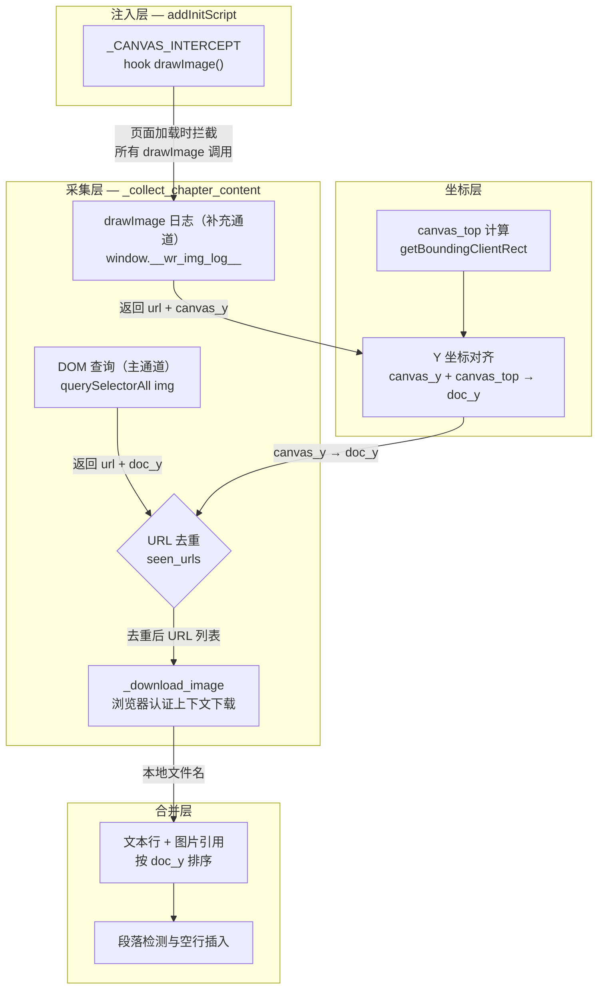

微信读书的阅读器以 Canvas 渲染为主，正文文字通过 `fillText` 绘制，插图则通过 `drawImage` 调用加载到画布上。与文字采集不同，图片采集面临一个独特的架构挑战：**并非所有图片都经由 Canvas 绘制**——部分书籍中的插图以标准 `` DOM 元素呈现，另一些则被 Canvas 直接消费，DOM 中无迹可寻。本项目的解法是**双重采集策略**：以 DOM `` 查询为主通道（可靠且自带文档坐标），以 Canvas `drawImage` 钩子日志为补充通道（捕获 Canvas 内部渲染的图片），两条通道的去重与合并构成了一个健壮的图片提取管线。

Sources: [scraper.py](src/weread/scraper.py#L31-L59)

## 架构总览：双重采集管线

下面的 Mermaid 图展示了图片从微信读书服务器到本地 Markdown 引用的完整数据流。理解此图需要先了解三个前置概念：**drawImage 钩子**是在页面脚本执行前注入的原型方法拦截器；**DOM 查询**是在页面渲染完成后对 DOM 树的直接检索；**`canvas_top` 偏移**是将 Canvas 坐标系中的 Y 值转换为文档绝对 Y 值的校正量。



Sources: [scraper.py](src/weread/scraper.py#L104-L289)

## drawImage 钩子：Canvas 渲染拦截

### 原型方法替换机制

图片拦截的底层原理与 [Canvas 文字拦截原理：fillText 钩子与文本行重组算法](8-canvas-wen-zi-lan-jie-yuan-li-filltext-gou-zi-yu-wen-ben-xing-zhong-zu-suan-fa) 中描述的 `fillText` 钩子完全一致——通过替换 `CanvasRenderingContext2D.prototype` 上的原生方法实现拦截。注入脚本 `_CANVAS_INTERCEPT` 在 Browser Context 创建时通过 `context.add_init_script()` 注册，确保**在任何页面脚本执行之前**完成原型替换，从而不遗漏任何后续的 Canvas 绑定操作。

```javascript
const _origDraw = CanvasRenderingContext2D.prototype.drawImage;
CanvasRenderingContext2D.prototype.drawImage = function() {
    const src = arguments[0];
    let imgUrl = null;
    if (src instanceof HTMLImageElement) {
        imgUrl = src.currentSrc || src.src || null;
    }
    // ... 日志记录 ...
    return _origDraw.apply(this, arguments);
};
```

钩子的核心逻辑是检查 `drawImage` 的第一个参数（即图片来源）是否为 `HTMLImageElement`。如果是，则通过 `currentSrc` 或 `src` 属性提取图片 URL。随后调用 `_origDraw.apply(this, arguments)` 将调用原封不动地传递给原生方法，**保证渲染行为零干扰**。

Sources: [scraper.py](src/weread/scraper.py#L45-L58)

### drawImage 参数多态与 Y 坐标提取

`CanvasRenderingContext2D.drawImage()` 有三种标准重载签名，参数数量分别为 3、5、9 个。钩子需要从不同签名中正确提取绘制位置的 Y 坐标（`dy`），用于后续按文档位置排序图片：

| 参数数量 | 签名 | dy 位置 | 语义 |
|----------|------|---------|------|
| 3 | `(image, dx, dy)` | `arguments[2]` | 原始尺寸绘制 |
| 5 | `(image, dx, dy, dWidth, dHeight)` | `arguments[2]` | 缩放绘制 |
| 9 | `(image, sx, sy, sWidth, sHeight, dx, dy, dWidth, dHeight)` | `arguments[6]` | 裁剪+缩放绘制 |

代码通过 `arguments.length` 判断签名类型：当参数数 ≥ 9 时取 `arguments[6]`，否则取 `arguments[2]`，兜底为 0。这个 Y 坐标是**Canvas 坐标系**内的值，后续需要加上 `canvas_top` 偏移才能转换为文档绝对 Y 坐标。

Sources: [scraper.py](src/weread/scraper.py#L52-L56)

### 过滤策略：排除 data URI

钩子通过 `!imgUrl.startsWith('data:')` 条件过滤掉所有 Base64 内嵌图片。这一设计决策基于两个考量：其一，微信读书的内容图片均通过 CDN URL 加载，data URI 仅出现在 UI 元素（如 loading 动画）中；其二，data URI 无需下载，它们已经是浏览器内存中的位图数据，对图片采集管线没有价值。日志记录的格式为 `[imgUrl, Math.round(dy)]`——一个 URL 与 Canvas Y 坐标的二元组，被推入全局数组 `window.__wr_img_log__`。

Sources: [scraper.py](src/weread/scraper.py#L52-L56)

## DOM 图片查询：主通道采集

### 选择器作用域与降级策略

DOM 图片查询作为**主通道**，优先于 Canvas 钩子日志执行。其核心原因是 DOM 元素天然拥有精确的文档坐标（通过 `getBoundingClientRect()` + `scrollY` 直接获取），无需 `canvas_top` 偏移校正，定位精度更高。

JavaScript 端的查询逻辑采用**作用域优先 + 全局降级**的双层策略：首先在读者内容容器 `.readerChapterContent`、`.reader_main`、`.readerContent` 中查找 `` 元素；若作用域内无结果，则降级到 `document.querySelectorAll('img[src]')` 全局搜索。这保证了即使微信读书前端结构调整容器类名，采集仍能正常工作。

Sources: [scraper.py](src/weread/scraper.py#L196-L212)

### 多维过滤体系

DOM 查询返回的图片经过四维过滤，排除非内容图片：

| 过滤维度 | 条件 | 目标 |
|----------|------|------|
| **尺寸过滤** | `naturalWidth > 80 && naturalHeight > 80` | 排除图标、装饰元素 |
| **协议过滤** | `!img.src.startsWith('data:')` | 排除 Base64 内嵌资源 |
| **UI 资产过滤** | `isUIAsset(img.src)` 正则匹配 | 排除 loading/spinner/webpack 哈希资源 |
| **布局过滤** | `isInContentFlow(img)` | 排除 fixed/sticky 定位的 UI 元素 |

其中 `isUIAsset` 函数通过两个正则模式识别 UI 资源：`/\.[0-9a-f]{8}\.[a-z]+$/` 匹配 Webpack 内容哈希文件名（如 `loading_dark.41a70b39.png`），`/loading|spinner|placeholder/i` 匹配常见的 UI 占位图命名模式。`isInContentFlow` 函数则沿 DOM 树向上遍历，检查是否有 `position: fixed` 或 `position: sticky` 的祖先元素——顶栏、侧边栏等固定定位容器内的图片不属于正文流。

Sources: [scraper.py](src/weread/scraper.py#L177-L211)

## 补充通道：Canvas drawImage 日志

当图片不作为 DOM `` 元素存在、而是直接被 JavaScript 加载到 Canvas 上绘制时，DOM 查询无法捕获。这时 `drawImage` 钩子日志作为补充通道发挥作用。

补充通道的采集逻辑位于 `_collect_chapter_content` 函数的后半段。它从 `window.__wr_img_log__` 中读取钩子记录的日志，截取从 `img_start` 索引开始的部分（排除前序章节已处理的记录），然后进行**桶式去重**：将 `(url, canvas_y // 50)` 作为去重键，其中 `canvas_y` 被 50 像素分桶量化。这种设计应对了同一图片在同一 Canvas 位置被多次绘制的场景——滚动触发的重绘会产生重复日志，分桶去重确保每个图片位置只记录一次。

去重后的 URL 还需通过 `url not in seen_urls` 检查——这是与主通道共享的 URL 全局去重集合，确保 DOM 已采集的图片不会在补充通道中重复下载。通过去重的新条目将 Canvas Y 坐标加上 `canvas_top` 偏移转换为文档绝对 Y 坐标，与主通道结果统一坐标系。

Sources: [scraper.py](src/weread/scraper.py#L219-L230)

## canvas_top 偏移计算

Canvas 坐标系的原点 `(0, 0)` 对应 Canvas 元素的左上角，而非文档的左上角。要让 Canvas 中提取的 Y 坐标与 DOM 查询得到的 Y 坐标可比，需要计算一个偏移量——`canvas_top`。

```javascript
const canvases = Array.from(document.querySelectorAll('canvas'));
const best = canvases.reduce((a, b) =>
    (a.width * a.height > b.width * b.height) ? a : b);
return Math.round(best.getBoundingClientRect().top + window.scrollY);
```

计算逻辑在页面中查找所有 Canvas 元素，选择面积最大（`width * height`）的那个作为主渲染画布，然后通过 `getBoundingClientRect().top + window.scrollY` 获取其在文档中的绝对 Y 位置。这个值用于两处校正：将 Canvas 文本行的 Y 坐标转换为文档 Y 坐标，以及将 `drawImage` 日志中的 `canvas_y` 转换为文档 Y 坐标。

Sources: [scraper.py](src/weread/scraper.py#L162-L168)

## 图片下载管线：浏览器认证上下文复用

### 下载机制

图片 URL 收集完毕后，通过 `_download_image` 函数执行实际下载。该函数的一个关键设计是**复用浏览器上下文的认证会话**——它调用 `context.request.get(src)` 而非独立的 HTTP 客户端，这意味着请求自动携带与页面相同的 Cookie 和认证头，无需手动管理微信读书的鉴权 token。

```python
def _download_image(context: BrowserContext, src: str, images_dir: Path) -> Optional[str]:
    response = context.request.get(src, timeout=10000)
    if not response.ok:
        return None
    parsed = urlparse(src)
    fname = Path(parsed.path).name
    if not fname or "." not in fname:
        fname = hashlib.md5(src.encode()).hexdigest()[:16] + ".jpg"
    local_path = images_dir / fname
    local_path.write_bytes(response.body())
    return fname
```

Sources: [scraper.py](src/weread/scraper.py#L70-L84)

### 文件名策略

下载函数采用**URL 路径优先、MD5 兜底**的文件名策略。首先从 URL 路径中提取文件名（如 `https://cdn.example.com/img/abc123.jpg` → `abc123.jpg`）；若路径中无有效文件名（如 REST API 返回的图片 URL），则对完整 URL 取 MD5 前 16 位作为文件名并追加 `.jpg` 后缀。这种策略确保同一 URL 始终映射到同一本地文件名，天然支持去重。

下载失败时函数返回 `None` 而非抛出异常——这是一种**优雅降级**策略，单张图片下载失败不应阻断整个章节的抓取流程。

Sources: [scraper.py](src/weread/scraper.py#L76-L83)

## 双通道合并与文档流重建

### 图片-文本交错排序

图片引用与文本行最终需要按它们在文档中的出现顺序交错排列。合并逻辑将两者统一到 `(doc_y, content, is_img, start_x)` 的元组列表中，然后按 `doc_y` 排序。排序后遍历列表，图片条目前后插入空行以保持 Markdown 格式整洁，文本条目则进入段落检测逻辑（X 缩进检测与 Y 间距分析，详见 [段落识别算法：缩进检测与 Y 轴间距分析](12-duan-luo-shi-bie-suan-fa-suo-jin-jian-ce-yu-y-zhou-jian-ju-fen-xi)）。

这种基于 Y 坐标的合并方式保证了图片在其应在的文本位置出现——例如一张位于两段文字之间的插图，其 `doc_y` 值自然落入两段文本的 Y 区间内，排序后恰好插入正确位置。

Sources: [scraper.py](src/weread/scraper.py#L257-L289)

### 章节间日志隔离

多章节抓取时，全局日志数组 `__wr_img_log__` 持续累积。`_capture_chapter` 函数在每章渲染前记录当前日志长度 `img_start`，然后 `_collect_chapter_content` 仅处理 `all_imgs[img_start:]` 部分。这种**索引隔离**避免了重复处理前序章节的图片记录，也无需在章节间清空日志数组。

当页面发生完整重载（`page.reload()`）时，`add_init_script` 会重新执行，日志数组被重置为空数组。此时 `img_start` 也被归零，保证索引与数组长度重新对齐。

Sources: [scraper.py](src/weread/scraper.py#L349-L364)

## 设计权衡与模式对比

| 维度 | DOM 查询（主通道） | drawImage 钩子（补充通道） |
|------|-------------------|---------------------------|
| **坐标精度** | 高——直接获取 `getBoundingClientRect` | 中——需 `canvas_top` 偏移校正 |
| **适用场景** | DOM 中存在 `` 元素的图片 | Canvas 内部消费、无 DOM 节点的图片 |
| **过滤能力** | 强——可检查尺寸、布局、UI 特征 | 弱——仅能过滤 data URI |
| **实现复杂度** | 高——多维过滤逻辑 | 低——仅记录 URL 和 Y 坐标 |
| **可靠性** | 依赖 DOM 结构稳定性 | 依赖 Canvas API 调用模式 |

双重采集策略的核心洞察是：**没有单一通道能覆盖所有图片类型**。DOM 查询在图片作为标准元素嵌入时最为可靠，但 Canvas 渲染器可能完全绕过 DOM；drawImage 钩子能捕获 Canvas 内部的一切，但缺乏 DOM 层面的过滤能力。两者的互补关系使采集管线在面对微信读书不同书籍的不同渲染模式时保持健壮。

Sources: [scraper.py](src/weread/scraper.py#L170-L235)

## 延伸阅读

本文聚焦于图片的**检测与采集**机制。采集到的图片在后续格式转换中的处理方式，请参考 [Markdown 生成：文本格式化与图片资源管理](14-markdown-sheng-cheng-wen-ben-ge-shi-hua-yu-tu-pian-zi-yuan-guan-li) 和 [EPUB 构建：电子书结构与图片嵌入](15-epub-gou-jian-dian-zi-shu-jie-gou-yu-tu-pian-qian-ru)。图片与文本交错后的段落检测逻辑，详见 [段落识别算法：缩进检测与 Y 轴间距分析](12-duan-luo-shi-bie-suan-fa-suo-jin-jian-ce-yu-y-zhou-jian-ju-fen-xi)。